# AI Service Architecture - Aegis AI Emergency Management

## Overview

The AI service layer in Aegis provides intelligent analysis and generation capabilities through Google's Gemini AI models. This document details the architecture, patterns, and strategies employed in the AI integration.

## Model Selection Strategy

### Model Comparison and Use Cases

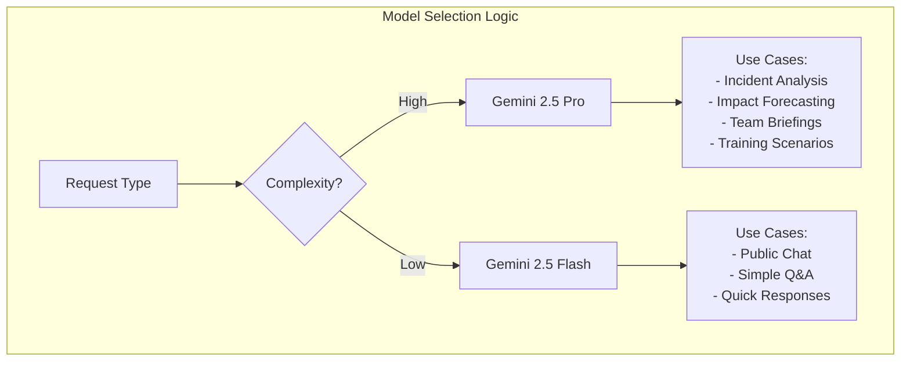

### Model Characteristics

| Model | Gemini 2.5 Pro | Gemini 2.5 Flash |
|-------|---------------|------------------|
| **Purpose** | Complex analysis, structured output | Conversational, quick responses |
| **Temperature** | 0.3 (deterministic) | 0.7 (creative) |
| **Response Format** | JSON with schema | Streaming text |
| **Latency** | Higher (~2-5s) | Lower (~0.5-2s) |
| **Cost** | Higher | Lower |
| **Use Case** | Critical analysis | User interaction |

## Service Architecture

### Core Service Structure

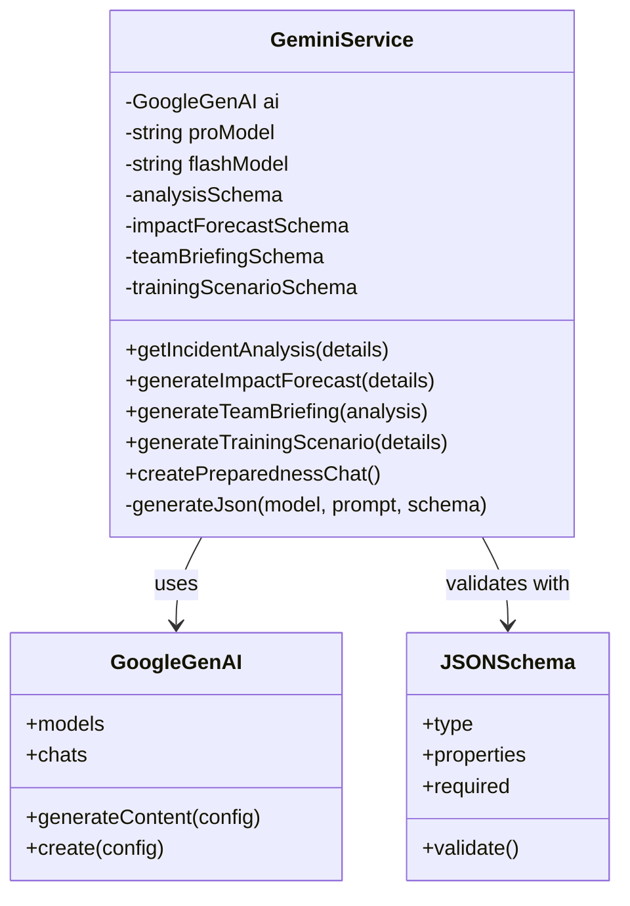

### Service Method Flow

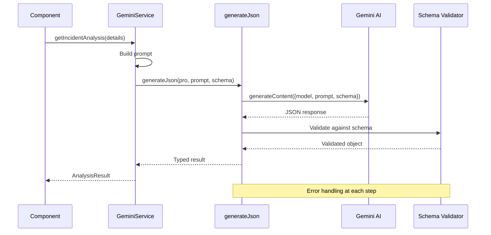

## JSON Schema Validation

### Schema Definition Pattern

```typescript
// Analysis Schema Structure
const analysisSchema = {
    type: Type.OBJECT,
    properties: {
        summary: {
            type: Type.STRING,
            description: "Brief, concise incident summary"
        },
        recommendedActions: {
            type: Type.ARRAY,
            items: { type: Type.STRING },
            description: "Immediate actionable steps"
        },
        potentialRisks: {
            type: Type.ARRAY,
            items: { type: Type.STRING },
            description: "Secondary risks/cascading effects"
        },
        resourceSuggestions: {
            type: Type.ARRAY,
            items: { type: Type.STRING },
            description: "Suggested resources to allocate"
        }
    },
    required: ["summary", "recommendedActions", "potentialRisks", "resourceSuggestions"]
}
```

### Schema Validation Flow

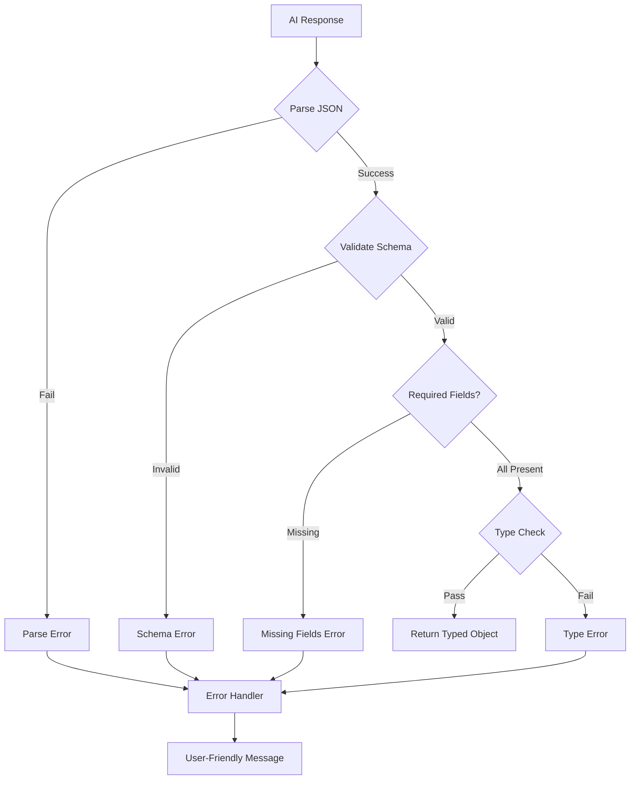

### Schema Types and Validation Rules

```mermaid
graph TD
    subgraph "Impact Forecast Schema"
        IF[ImpactForecast] --> SH[shortTermImpacts: string[]]
        IF --> LH[longTermImpacts: string[]]
        IF --> CL[communityLifelines: object[]]
        CL --> LL[lifeline: string]
        CL --> IM[impact: string]
        CL --> MIT[mitigation: string]
    end

    subgraph "Team Briefing Schema"
        TB[TeamBriefing] --> MS[missionStatement: string]
        TB --> KO[keyObjectives: string[]]
        TB --> KR[knownRisks: string[]]
        TB --> CP[commsPlan: string]
    end

    subgraph "Training Scenario Schema"
        TS[TrainingScenario] --> ST[scenarioTitle: string]
        TS --> LO[learningObjectives: string[]]
        TS --> IB[initialBriefing: string]
        TS --> TI[timelineInjects: object[]]
        TI --> TM[time: string]
        TI --> EV[event: string]
        TI --> EA[expectedAction: string]
    end
```

## Streaming vs Structured Responses

### Response Pattern Comparison

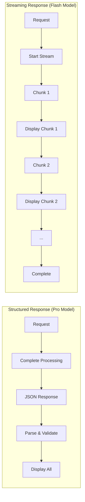

### Streaming Implementation

```typescript
// Streaming chat response pattern
async function handleStreamingResponse(chat: Chat, message: string) {
    const stream = await chat.sendMessageStream({ message });
    let fullResponse = '';

    for await (const chunk of stream) {
        fullResponse += chunk.text;
        // Progressive UI update
        updateUIWithChunk(fullResponse);
    }

    return fullResponse;
}
```

### Structured Response Implementation

```typescript
// Structured JSON response pattern
async function generateJson<T>(
    model: string,
    prompt: string,
    schema: object
): Promise<T> {
    const response = await ai.models.generateContent({
        model: model,
        contents: prompt,
        config: {
            responseMimeType: "application/json",
            responseSchema: schema,
            temperature: 0.3,
        }
    });

    const jsonText = response.text.trim();
    return JSON.parse(jsonText) as T;
}
```

## Prompt Engineering Strategies

### Prompt Construction Pattern

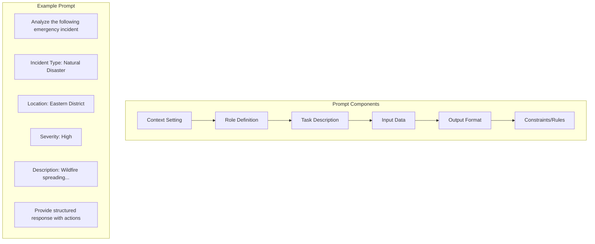

### Prompt Templates

```typescript
// Incident Analysis Prompt
const analysisPrompt = `
Analyze the following emergency incident report and provide a structured response.
Incident Type: ${details.incidentType}
Location: ${details.location}
Severity: ${details.severity}
Description: ${details.description}
`;

// Impact Forecast Prompt
const forecastPrompt = `
Generate a detailed impact forecast for this incident:
Incident Type: ${details.incidentType}
Location: ${details.location}
Severity: ${details.severity}
Description: ${details.description}
Focus on short-term, long-term, and community lifeline impacts.
`;

// Team Briefing Prompt
const briefingPrompt = `
Based on the following incident analysis, create a standardized
operational team briefing (ICS style).
Analysis: ${JSON.stringify(analysis)}
The briefing must be clear, concise, and actionable for first responders.
`;
```

## Error Handling and Recovery

### Error Handling Flow

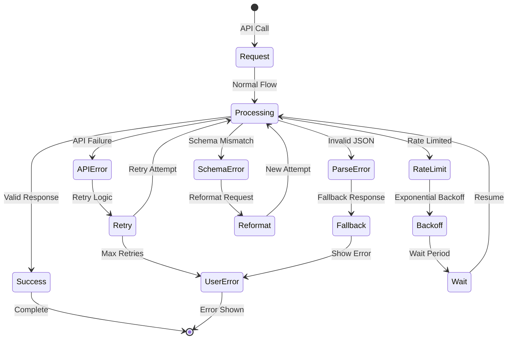

### Error Types and Handling

| Error Type | Cause | Handling Strategy | User Feedback |
|------------|-------|-------------------|---------------|
| API Timeout | Network/Server | Retry with backoff | "Processing taking longer than usual..." |
| Rate Limit | Too many requests | Queue and delay | "High demand, please wait..." |
| Invalid JSON | Malformed response | Request regeneration | "Reformatting response..." |
| Schema Mismatch | Missing fields | Default values | "Partial results available" |
| Authentication | Invalid API key | Check configuration | "Configuration error" |

## Performance Optimization

### Optimization Strategies

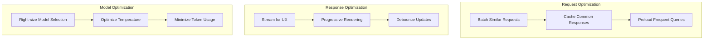

### Performance Metrics

```typescript
// Performance monitoring pattern
interface PerformanceMetrics {
    requestTime: number;
    responseTime: number;
    tokenCount: number;
    modelUsed: string;
    cacheHit: boolean;
}

async function monitoredRequest<T>(
    operation: () => Promise<T>
): Promise<[T, PerformanceMetrics]> {
    const startTime = performance.now();
    const result = await operation();
    const endTime = performance.now();

    const metrics: PerformanceMetrics = {
        requestTime: endTime - startTime,
        responseTime: /* extract from response */,
        tokenCount: /* extract from response */,
        modelUsed: /* model identifier */,
        cacheHit: /* check cache */
    };

    return [result, metrics];
}
```

## Advanced Patterns

### Parallel Request Processing

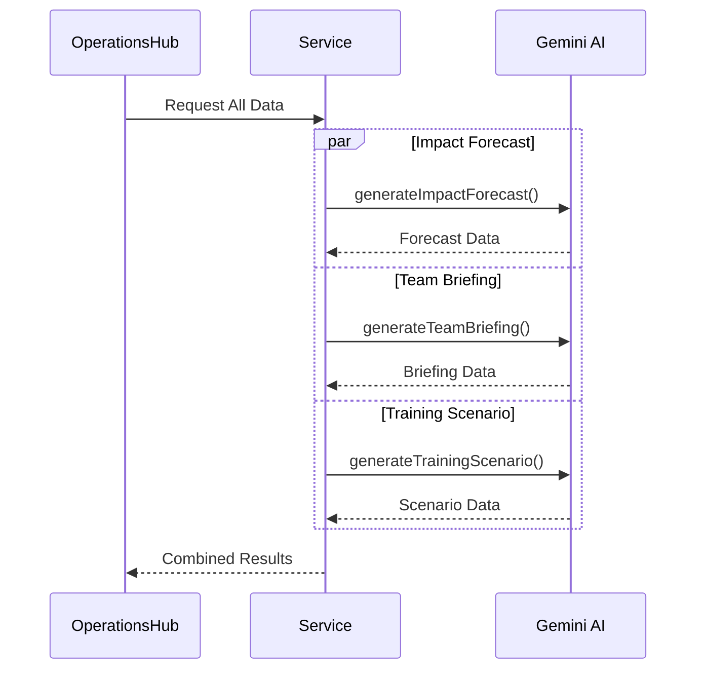

### Context Management for Chat

```typescript
// Chat context management
class ChatContextManager {
    private systemInstruction = `
        You are an expert in emergency preparedness and public safety.
        Your role is to provide clear, concise, and actionable advice.
        Answer questions about creating emergency kits, evacuation plans,
        and safety procedures for various disasters.
        Be calm, reassuring, and authoritative.
        Use lists and simple language.
    `;

    private messageHistory: ChatMessage[] = [];

    addMessage(message: ChatMessage) {
        this.messageHistory.push(message);
        // Maintain sliding window of context
        if (this.messageHistory.length > 20) {
            this.messageHistory = this.messageHistory.slice(-20);
        }
    }

    getContext(): string {
        return this.messageHistory
            .map(m => `${m.sender}: ${m.text}`)
            .join('\n');
    }
}
```

## Security Considerations

### AI Service Security

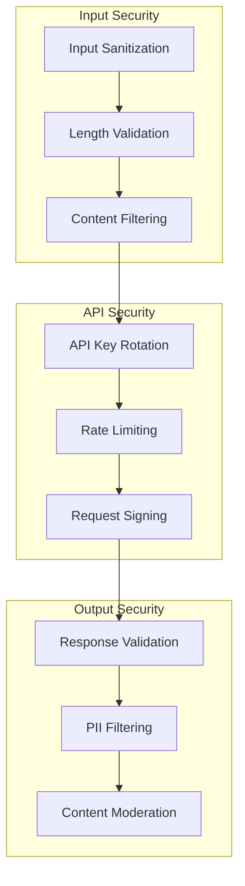

### Security Best Practices

1. **API Key Management**
   - Environment variables only
   - Never expose in client code
   - Regular rotation schedule

2. **Input Validation**
   - Sanitize user inputs
   - Enforce character limits
   - Block malicious patterns

3. **Output Validation**
   - Verify response structure
   - Filter sensitive information
   - Moderate generated content

## Future Enhancements

### Planned Improvements

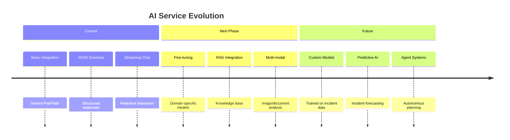

### Advanced Capabilities Roadmap

1. **Retrieval-Augmented Generation (RAG)**
   - Historical incident database
   - Local regulations and procedures
   - Best practices repository

2. **Multi-Modal Analysis**
   - Incident photo analysis
   - Map and diagram interpretation
   - Document processing

3. **Predictive Intelligence**
   - Pattern recognition across incidents
   - Resource optimization suggestions
   - Outcome probability modeling

---

This AI service architecture provides a robust, scalable foundation for intelligent emergency management capabilities, with clear patterns for both structured analysis and interactive assistance.