# Architecture Documentation - Aegis AI Emergency Management

## System Architecture Overview

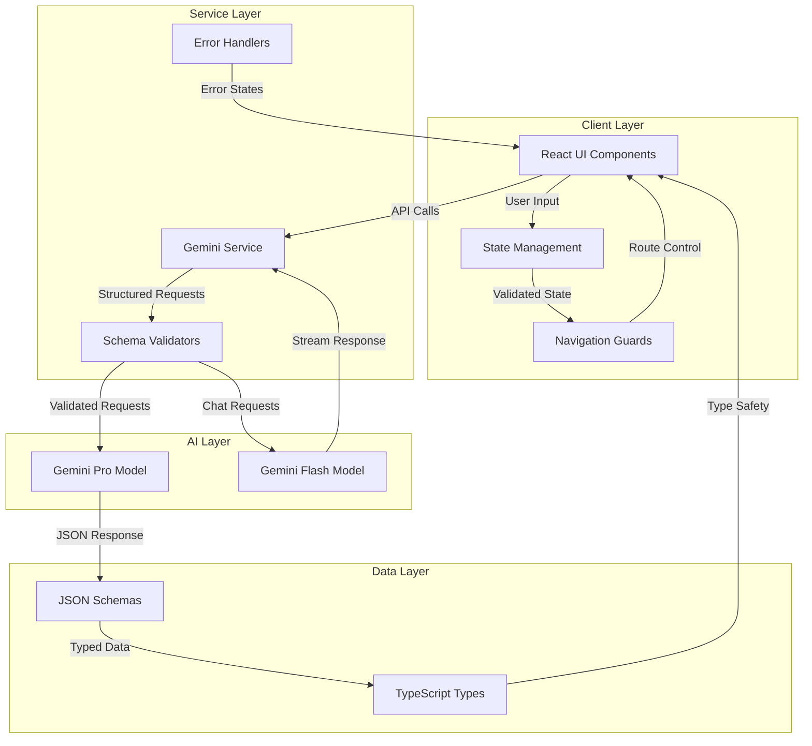

## Component Architecture

### Component Hierarchy

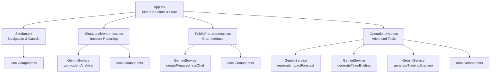

### Component Responsibilities

| Component | Primary Responsibility | State Management | AI Integration |
|-----------|----------------------|------------------|----------------|
| `App.tsx` | Application shell, view routing, global state | Owns incident and analysis state | None |
| `Sidebar.tsx` | Navigation, state-based guards | Receives hasAnalysis prop | None |
| `SituationalAwareness.tsx` | Incident input, analysis display | Local form state, updates global | Direct - Pro model |
| `PublicPreparedness.tsx` | Chat interface | Local chat history | Direct - Flash model |
| `OperationsHub.tsx` | Advanced tools display | Local operational data | Direct - Pro model |

## State Management Architecture

### State Flow Diagram

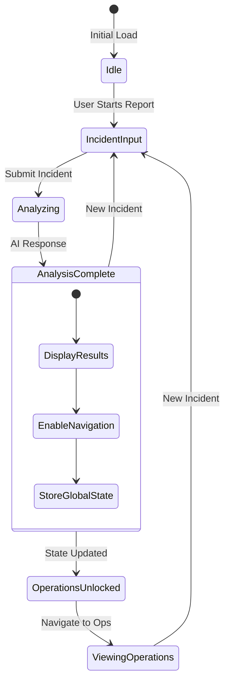

### State Management Strategy

```typescript
// Global State (App.tsx)
interface GlobalState {
    currentView: View;
    incidentDetails: IncidentDetails | null;
    analysisResult: AnalysisResult | null;
}

// Local Component States
interface SituationalAwarenessState {
    incidentType: string;
    location: string;
    severity: string;
    description: string;
    isLoading: boolean;
    error: string | null;
}

interface PublicPreparednessState {
    chat: Chat | null;
    messages: ChatMessage[];
    userInput: string;
    isLoading: boolean;
}

interface OperationsHubState {
    forecast: ImpactForecast | null;
    briefing: TeamBriefing | null;
    scenario: TrainingScenario | null;
    isLoading: boolean;
}
```

## Navigation Architecture

### Navigation Flow with Guards

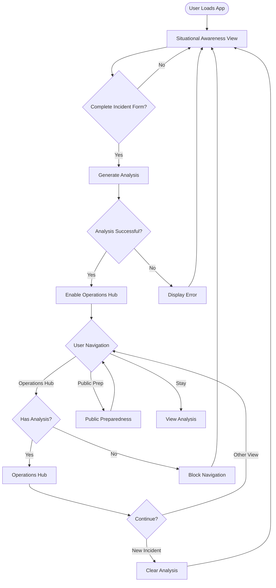

### Navigation Guard Implementation

```typescript
// Navigation guard logic in App.tsx
const handleSetCurrentView = (view: View) => {
    // Guard: Prevent navigation to Operations without analysis
    if (view === 'operations' && !analysisResult) {
        console.warn("Navigation blocked: No analysis available");
        return;
    }
    setCurrentView(view);
};

// Sidebar reflects guard state
<button
    disabled={item.id === 'operations' && !hasAnalysis}
    className={item.disabled ? 'opacity-50 cursor-not-allowed' : ''}
/>
```

## Data Flow Architecture

### Request/Response Flow

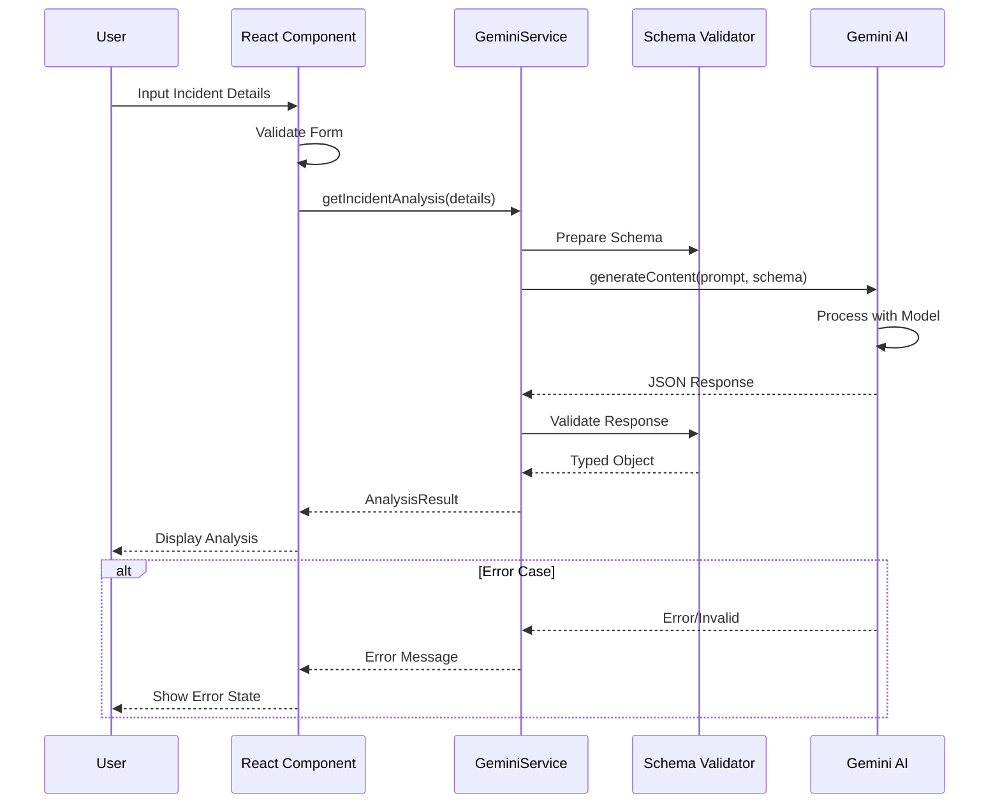

### Data Transformation Pipeline

```mermaid
graph LR
    UserInput[User Input<br/>Raw Form Data] --> Validation[Form Validation<br/>Required Fields]
    Validation --> TypedData[Typed Data<br/>IncidentDetails]
    TypedData --> Prompt[Prompt Generation<br/>Structured Text]
    Prompt --> AIRequest[AI Request<br/>+ JSON Schema]
    AIRequest --> AIResponse[AI Response<br/>Raw JSON]
    AIResponse --> Parse[JSON Parse<br/>Object Creation]
    Parse --> TypeCheck[Type Assertion<br/>TypeScript Types]
    TypeCheck --> UIRender[UI Render<br/>Formatted Display]
```

## AI Service Architecture Overview

### Model Selection Strategy

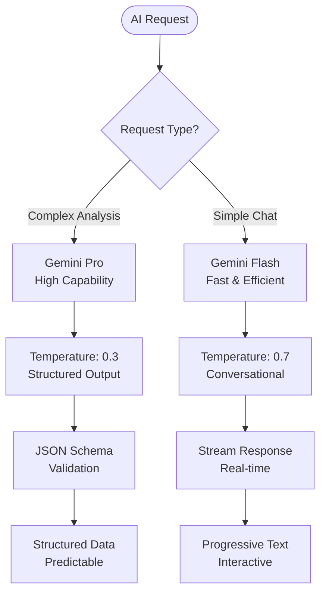

### Service Method Architecture

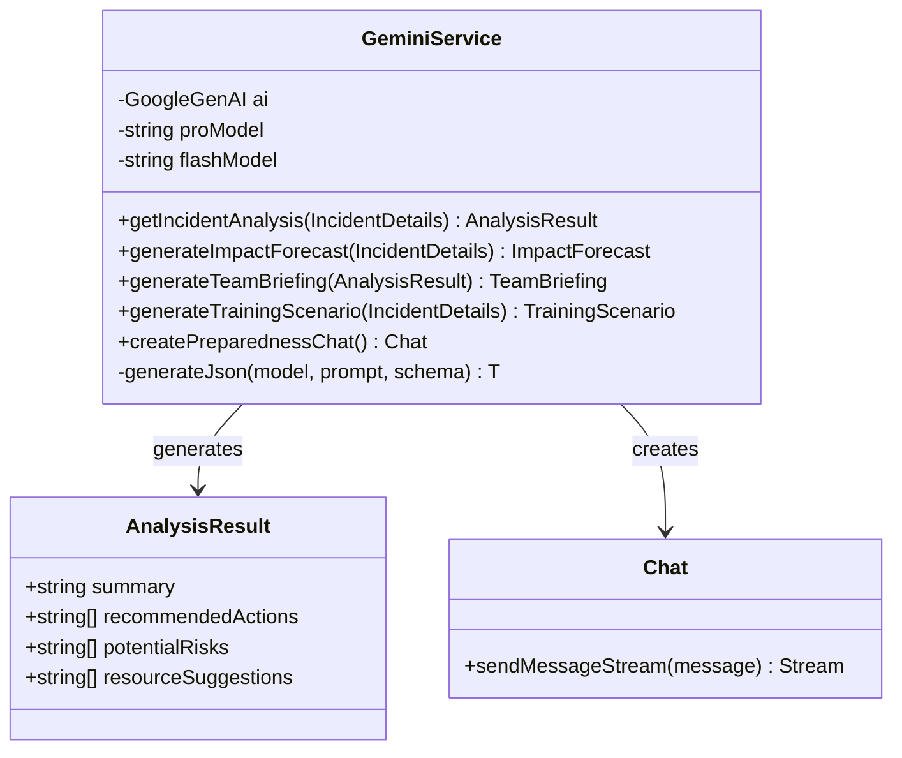

## Error Handling Architecture

### Error Handling Flow

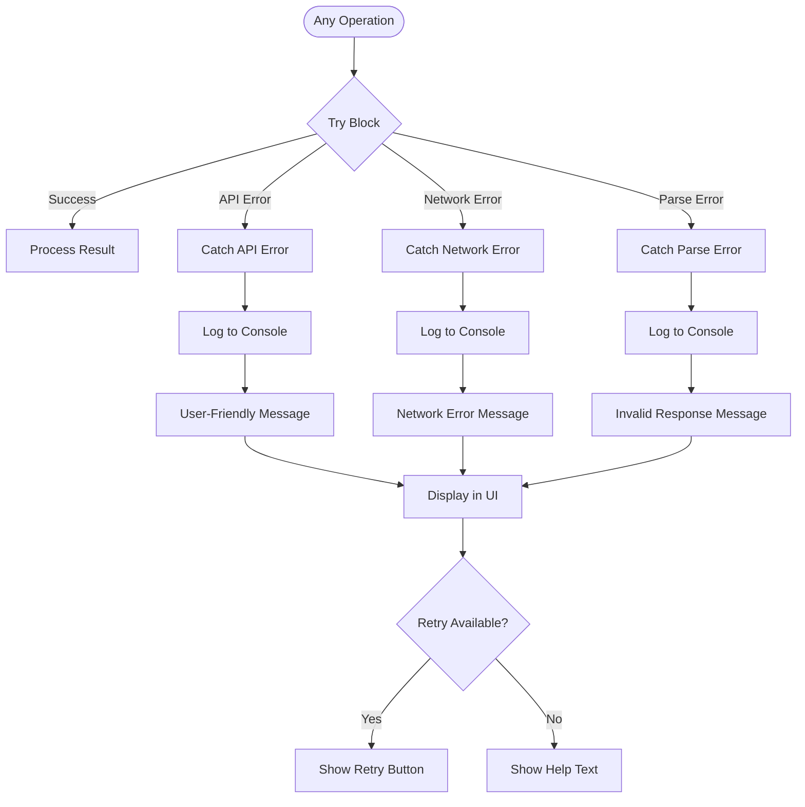

### Error States by Component

| Component | Error Types | User Feedback | Recovery Strategy |
|-----------|------------|---------------|-------------------|
| SituationalAwareness | Form validation, API failure | Inline error messages | Clear error on retry |
| PublicPreparedness | Chat failure, Stream interruption | Chat error message | Maintain chat history |
| OperationsHub | Multiple API failures | Loading states, error banner | Partial data display |
| GeminiService | API limits, Network, Invalid response | Specific error messages | Automatic retry logic |

## Performance Optimization Strategies

### Lazy Loading and Code Splitting

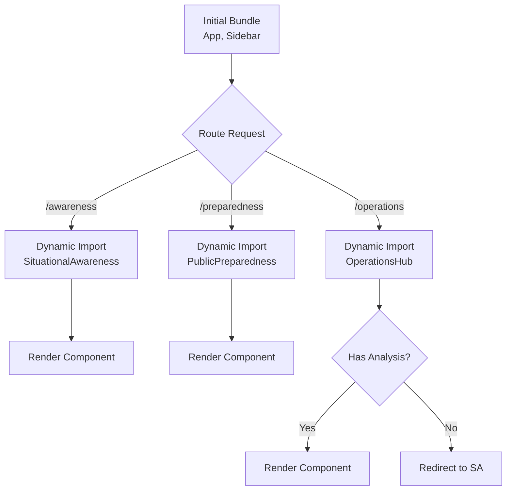

### Caching Strategy

1. **Component Level**: React memo for icons
2. **API Level**: Response caching for repeated queries
3. **State Level**: Persist analysis across navigation
4. **Service Worker**: Offline capability for core features

## Security Architecture

### Security Layers

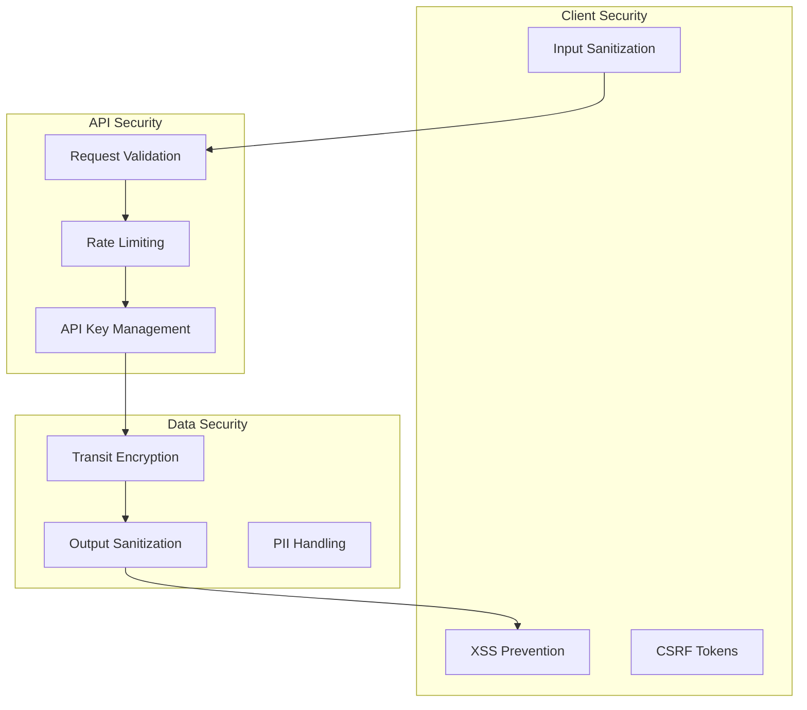

## Deployment Architecture

### Production Deployment

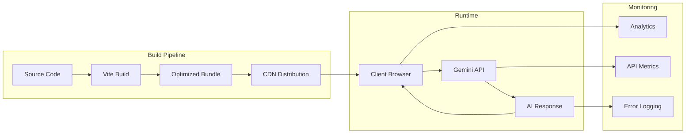

## Scalability Considerations

### Horizontal Scaling Strategy

1. **Stateless Design**: No server-side session state
2. **CDN Distribution**: Static assets globally distributed
3. **API Management**: Google's infrastructure handles AI scaling
4. **Client-Side State**: Reduces server load

### Vertical Scaling Options

1. **Model Selection**: Upgrade to more capable models as needed
2. **Concurrent Requests**: Parallel API calls for Operations Hub
3. **Batch Processing**: Group similar requests when possible
4. **Progressive Enhancement**: Add features without breaking existing

## Future Architecture Enhancements

### Planned Improvements

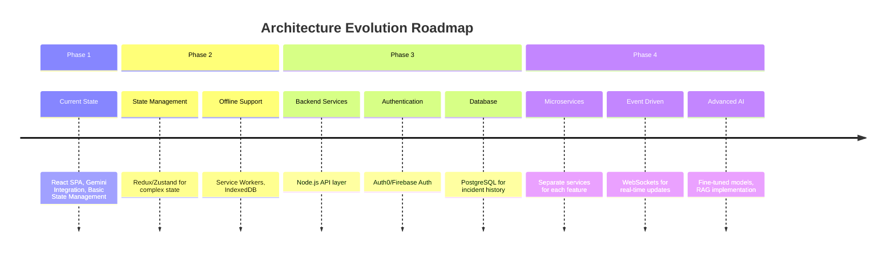

---

This architecture provides a robust, scalable foundation for the Aegis AI Emergency Management system, with clear separation of concerns, strong type safety, and strategic AI model utilization.