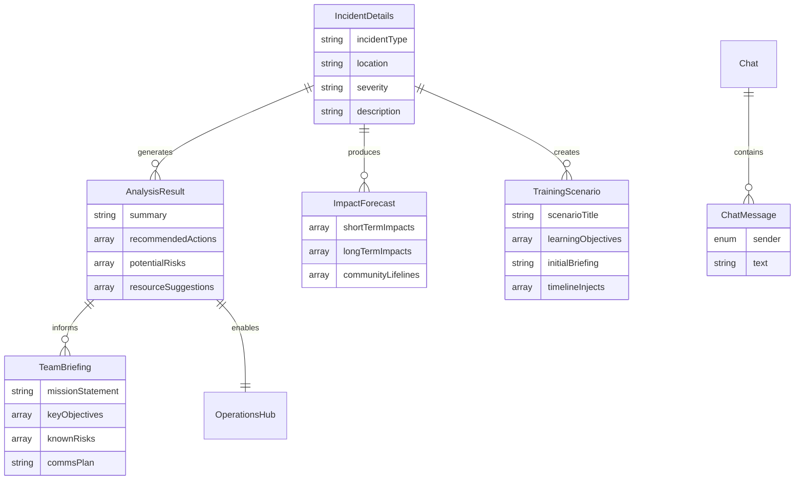
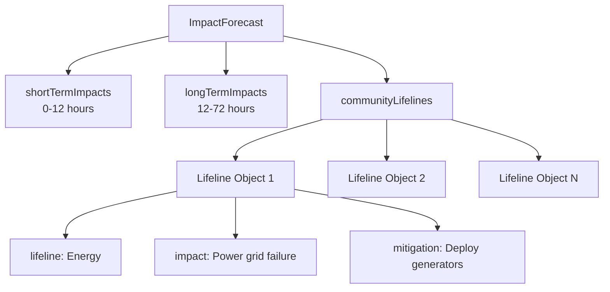
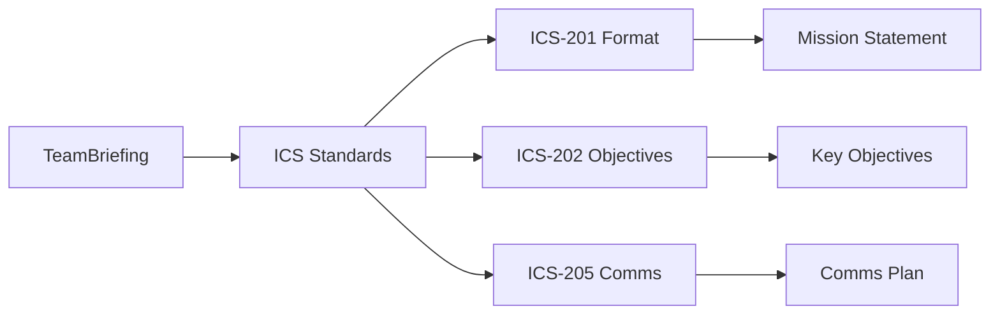
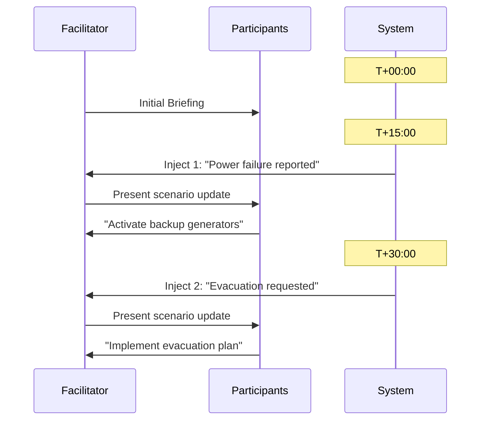
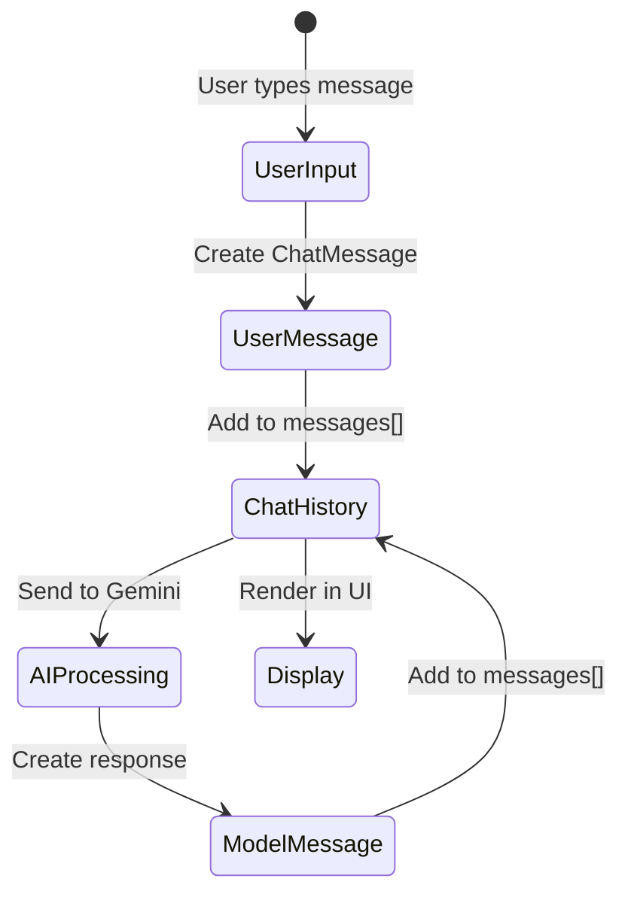
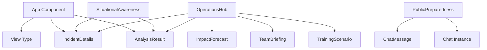
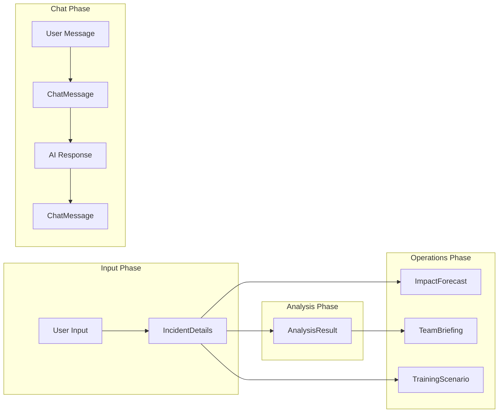
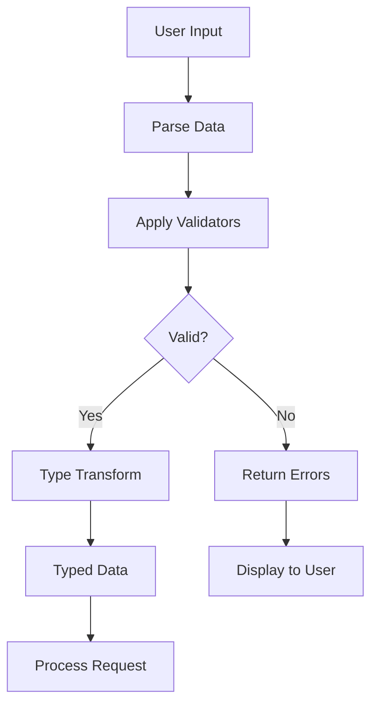
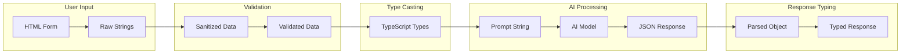
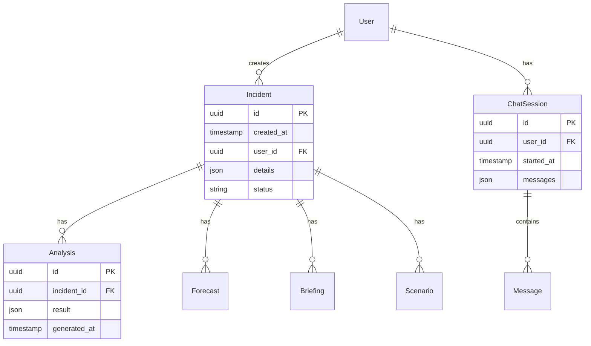

# Data Models Documentation - Aegis AI Emergency Management

## Overview

This document provides comprehensive documentation of all TypeScript interfaces, their relationships, and data flow patterns within the Aegis system.

## Core Data Models

### Entity Relationship Diagram



## Detailed Interface Specifications

### IncidentDetails Interface

```typescript
interface IncidentDetails {
    incidentType: string;
    location: string;
    severity: string;
    description: string;
}
```

#### Field Specifications

| Field | Type | Constraints | Description | Example |
|-------|------|------------|-------------|---------|
| `incidentType` | string | Enum values | Type of emergency incident | "Natural Disaster" |
| `location` | string | Required, non-empty | Geographic location or address | "Downtown Metro Area" |
| `severity` | string | Enum values | Incident severity level | "High" |
| `description` | string | Required, min 10 chars | Detailed incident description | "Wildfire spreading rapidly..." |

#### Enum Values

```typescript
// Incident Types
const incidentTypes = [
    'Natural Disaster',
    'Technological Accident',
    'Terrorism',
    'Public Health Emergency',
    'Other'
];

// Severity Levels
const severityLevels = [
    'Low',
    'Moderate',
    'High',
    'Severe',
    'Catastrophic'
];
```

### AnalysisResult Interface

```typescript
interface AnalysisResult {
    summary: string;
    recommendedActions: string[];
    potentialRisks: string[];
    resourceSuggestions: string[];
}
```

#### Field Specifications

| Field | Type | Description | Typical Length | Generated By |
|-------|------|-------------|----------------|--------------|
| `summary` | string | Concise incident overview | 50-200 chars | Gemini Pro |
| `recommendedActions` | string[] | Immediate action items | 3-5 items | Gemini Pro |
| `potentialRisks` | string[] | Secondary hazards | 2-4 items | Gemini Pro |
| `resourceSuggestions` | string[] | Required resources | 3-5 items | Gemini Pro |

### ImpactForecast Interface

```typescript
interface ImpactForecast {
    shortTermImpacts: string[];
    longTermImpacts: string[];
    communityLifelines: {
        lifeline: string;
        impact: string;
        mitigation: string;
    }[];
}
```

#### Nested Structure



#### Community Lifelines Reference

```typescript
// Standard FEMA Community Lifelines
const communityLifelines = [
    'Safety and Security',
    'Food, Water, Shelter',
    'Health and Medical',
    'Energy',
    'Communications',
    'Transportation',
    'Hazardous Materials'
];
```

### TeamBriefing Interface

```typescript
interface TeamBriefing {
    missionStatement: string;
    keyObjectives: string[];
    knownRisks: string[];
    commsPlan: string;
}
```

#### ICS Compliance



### TrainingScenario Interface

```typescript
interface TrainingScenario {
    scenarioTitle: string;
    learningObjectives: string[];
    initialBriefing: string;
    timelineInjects: {
        time: string;
        event: string;
        expectedAction: string;
    }[];
}
```

#### Timeline Inject Structure



### ChatMessage Interface

```typescript
interface ChatMessage {
    sender: 'user' | 'model';
    text: string;
}
```

#### Message Flow



## Type Relationships and Dependencies

### Type Dependency Graph



### Data Flow Between Types



## State Management Patterns

### Global State Types

```typescript
// Application-level state
interface AppState {
    currentView: View;
    incidentDetails: IncidentDetails | null;
    analysisResult: AnalysisResult | null;
}

// View enumeration
type View = 'awareness' | 'preparedness' | 'operations';
```

### Component State Types

```typescript
// SituationalAwareness local state
interface SituationalAwarenessState {
    // Form fields (mirrors IncidentDetails)
    incidentType: string;
    location: string;
    severity: string;
    description: string;

    // UI state
    analysis: AnalysisResult | null;
    isLoading: boolean;
    error: string | null;
}

// PublicPreparedness local state
interface PublicPreparednessState {
    chat: Chat | null;
    messages: ChatMessage[];
    userInput: string;
    isLoading: boolean;
    error: string | null;
}

// OperationsHub local state
interface OperationsHubState {
    forecast: ImpactForecast | null;
    briefing: TeamBriefing | null;
    scenario: TrainingScenario | null;
    isLoading: boolean;
    error: string | null;
}
```

## Data Validation Patterns

### Validation Rules

```typescript
// Validation functions for each type
const validators = {
    incidentDetails: (data: IncidentDetails): ValidationResult => {
        const errors: string[] = [];

        if (!data.location?.trim()) {
            errors.push("Location is required");
        }

        if (!data.description?.trim() || data.description.length < 10) {
            errors.push("Description must be at least 10 characters");
        }

        if (!incidentTypes.includes(data.incidentType)) {
            errors.push("Invalid incident type");
        }

        if (!severityLevels.includes(data.severity)) {
            errors.push("Invalid severity level");
        }

        return {
            isValid: errors.length === 0,
            errors
        };
    }
};

interface ValidationResult {
    isValid: boolean;
    errors: string[];
}
```

### Schema Validation Flow



## Data Transformation Pipeline

### Input to Output Transformation



## Type Safety Strategies

### Runtime Type Checking

```typescript
// Type guard functions
function isIncidentDetails(obj: any): obj is IncidentDetails {
    return obj &&
        typeof obj.incidentType === 'string' &&
        typeof obj.location === 'string' &&
        typeof obj.severity === 'string' &&
        typeof obj.description === 'string';
}

function isAnalysisResult(obj: any): obj is AnalysisResult {
    return obj &&
        typeof obj.summary === 'string' &&
        Array.isArray(obj.recommendedActions) &&
        Array.isArray(obj.potentialRisks) &&
        Array.isArray(obj.resourceSuggestions);
}

// Usage example
const processAnalysis = (data: unknown) => {
    if (!isAnalysisResult(data)) {
        throw new Error("Invalid analysis result format");
    }
    // Safe to use as AnalysisResult
    return data;
};
```

### Null Safety Patterns

```typescript
// Safe property access patterns
const safeAccess = {
    getIncidentType: (details: IncidentDetails | null): string => {
        return details?.incidentType ?? 'Unknown';
    },

    getFirstAction: (result: AnalysisResult | null): string | null => {
        return result?.recommendedActions?.[0] ?? null;
    },

    getLifelineCount: (forecast: ImpactForecast | null): number => {
        return forecast?.communityLifelines?.length ?? 0;
    }
};
```

## Data Persistence Considerations

### Future Storage Schema



## Migration and Evolution Strategies

### Version Management

```typescript
// Versioned interfaces for future compatibility
interface IncidentDetailsV1 {
    incidentType: string;
    location: string;
    severity: string;
    description: string;
}

interface IncidentDetailsV2 extends IncidentDetailsV1 {
    coordinates?: [number, number];
    reportedBy?: string;
    verificationStatus?: 'unverified' | 'verified' | 'false';
}

// Migration function
function migrateIncidentDetails(v1: IncidentDetailsV1): IncidentDetailsV2 {
    return {
        ...v1,
        coordinates: undefined,
        reportedBy: undefined,
        verificationStatus: 'unverified'
    };
}
```

## Best Practices

### Type Definition Guidelines

1. **Keep interfaces focused**: Single responsibility per interface
2. **Use strict types**: Avoid `any`, prefer union types
3. **Document complex fields**: Add JSDoc comments
4. **Version interfaces**: Plan for evolution
5. **Validate at boundaries**: Input/output validation

### Naming Conventions

```typescript
// Interface naming
interface [Feature][DataType] {
    // PascalCase for interfaces
}

// Type naming
type [Feature][Type] = // PascalCase for types

// Enum naming
enum [Feature][Enum] {
    // PascalCase for enums
    CONSTANT_CASE // for values
}

// Property naming
interface Example {
    camelCaseProperty: string;
    isBoolean: boolean;  // prefix with 'is' or 'has'
    handleAction: () => void; // prefix with 'handle' for handlers
}
```

---

This comprehensive data model documentation ensures type safety, maintainability, and clear understanding of data structures throughout the Aegis system.