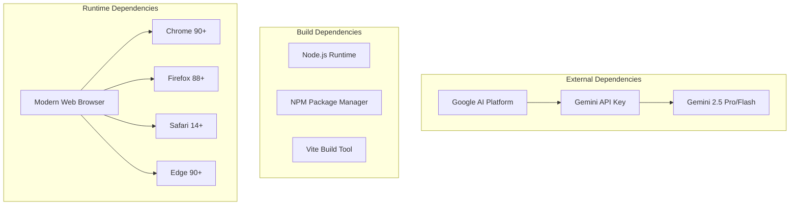
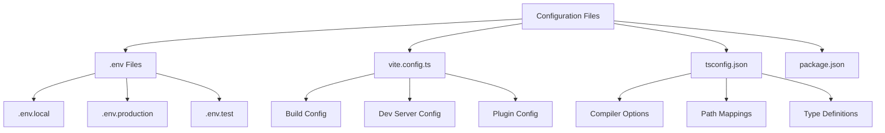
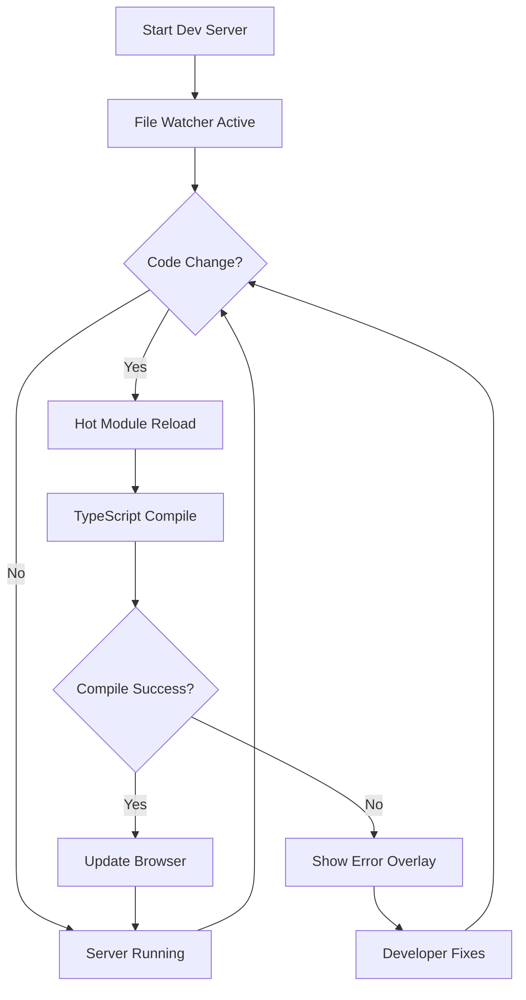
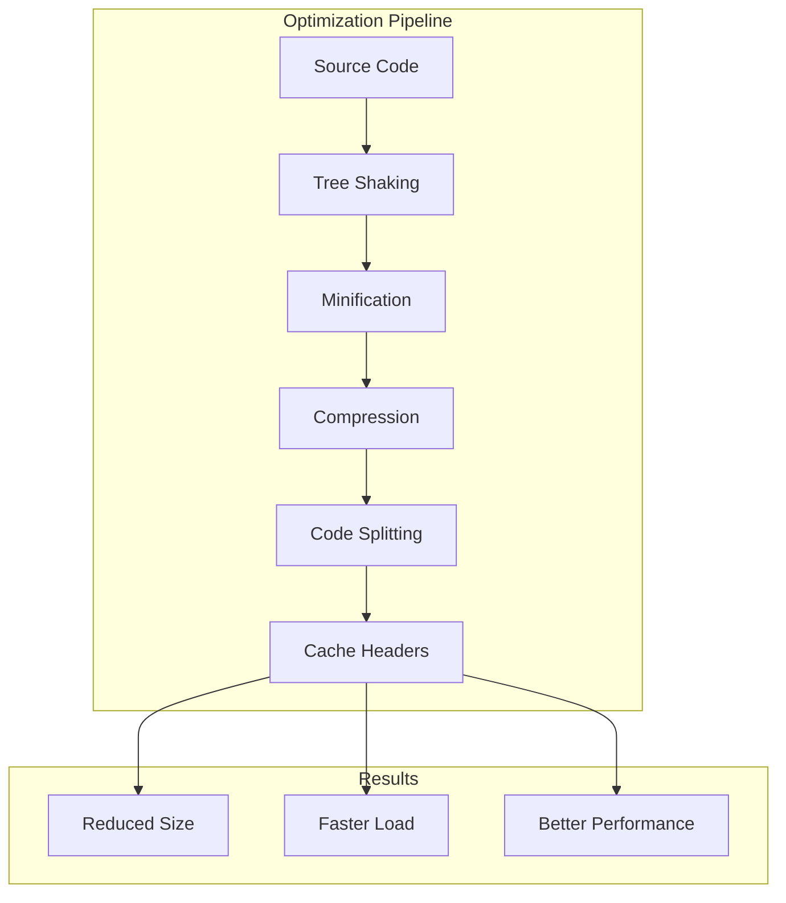
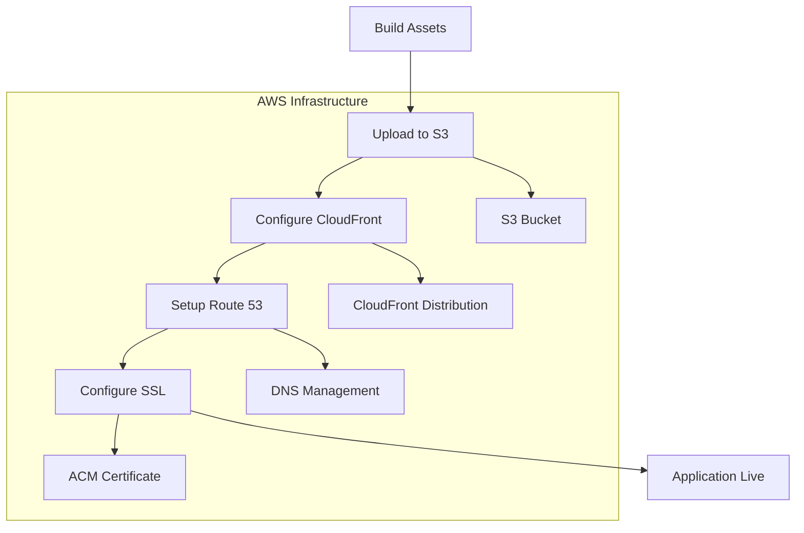
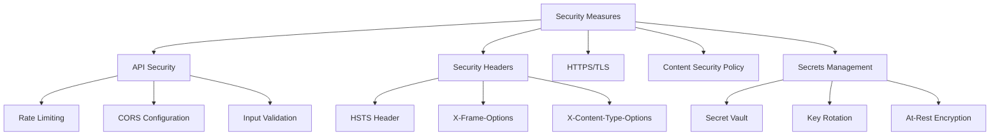
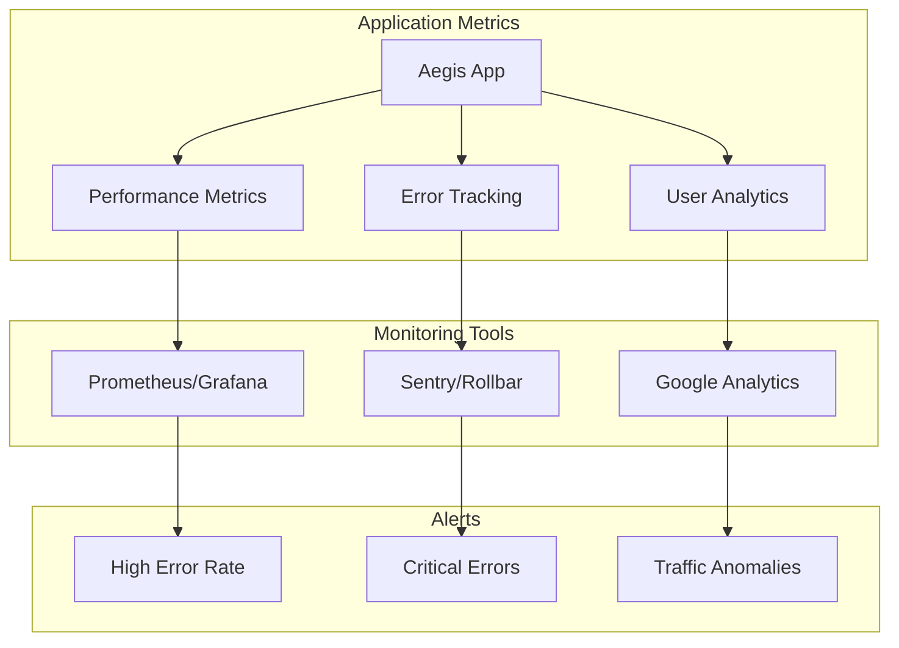
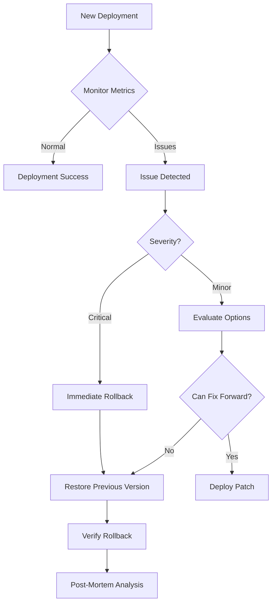

# Deployment Guide - Aegis AI Emergency Management

## Overview

This guide provides comprehensive instructions for deploying the Aegis AI Emergency Management application across different environments, from local development to production deployment.

## Prerequisites

### System Requirements

```yaml
Minimum Requirements:
  Node.js: v18.0.0 or higher
  npm: v9.0.0 or higher
  Memory: 4GB RAM minimum
  Disk: 1GB free space

Recommended Requirements:
  Node.js: v20.0.0 (LTS)
  npm: v10.0.0
  Memory: 8GB RAM
  Disk: 2GB free space
  CPU: 2+ cores
```

### Required Services



## Environment Configuration

### Environment Variables

```bash
# .env.local (Development)
API_KEY=your-gemini-api-key-here
VITE_APP_ENV=development
VITE_API_TIMEOUT=30000
VITE_ENABLE_LOGGING=true

# .env.production (Production)
API_KEY=your-production-gemini-api-key
VITE_APP_ENV=production
VITE_API_TIMEOUT=10000
VITE_ENABLE_LOGGING=false
```

### Configuration Files



### Vite Configuration

```typescript
// vite.config.ts
import { defineConfig } from 'vite';
import react from '@vitejs/plugin-react';

export default defineConfig({
  plugins: [react()],

  build: {
    outDir: 'dist',
    sourcemap: process.env.NODE_ENV !== 'production',
    minify: 'esbuild',
    target: 'es2020',

    rollupOptions: {
      output: {
        manualChunks: {
          'react-vendor': ['react', 'react-dom'],
          'ai-vendor': ['@google/genai'],
        }
      }
    }
  },

  server: {
    port: 3000,
    strictPort: false,
    host: true,
    cors: true
  },

  optimizeDeps: {
    include: ['react', 'react-dom', '@google/genai']
  }
});
```

## Local Development Setup

### Step-by-Step Setup

```bash
# 1. Clone the repository
git clone <repository-url>
cd aegis

# 2. Install dependencies
npm install

# 3. Set up environment variables
cp .env.example .env.local
# Edit .env.local and add your Gemini API key

# 4. Start development server
npm run dev

# 5. Open browser
# Navigate to http://localhost:3000
```

### Development Workflow



## Production Build

### Build Process

```bash
# 1. Clean previous builds
rm -rf dist

# 2. Install production dependencies
npm ci --production=false

# 3. Run type checking
npm run type-check

# 4. Run build
npm run build

# 5. Preview production build locally (optional)
npm run preview
```

### Build Output Structure

```
dist/
├── assets/
│   ├── index-[hash].js        # Main application bundle
│   ├── index-[hash].css       # Compiled styles
│   ├── react-vendor-[hash].js # React libraries
│   └── ai-vendor-[hash].js    # AI service libraries
├── index.html                  # Entry HTML file
└── favicon.ico                 # Application icon
```

### Build Optimization Strategies



## Deployment Options

### Option 1: Static Hosting (Recommended)

#### Vercel Deployment

```bash
# Install Vercel CLI
npm i -g vercel

# Deploy to Vercel
vercel

# Follow prompts:
# - Link to existing project or create new
# - Configure build settings
# - Set environment variables
```

```json
// vercel.json
{
  "buildCommand": "npm run build",
  "outputDirectory": "dist",
  "framework": "vite",
  "env": {
    "API_KEY": "@gemini-api-key"
  }
}
```

#### Netlify Deployment

```bash
# Install Netlify CLI
npm i -g netlify-cli

# Deploy to Netlify
netlify deploy --prod

# Or use netlify.toml
```

```toml
# netlify.toml
[build]
  command = "npm run build"
  publish = "dist"

[build.environment]
  NODE_VERSION = "18"

[[redirects]]
  from = "/*"
  to = "/index.html"
  status = 200
```

### Option 2: Cloud Platform Deployment

#### AWS S3 + CloudFront



```bash
# AWS CLI deployment script
#!/bin/bash

# Build the application
npm run build

# Sync to S3
aws s3 sync dist/ s3://aegis-app-bucket \
  --delete \
  --cache-control "public, max-age=31536000" \
  --exclude "index.html"

# Upload index.html with no-cache
aws s3 cp dist/index.html s3://aegis-app-bucket/index.html \
  --cache-control "no-cache, no-store, must-revalidate"

# Invalidate CloudFront cache
aws cloudfront create-invalidation \
  --distribution-id YOUR_DISTRIBUTION_ID \
  --paths "/*"
```

#### Google Cloud Platform

```yaml
# app.yaml for App Engine
runtime: nodejs18
env: standard

handlers:
  - url: /assets
    static_dir: dist/assets
    expiration: "30d"

  - url: /.*
    static_files: dist/index.html
    upload: dist/index.html

env_variables:
  API_KEY: "your-api-key"
```

### Option 3: Container Deployment

#### Docker Configuration

```dockerfile
# Dockerfile
FROM node:18-alpine AS builder

WORKDIR /app
COPY package*.json ./
RUN npm ci
COPY . .
RUN npm run build

FROM nginx:alpine
COPY --from=builder /app/dist /usr/share/nginx/html
COPY nginx.conf /etc/nginx/nginx.conf

EXPOSE 80
CMD ["nginx", "-g", "daemon off;"]
```

```nginx
# nginx.conf
server {
    listen 80;
    server_name localhost;
    root /usr/share/nginx/html;

    location / {
        try_files $uri /index.html;
    }

    location /assets {
        expires 30d;
        add_header Cache-Control "public, immutable";
    }

    gzip on;
    gzip_types text/plain text/css text/javascript application/javascript application/json;
}
```

#### Kubernetes Deployment

```yaml
# deployment.yaml
apiVersion: apps/v1
kind: Deployment
metadata:
  name: aegis-app
spec:
  replicas: 3
  selector:
    matchLabels:
      app: aegis
  template:
    metadata:
      labels:
        app: aegis
    spec:
      containers:
      - name: aegis
        image: aegis-app:latest
        ports:
        - containerPort: 80
        env:
        - name: API_KEY
          valueFrom:
            secretKeyRef:
              name: aegis-secrets
              key: api-key
---
apiVersion: v1
kind: Service
metadata:
  name: aegis-service
spec:
  selector:
    app: aegis
  ports:
  - port: 80
    targetPort: 80
  type: LoadBalancer
```

## Security Configuration

### Production Security Checklist



### Security Headers Configuration

```javascript
// Express middleware for security headers
const securityHeaders = {
  'Strict-Transport-Security': 'max-age=31536000; includeSubDomains',
  'X-Content-Type-Options': 'nosniff',
  'X-Frame-Options': 'DENY',
  'X-XSS-Protection': '1; mode=block',
  'Referrer-Policy': 'strict-origin-when-cross-origin',
  'Content-Security-Policy': `
    default-src 'self';
    script-src 'self' 'unsafe-inline' https://apis.google.com;
    style-src 'self' 'unsafe-inline';
    img-src 'self' data: https:;
    font-src 'self' data:;
    connect-src 'self' https://generativelanguage.googleapis.com;
  `.replace(/\s+/g, ' ').trim()
};
```

## Monitoring and Observability

### Monitoring Stack



### Performance Monitoring

```javascript
// Performance monitoring integration
import * as Sentry from "@sentry/react";

Sentry.init({
  dsn: process.env.VITE_SENTRY_DSN,
  environment: process.env.VITE_APP_ENV,
  integrations: [
    new Sentry.BrowserTracing(),
  ],
  tracesSampleRate: process.env.NODE_ENV === 'production' ? 0.1 : 1.0,
});

// Custom performance marks
performance.mark('analysis-start');
// ... analysis code
performance.mark('analysis-end');
performance.measure('analysis-duration', 'analysis-start', 'analysis-end');
```

## Rollback Strategy

### Deployment Rollback Process



### Rollback Commands

```bash
# Vercel rollback
vercel rollback

# Netlify rollback
netlify deploy --prod --dir=dist-previous

# Docker rollback
docker tag aegis-app:current aegis-app:rollback
docker tag aegis-app:previous aegis-app:current
kubectl set image deployment/aegis-app aegis=aegis-app:previous

# Git-based rollback
git revert HEAD
git push origin main
# Trigger CI/CD pipeline
```

## Maintenance Mode

### Maintenance Page Setup

```html
<!-- maintenance.html -->
<!DOCTYPE html>
<html>
<head>
    <title>Aegis - Maintenance</title>
    <style>
        body {
            background: #1a1a2e;
            color: #eee;
            font-family: system-ui;
            display: flex;
            align-items: center;
            justify-content: center;
            height: 100vh;
            margin: 0;
        }
        .container {
            text-align: center;
            padding: 2rem;
        }
        h1 { color: #60a5fa; }
        p { color: #94a3b8; }
    </style>
</head>
<body>
    <div class="container">
        <h1>System Maintenance</h1>
        <p>Aegis is currently undergoing scheduled maintenance.</p>
        <p>We'll be back online shortly.</p>
        <p>Expected completion: <span id="time">2 hours</span></p>
    </div>
</body>
</html>
```

## Troubleshooting

### Common Deployment Issues

| Issue | Symptoms | Solution |
|-------|----------|----------|
| API Key Invalid | 401 errors in console | Verify API_KEY environment variable |
| Build Fails | TypeScript errors | Run `npm run type-check` locally |
| Blank Page | No content loads | Check browser console, verify build output |
| CORS Errors | Blocked requests | Configure CORS headers correctly |
| Slow Performance | Long load times | Enable compression, optimize bundles |
| Memory Issues | High memory usage | Increase Node heap size: `NODE_OPTIONS=--max-old-space-size=4096` |

### Debug Deployment

```bash
# Enable verbose logging
export DEBUG=*
npm run build

# Test production build locally
npm run preview

# Check environment variables
node -e "console.log(process.env.API_KEY ? 'API Key Set' : 'API Key Missing')"

# Verify build output
ls -la dist/
du -sh dist/

# Test with curl
curl -I https://your-deployment-url.com
```

## Best Practices

### Deployment Checklist

- [ ] Environment variables configured
- [ ] API keys secured and not in code
- [ ] TypeScript compilation successful
- [ ] Tests passing (when implemented)
- [ ] Build size optimized (< 500KB gzipped)
- [ ] Security headers configured
- [ ] SSL/TLS certificate valid
- [ ] Monitoring configured
- [ ] Rollback plan documented
- [ ] Team notified of deployment

### Continuous Deployment Pipeline

```yaml
# .github/workflows/deploy.yml
name: Deploy to Production

on:
  push:
    branches: [main]

jobs:
  deploy:
    runs-on: ubuntu-latest

    steps:
      - uses: actions/checkout@v3

      - name: Setup Node
        uses: actions/setup-node@v3
        with:
          node-version: '18'

      - name: Install Dependencies
        run: npm ci

      - name: Type Check
        run: npm run type-check

      - name: Build
        run: npm run build
        env:
          API_KEY: ${{ secrets.API_KEY }}

      - name: Deploy to Vercel
        run: vercel --prod --token=${{ secrets.VERCEL_TOKEN }}
```

---

This deployment guide ensures smooth, secure, and scalable deployment of the Aegis AI Emergency Management system across various platforms and environments.