# Phase 2 System Design - Aegis AI Next-Generation Emergency Management

## System Architecture Overview

### High-Level Architecture

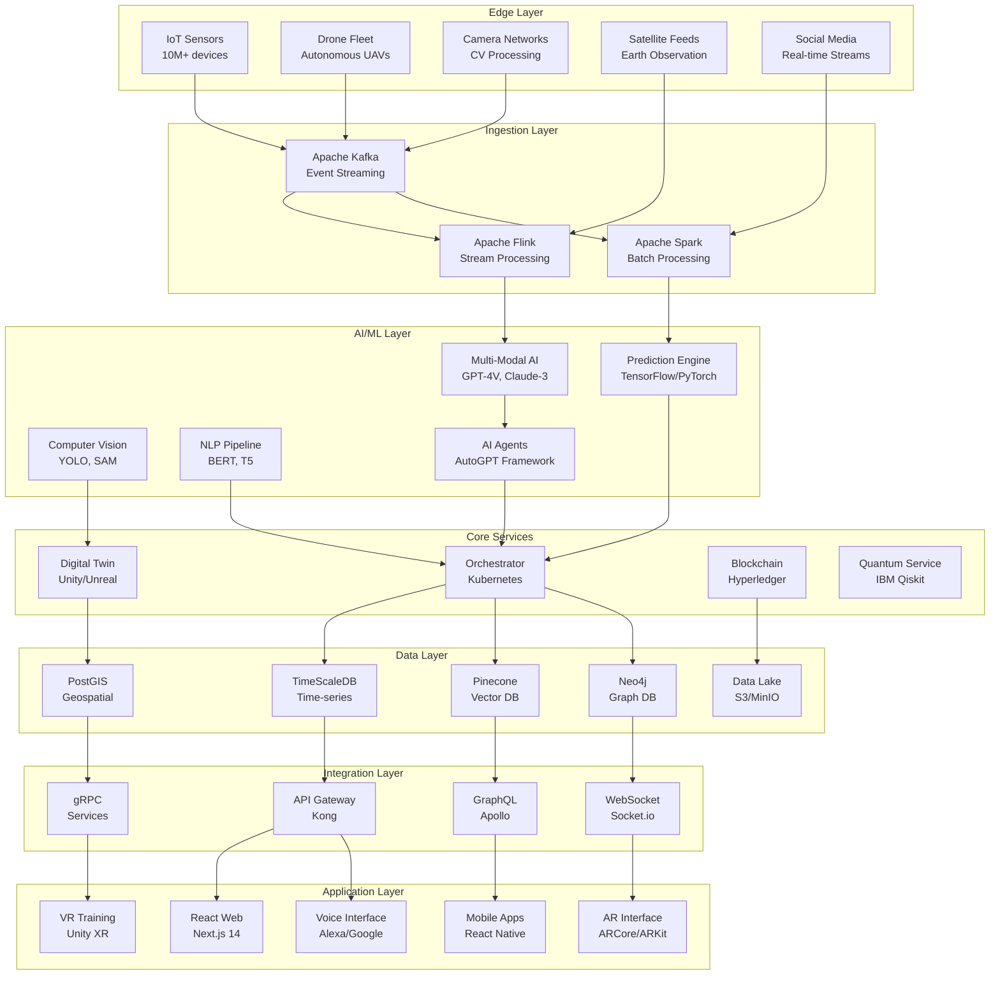
```mermaid
graph TB
    subgraph "Edge Layer"
        IOT[IoT Sensors<br/>10M+ devices]
        DRONE[Drone Fleet<br/>Autonomous UAVs]
        CAM[Camera Networks<br/>CV Processing]
        SAT[Satellite Feeds<br/>Earth Observation]
        SOCIAL[Social Media<br/>Real-time Streams]
    end

    subgraph "Ingestion Layer"
        KAFKA[Apache Kafka<br/>Event Streaming]
        FLINK[Apache Flink<br/>Stream Processing]
        SPARK[Apache Spark<br/>Batch Processing]
    end

    subgraph "AI/ML Layer"
        MULTIMODAL[Multi-Modal AI<br/>GPT-4V, Claude-3]
        PREDICTION[Prediction Engine<br/>TensorFlow/PyTorch]
        COMPUTER_VISION[Computer Vision<br/>YOLO, SAM]
        NLP[NLP Pipeline<br/>BERT, T5]
        AGENTS[AI Agents<br/>AutoGPT Framework]
    end

    subgraph "Core Services"
        ORCHESTRATOR[Orchestrator<br/>Kubernetes]
        DIGITAL_TWIN[Digital Twin<br/>Unity/Unreal]
        BLOCKCHAIN[Blockchain<br/>Hyperledger]
        QUANTUM[Quantum Service<br/>IBM Qiskit]
    end

    subgraph "Data Layer"
        TIMESERIES[TimeScaleDB<br/>Time-series]
        VECTOR[Pinecone<br/>Vector DB]
        GRAPH[Neo4j<br/>Graph DB]
        SPATIAL[PostGIS<br/>Geospatial]
        LAKE[Data Lake<br/>S3/MinIO]
    end

    subgraph "Application Layer"
        WEB[React Web<br/>Next.js 14]
        MOBILE[Mobile Apps<br/>React Native]
        AR[AR Interface<br/>ARCore/ARKit]
        VR[VR Training<br/>Unity XR]
        VOICE[Voice Interface<br/>Alexa/Google]
    end

    subgraph "Integration Layer"
        API[API Gateway<br/>Kong]
        GRAPHQL[GraphQL<br/>Apollo]
        WEBSOCKET[WebSocket<br/>Socket.io]
        GRPC[gRPC<br/>Services]
    end

    IOT --> KAFKA
    DRONE --> KAFKA
    CAM --> KAFKA
    SAT --> FLINK
    SOCIAL --> SPARK

    KAFKA --> FLINK
    KAFKA --> SPARK
    FLINK --> MULTIMODAL
    SPARK --> PREDICTION

    MULTIMODAL --> AGENTS
    PREDICTION --> ORCHESTRATOR
    COMPUTER_VISION --> DIGITAL_TWIN
    NLP --> ORCHESTRATOR
    AGENTS --> ORCHESTRATOR

    ORCHESTRATOR --> TIMESERIES
    ORCHESTRATOR --> VECTOR
    ORCHESTRATOR --> GRAPH
    DIGITAL_TWIN --> SPATIAL
    BLOCKCHAIN --> LAKE

    TIMESERIES --> API
    VECTOR --> GRAPHQL
    GRAPH --> WEBSOCKET
    SPATIAL --> GRPC

    API --> WEB
    GRAPHQL --> MOBILE
    WEBSOCKET --> AR
    GRPC --> VR
    API --> VOICE
```

## New Features and Capabilities

### 1. Predictive Intelligence System

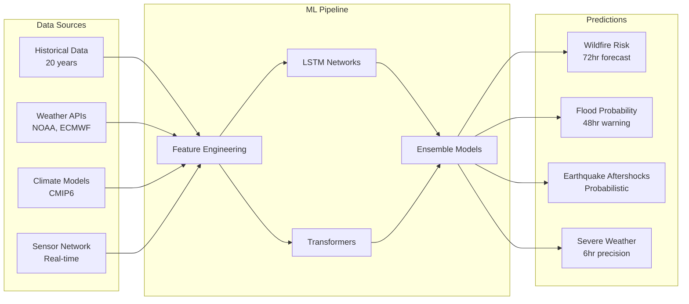
```mermaid
graph LR
    subgraph "Data Sources"
        HIST[Historical Data<br/>20 years]
        WEATHER[Weather APIs<br/>NOAA, ECMWF]
        CLIMATE[Climate Models<br/>CMIP6]
        SENSOR[Sensor Network<br/>Real-time]
    end

    subgraph "ML Pipeline"
        FEAT[Feature Engineering]
        LSTM[LSTM Networks]
        TRANS[Transformers]
        ENSEMBLE[Ensemble Models]
    end

    subgraph "Predictions"
        FIRE[Wildfire Risk<br/>72hr forecast]
        FLOOD[Flood Probability<br/>48hr warning]
        QUAKE[Earthquake Aftershocks<br/>Probabilistic]
        STORM[Severe Weather<br/>6hr precision]
    end

    HIST --> FEAT
    WEATHER --> FEAT
    CLIMATE --> FEAT
    SENSOR --> FEAT

    FEAT --> LSTM
    FEAT --> TRANS
    LSTM --> ENSEMBLE
    TRANS --> ENSEMBLE

    ENSEMBLE --> FIRE
    ENSEMBLE --> FLOOD
    ENSEMBLE --> QUAKE
    ENSEMBLE --> STORM
```

#### Technical Specifications
- **Model Architecture**: Ensemble of LSTM + Transformer + XGBoost
- **Training Data**: 20 years historical + real-time updates
- **Inference Speed**: < 100ms for point predictions
- **Accuracy Targets**: 85% at 24hr, 70% at 72hr
- **Update Frequency**: Models retrained daily, fine-tuned hourly

### 2. Multi-Agent AI System

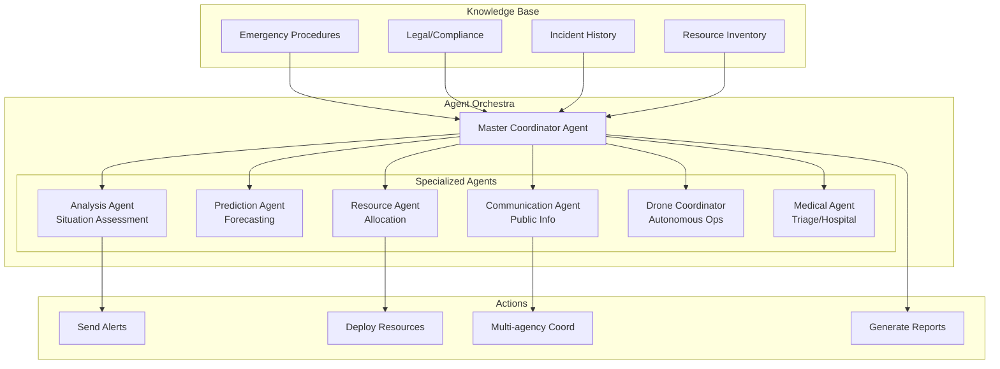
```mermaid
graph TB
    subgraph "Agent Orchestra"
        MASTER[Master Coordinator Agent]

        subgraph "Specialized Agents"
            ANALYSIS[Analysis Agent<br/>Situation Assessment]
            PREDICT[Prediction Agent<br/>Forecasting]
            RESOURCE[Resource Agent<br/>Allocation]
            COMMS[Communication Agent<br/>Public Info]
            DRONE_AI[Drone Coordinator<br/>Autonomous Ops]
            MEDICAL[Medical Agent<br/>Triage/Hospital]
        end
    end

    subgraph "Knowledge Base"
        PROCEDURES[Emergency Procedures]
        REGULATIONS[Legal/Compliance]
        HISTORY[Incident History]
        RESOURCES[Resource Inventory]
    end

    subgraph "Actions"
        ALERT[Send Alerts]
        DEPLOY[Deploy Resources]
        COORDINATE[Multi-agency Coord]
        REPORT[Generate Reports]
    end

    MASTER --> ANALYSIS
    MASTER --> PREDICT
    MASTER --> RESOURCE
    MASTER --> COMMS
    MASTER --> DRONE_AI
    MASTER --> MEDICAL

    PROCEDURES --> MASTER
    REGULATIONS --> MASTER
    HISTORY --> MASTER
    RESOURCES --> MASTER

    ANALYSIS --> ALERT
    RESOURCE --> DEPLOY
    COMMS --> COORDINATE
    MASTER --> REPORT
```

#### Agent Framework
- **Base Framework**: AutoGPT with custom extensions
- **Communication**: Agent-to-agent via message queues
- **Decision Making**: Reinforcement learning with human feedback
- **Explainability**: Decision trees for audit trail
- **Safety**: Kill switches and human override at every level

### 3. Real-Time Data Pipeline

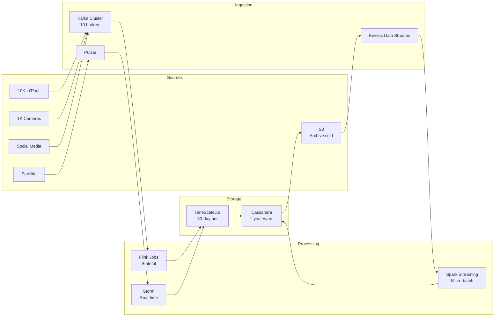
```mermaid
graph LR
    subgraph "Sources"
        S1[10K IoT/sec]
        S2[1K Cameras]
        S3[50 Drones]
        S4[Satellite]
        S5[Social Media]
    end

    subgraph "Ingestion"
        K1[Kafka Cluster<br/>10 brokers]
        K2[Kinesis Data Streams]
        K3[Pulsar]
    end

    subgraph "Processing"
        F1[Flink Jobs<br/>Stateful]
        F2[Spark Streaming<br/>Micro-batch]
        F3[Storm<br/>Real-time]
    end

    subgraph "Storage"
        TS[TimeScaleDB<br/>30-day hot]
        CS[Cassandra<br/>1-year warm]
        S3[S3<br/>Archive cold]
    end

    S1 --> K1
    S2 --> K1
    S3 --> K2
    S4 --> K3
    S5 --> K1

    K1 --> F1
    K2 --> F2
    K3 --> F3

    F1 --> TS
    F2 --> CS
    F3 --> TS

    TS --> CS
    CS --> S3
```

#### Pipeline Specifications
- **Throughput**: 1M events/second sustained
- **Latency**: < 500ms end-to-end
- **Durability**: 3x replication, multi-region
- **Scalability**: Auto-scaling based on load
- **Monitoring**: Datadog + Prometheus + Grafana

### 4. Digital Twin City Platform

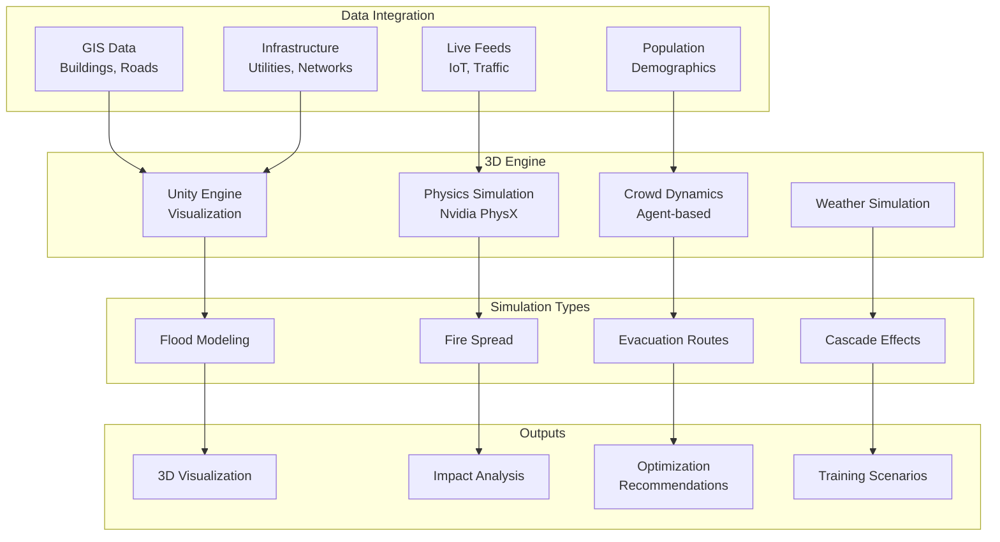
```mermaid
graph TB
    subgraph "Data Integration"
        GIS[GIS Data<br/>Buildings, Roads]
        INFRA[Infrastructure<br/>Utilities, Networks]
        POP[Population<br/>Demographics]
        LIVE[Live Feeds<br/>IoT, Traffic]
    end

    subgraph "3D Engine"
        UNITY[Unity Engine<br/>Visualization]
        PHYSICS[Physics Simulation<br/>Nvidia PhysX]
        WEATHER_SIM[Weather Simulation]
        CROWD[Crowd Dynamics<br/>Agent-based]
    end

    subgraph "Simulation Types"
        FLOOD_SIM[Flood Modeling]
        FIRE_SIM[Fire Spread]
        EVAC[Evacuation Routes]
        CASCADE[Cascade Effects]
    end

    subgraph "Outputs"
        VIS[3D Visualization]
        IMPACT[Impact Analysis]
        OPT[Optimization<br/>Recommendations]
        TRAIN[Training Scenarios]
    end

    GIS --> UNITY
    INFRA --> UNITY
    POP --> CROWD
    LIVE --> PHYSICS

    UNITY --> FLOOD_SIM
    PHYSICS --> FIRE_SIM
    CROWD --> EVAC
    WEATHER_SIM --> CASCADE

    FLOOD_SIM --> VIS
    FIRE_SIM --> IMPACT
    EVAC --> OPT
    CASCADE --> TRAIN
```

#### Digital Twin Features
- **City Coverage**: 100 square miles at 1-meter resolution
- **Update Frequency**: Real-time for critical assets
- **Simulation Speed**: 100x faster than real-time
- **Scenario Library**: 500+ pre-configured disaster scenarios
- **API Access**: RESTful and GraphQL for third-party integration

### 5. Autonomous Systems Integration

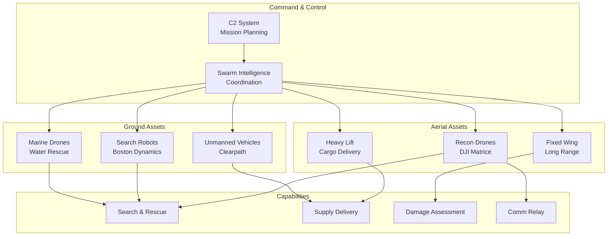
```mermaid
graph TB
    subgraph "Command & Control"
        C2[C2 System<br/>Mission Planning]
        SWARM[Swarm Intelligence<br/>Coordination]
    end

    subgraph "Aerial Assets"
        RECON[Recon Drones<br/>DJI Matrice]
        HEAVY[Heavy Lift<br/>Cargo Delivery]
        FIXED[Fixed Wing<br/>Long Range]
    end

    subgraph "Ground Assets"
        ROBOT[Search Robots<br/>Boston Dynamics]
        UGV[Unmanned Vehicles<br/>Clearpath]
        BOAT[Marine Drones<br/>Water Rescue]
    end

    subgraph "Capabilities"
        SEARCH[Search & Rescue]
        DELIVER[Supply Delivery]
        ASSESS[Damage Assessment]
        COMM[Comm Relay]
    end

    C2 --> SWARM
    SWARM --> RECON
    SWARM --> HEAVY
    SWARM --> FIXED
    SWARM --> ROBOT
    SWARM --> UGV
    SWARM --> BOAT

    RECON --> SEARCH
    HEAVY --> DELIVER
    FIXED --> ASSESS
    ROBOT --> SEARCH
    UGV --> DELIVER
    BOAT --> SEARCH
    RECON --> COMM
```

#### Autonomous Capabilities
- **Fleet Size**: 100 aerial, 50 ground units
- **Autonomy Level**: Level 4 (Human oversight)
- **Communication**: Mesh networking, satellite backup
- **Endurance**: 2-24 hours depending on platform
- **Payload**: Cameras, sensors, supplies, communication

## Technology Stack Recommendations

### Core Infrastructure

| Component | Technology | Rationale |
|-----------|------------|-----------|
| **Container Orchestration** | Kubernetes (K8s) | Industry standard, scalable |
| **Service Mesh** | Istio | Traffic management, security |
| **Message Queue** | Apache Kafka | High throughput, reliable |
| **Stream Processing** | Apache Flink | Stateful, exactly-once processing |
| **API Gateway** | Kong | Extensible, high performance |
| **Load Balancer** | NGINX Plus | Advanced features, monitoring |
| **CDN** | Cloudflare | Global presence, DDoS protection |
| **Monitoring** | Datadog + Prometheus | Comprehensive observability |

### AI/ML Stack

| Component | Technology | Rationale |
|-----------|------------|-----------|
| **Deep Learning** | PyTorch 2.0 | Dynamic graphs, research-friendly |
| **Computer Vision** | YOLOv8, SAM | State-of-the-art detection |
| **NLP** | Hugging Face | Extensive model library |
| **MLOps** | MLflow + Kubeflow | Full lifecycle management |
| **Vector Database** | Pinecone | Scalable similarity search |
| **Model Serving** | TorchServe + Triton | Optimized inference |
| **AutoML** | H2O.ai | Automated model selection |
| **Federated Learning** | PySyft | Privacy-preserving training |

### Data Infrastructure

| Component | Technology | Rationale |
|-----------|------------|-----------|
| **Time-series DB** | TimeScaleDB | PostgreSQL compatible |
| **Graph Database** | Neo4j | Relationship modeling |
| **Document Store** | MongoDB | Flexible schema |
| **Data Lake** | Apache Iceberg | ACID transactions |
| **Data Warehouse** | Snowflake | Scalable analytics |
| **Search** | Elasticsearch | Full-text search |
| **Cache** | Redis Enterprise | In-memory performance |
| **Spatial DB** | PostGIS | Geospatial queries |

### Frontend Technologies

| Component | Technology | Rationale |
|-----------|------------|-----------|
| **Web Framework** | Next.js 14 | SSR, performance |
| **Mobile** | React Native | Code reuse |
| **State Management** | Zustand | Simple, performant |
| **UI Components** | Ant Design + Tailwind | Comprehensive, customizable |
| **Mapping** | Mapbox GL | Advanced visualization |
| **3D Graphics** | Three.js | WebGL abstraction |
| **AR** | AR.js + 8th Wall | Web-based AR |
| **Real-time** | Socket.io | WebSocket abstraction |

## AI/ML Architecture

### Multi-Modal AI Processing Pipeline

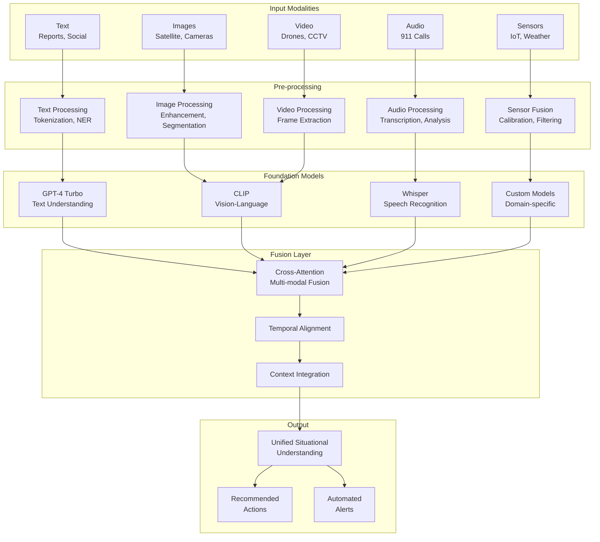
```mermaid
graph TB
    subgraph "Input Modalities"
        TEXT[Text<br/>Reports, Social]
        IMAGE[Images<br/>Satellite, Cameras]
        VIDEO[Video<br/>Drones, CCTV]
        AUDIO[Audio<br/>911 Calls]
        SENSOR[Sensors<br/>IoT, Weather]
    end

    subgraph "Pre-processing"
        TEXT_PROC[Text Processing<br/>Tokenization, NER]
        IMG_PROC[Image Processing<br/>Enhancement, Segmentation]
        VID_PROC[Video Processing<br/>Frame Extraction]
        AUDIO_PROC[Audio Processing<br/>Transcription, Analysis]
        SENSOR_PROC[Sensor Fusion<br/>Calibration, Filtering]
    end

    subgraph "Foundation Models"
        GPT[GPT-4 Turbo<br/>Text Understanding]
        CLIP[CLIP<br/>Vision-Language]
        WHISPER[Whisper<br/>Speech Recognition]
        CUSTOM[Custom Models<br/>Domain-specific]
    end

    subgraph "Fusion Layer"
        ATTENTION[Cross-Attention<br/>Multi-modal Fusion]
        ALIGNMENT[Temporal Alignment]
        CONTEXT[Context Integration]
    end

    subgraph "Output"
        UNIFIED[Unified Situational<br/>Understanding]
        ACTIONS[Recommended<br/>Actions]
        ALERTS[Automated<br/>Alerts]
    end

    TEXT --> TEXT_PROC --> GPT
    IMAGE --> IMG_PROC --> CLIP
    VIDEO --> VID_PROC --> CLIP
    AUDIO --> AUDIO_PROC --> WHISPER
    SENSOR --> SENSOR_PROC --> CUSTOM

    GPT --> ATTENTION
    CLIP --> ATTENTION
    WHISPER --> ATTENTION
    CUSTOM --> ATTENTION

    ATTENTION --> ALIGNMENT
    ALIGNMENT --> CONTEXT
    CONTEXT --> UNIFIED
    UNIFIED --> ACTIONS
    UNIFIED --> ALERTS
```

### RAG (Retrieval-Augmented Generation) System

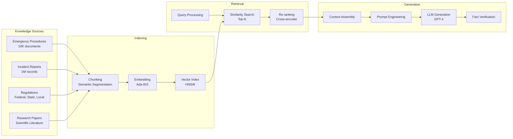
```mermaid
graph LR
    subgraph "Knowledge Sources"
        DOCS[Emergency Procedures<br/>10K documents]
        HISTORY[Incident Reports<br/>1M records]
        REGS[Regulations<br/>Federal, State, Local]
        RESEARCH[Research Papers<br/>Scientific Literature]
    end

    subgraph "Indexing"
        CHUNK[Chunking<br/>Semantic Segmentation]
        EMBED[Embedding<br/>Ada-002]
        INDEX[Vector Index<br/>HNSW]
    end

    subgraph "Retrieval"
        QUERY[Query Processing]
        SEARCH[Similarity Search<br/>Top-K]
        RERANK[Re-ranking<br/>Cross-encoder]
    end

    subgraph "Generation"
        CONTEXT[Context Assembly]
        PROMPT[Prompt Engineering]
        LLM[LLM Generation<br/>GPT-4]
        VERIFY[Fact Verification]
    end

    DOCS --> CHUNK
    HISTORY --> CHUNK
    REGS --> CHUNK
    RESEARCH --> CHUNK

    CHUNK --> EMBED
    EMBED --> INDEX

    QUERY --> SEARCH
    INDEX --> SEARCH
    SEARCH --> RERANK

    RERANK --> CONTEXT
    CONTEXT --> PROMPT
    PROMPT --> LLM
    LLM --> VERIFY
```

### Model Training and Fine-Tuning Pipeline

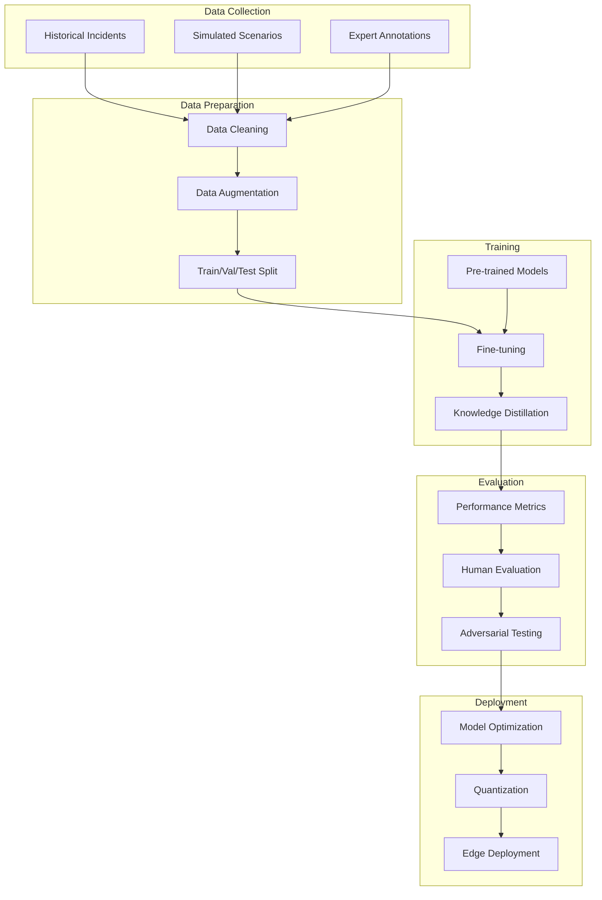
```mermaid
graph TB
    subgraph "Data Collection"
        HISTORICAL[Historical Incidents]
        SIMULATED[Simulated Scenarios]
        EXPERT[Expert Annotations]
    end

    subgraph "Data Preparation"
        CLEAN[Data Cleaning]
        AUGMENT[Data Augmentation]
        SPLIT[Train/Val/Test Split]
    end

    subgraph "Training"
        PRETRAIN[Pre-trained Models]
        FINETUNE[Fine-tuning]
        DISTILL[Knowledge Distillation]
    end

    subgraph "Evaluation"
        METRICS[Performance Metrics]
        HUMAN[Human Evaluation]
        ADVERSARIAL[Adversarial Testing]
    end

    subgraph "Deployment"
        OPTIMIZE[Model Optimization]
        QUANTIZE[Quantization]
        DEPLOY[Edge Deployment]
    end

    HISTORICAL --> CLEAN
    SIMULATED --> CLEAN
    EXPERT --> CLEAN

    CLEAN --> AUGMENT
    AUGMENT --> SPLIT

    SPLIT --> FINETUNE
    PRETRAIN --> FINETUNE
    FINETUNE --> DISTILL

    DISTILL --> METRICS
    METRICS --> HUMAN
    HUMAN --> ADVERSARIAL

    ADVERSARIAL --> OPTIMIZE
    OPTIMIZE --> QUANTIZE
    QUANTIZE --> DEPLOY
```

## Database Design

### Multi-Model Database Architecture

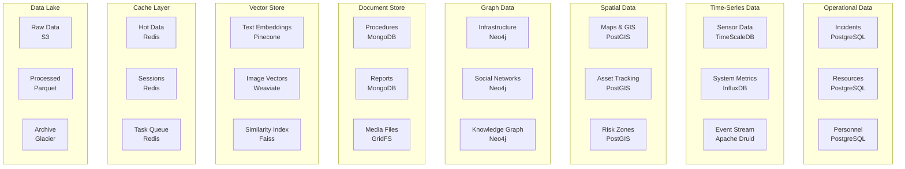
```mermaid
graph TB
    subgraph "Operational Data"
        INCIDENTS[Incidents<br/>PostgreSQL]
        RESOURCES[Resources<br/>PostgreSQL]
        PERSONNEL[Personnel<br/>PostgreSQL]
    end

    subgraph "Time-Series Data"
        SENSORS[Sensor Data<br/>TimeScaleDB]
        METRICS[System Metrics<br/>InfluxDB]
        EVENTS[Event Stream<br/>Apache Druid]
    end

    subgraph "Spatial Data"
        MAPS[Maps & GIS<br/>PostGIS]
        TRACKING[Asset Tracking<br/>PostGIS]
        ZONES[Risk Zones<br/>PostGIS]
    end

    subgraph "Graph Data"
        DEPENDENCIES[Infrastructure<br/>Neo4j]
        SOCIAL_NET[Social Networks<br/>Neo4j]
        KNOWLEDGE[Knowledge Graph<br/>Neo4j]
    end

    subgraph "Document Store"
        PROCEDURES[Procedures<br/>MongoDB]
        REPORTS[Reports<br/>MongoDB]
        MULTIMEDIA[Media Files<br/>GridFS]
    end

    subgraph "Vector Store"
        EMBEDDINGS[Text Embeddings<br/>Pinecone]
        IMAGE_VECTORS[Image Vectors<br/>Weaviate]
        SIMILARITY[Similarity Index<br/>Faiss]
    end

    subgraph "Cache Layer"
        HOT[Hot Data<br/>Redis]
        SESSION[Sessions<br/>Redis]
        QUEUE[Task Queue<br/>Redis]
    end

    subgraph "Data Lake"
        RAW[Raw Data<br/>S3]
        PROCESSED[Processed<br/>Parquet]
        ARCHIVE[Archive<br/>Glacier]
    end
```

### Core Database Schemas

#### Incident Management Schema
```sql
-- Main incident table
CREATE TABLE incidents (
    id UUID PRIMARY KEY DEFAULT gen_random_uuid(),
    incident_number VARCHAR(50) UNIQUE NOT NULL,
    type VARCHAR(100) NOT NULL,
    severity ENUM('low', 'medium', 'high', 'critical'),
    status ENUM('reported', 'verified', 'responding', 'contained', 'resolved'),
    location GEOGRAPHY(POINT, 4326),
    polygon_area GEOGRAPHY(POLYGON, 4326),
    reported_at TIMESTAMP WITH TIME ZONE,
    verified_at TIMESTAMP WITH TIME ZONE,
    resolved_at TIMESTAMP WITH TIME ZONE,
    ai_confidence DECIMAL(3, 2),
    casualties JSONB,
    damage_estimate DECIMAL(15, 2),
    created_by UUID REFERENCES users(id),
    metadata JSONB,
    vector_embedding vector(1536) -- For semantic search
);

-- AI predictions table
CREATE TABLE predictions (
    id UUID PRIMARY KEY DEFAULT gen_random_uuid(),
    incident_type VARCHAR(100),
    location GEOGRAPHY(POINT, 4326),
    probability DECIMAL(3, 2),
    predicted_impact JSONB,
    confidence_interval JSONB,
    model_version VARCHAR(50),
    created_at TIMESTAMP WITH TIME ZONE DEFAULT NOW(),
    expires_at TIMESTAMP WITH TIME ZONE,
    actual_outcome JSONB,
    feedback_score DECIMAL(3, 2)
);

-- Resource allocation table
CREATE TABLE resource_allocations (
    id UUID PRIMARY KEY DEFAULT gen_random_uuid(),
    incident_id UUID REFERENCES incidents(id),
    resource_type VARCHAR(100),
    quantity INTEGER,
    unit VARCHAR(50),
    location GEOGRAPHY(POINT, 4326),
    status ENUM('requested', 'dispatched', 'on_scene', 'returning'),
    eta TIMESTAMP WITH TIME ZONE,
    assigned_by UUID REFERENCES users(id),
    ai_recommended BOOLEAN DEFAULT FALSE,
    priority INTEGER,
    metadata JSONB
);
```

#### Time-Series Schema (TimeScaleDB)
```sql
-- Sensor data hypertable
CREATE TABLE sensor_data (
    time TIMESTAMPTZ NOT NULL,
    sensor_id UUID NOT NULL,
    location GEOGRAPHY(POINT, 4326),
    metric_type VARCHAR(50),
    value DOUBLE PRECISION,
    unit VARCHAR(20),
    quality DECIMAL(3, 2),
    metadata JSONB
);

SELECT create_hypertable('sensor_data', 'time',
    chunk_time_interval => INTERVAL '1 hour');

-- Create continuous aggregates for performance
CREATE MATERIALIZED VIEW sensor_hourly
WITH (timescaledb.continuous) AS
SELECT
    time_bucket('1 hour', time) AS hour,
    sensor_id,
    metric_type,
    AVG(value) as avg_value,
    MAX(value) as max_value,
    MIN(value) as min_value,
    COUNT(*) as sample_count
FROM sensor_data
GROUP BY hour, sensor_id, metric_type
WITH NO DATA;
```

#### Graph Database Schema (Neo4j)
```cypher
// Infrastructure dependencies
CREATE (power:Infrastructure {
    type: 'PowerGrid',
    id: 'grid-001',
    capacity: 1000,
    unit: 'MW'
})

CREATE (hospital:Facility {
    type: 'Hospital',
    id: 'hosp-001',
    beds: 500,
    criticality: 'high'
})

CREATE (power)-[:POWERS {priority: 1}]->(hospital)

// Social network for crisis communication
CREATE (user:Person {
    id: 'user-001',
    role: 'EmergencyManager',
    clearance: 'high'
})

CREATE (alert:Alert {
    id: 'alert-001',
    severity: 'critical',
    message: 'Evacuation order'
})

CREATE (user)-[:AUTHORIZED_TO_SEND]->(alert)
CREATE (alert)-[:TARGETS]->(zone:Zone {id: 'zone-A'})
```

## Microservices vs Monolith Considerations

### Recommended Architecture: Hybrid Microservices

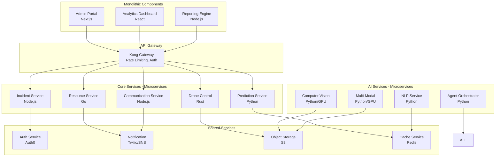
```mermaid
graph TB
    subgraph "API Gateway"
        KONG[Kong Gateway<br/>Rate Limiting, Auth]
    end

    subgraph "Core Services - Microservices"
        INCIDENT[Incident Service<br/>Node.js]
        PREDICT[Prediction Service<br/>Python]
        RESOURCE[Resource Service<br/>Go]
        COMM[Communication Service<br/>Node.js]
        DRONE[Drone Control<br/>Rust]
    end

    subgraph "AI Services - Microservices"
        VISION[Computer Vision<br/>Python/GPU]
        NLP_SVC[NLP Service<br/>Python]
        MULTIMODAL_SVC[Multi-Modal<br/>Python/GPU]
        AGENT[Agent Orchestrator<br/>Python]
    end

    subgraph "Monolithic Components"
        ADMIN[Admin Portal<br/>Next.js]
        ANALYTICS[Analytics Dashboard<br/>React]
        REPORTING[Reporting Engine<br/>Node.js]
    end

    subgraph "Shared Services"
        AUTH[Auth Service<br/>Auth0]
        NOTIFICATION[Notification<br/>Twilio/SNS]
        STORAGE[Object Storage<br/>S3]
        CACHE_SVC[Cache Service<br/>Redis]
    end

    KONG --> INCIDENT
    KONG --> PREDICT
    KONG --> RESOURCE
    KONG --> COMM
    KONG --> DRONE

    INCIDENT --> AUTH
    PREDICT --> CACHE_SVC
    RESOURCE --> NOTIFICATION
    COMM --> NOTIFICATION
    DRONE --> STORAGE

    VISION --> STORAGE
    NLP_SVC --> CACHE_SVC
    MULTIMODAL_SVC --> STORAGE
    AGENT --> ALL

    ADMIN --> KONG
    ANALYTICS --> KONG
    REPORTING --> KONG
```

### Service Communication Patterns

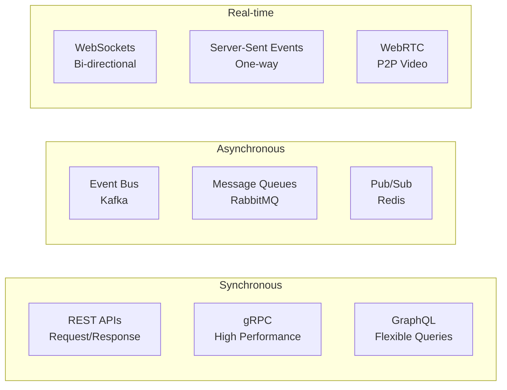
```mermaid
graph LR
    subgraph "Synchronous"
        REST[REST APIs<br/>Request/Response]
        GRPC_SYNC[gRPC<br/>High Performance]
        GRAPHQL_API[GraphQL<br/>Flexible Queries]
    end

    subgraph "Asynchronous"
        EVENTS[Event Bus<br/>Kafka]
        QUEUES[Message Queues<br/>RabbitMQ]
        PUBSUB[Pub/Sub<br/>Redis]
    end

    subgraph "Real-time"
        WEBSOCKET_RT[WebSockets<br/>Bi-directional]
        SSE[Server-Sent Events<br/>One-way]
        WEBRTC[WebRTC<br/>P2P Video]
    end
```

## Scalability and Performance Design

### Horizontal Scaling Strategy

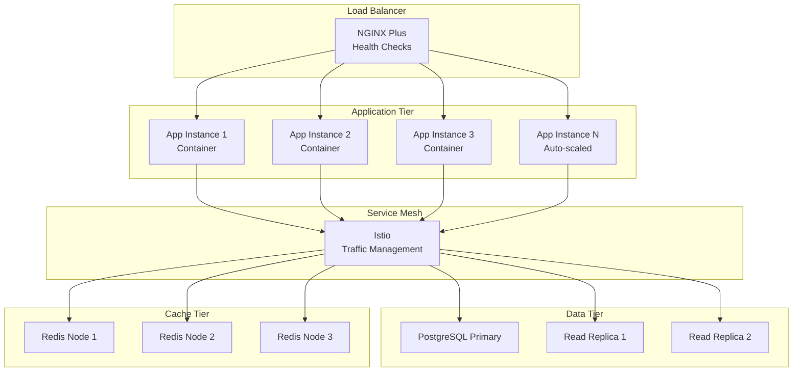
```mermaid
graph TB
    subgraph "Load Balancer"
        LB[NGINX Plus<br/>Health Checks]
    end

    subgraph "Application Tier"
        APP1[App Instance 1<br/>Container]
        APP2[App Instance 2<br/>Container]
        APP3[App Instance 3<br/>Container]
        APPN[App Instance N<br/>Auto-scaled]
    end

    subgraph "Service Mesh"
        ISTIO[Istio<br/>Traffic Management]
    end

    subgraph "Data Tier"
        DB_PRIMARY[PostgreSQL Primary]
        DB_REPLICA1[Read Replica 1]
        DB_REPLICA2[Read Replica 2]
    end

    subgraph "Cache Tier"
        REDIS1[Redis Node 1]
        REDIS2[Redis Node 2]
        REDIS3[Redis Node 3]
    end

    LB --> APP1
    LB --> APP2
    LB --> APP3
    LB --> APPN

    APP1 --> ISTIO
    APP2 --> ISTIO
    APP3 --> ISTIO
    APPN --> ISTIO

    ISTIO --> DB_PRIMARY
    ISTIO --> DB_REPLICA1
    ISTIO --> DB_REPLICA2

    ISTIO --> REDIS1
    ISTIO --> REDIS2
    ISTIO --> REDIS3
```

### Performance Optimization Strategies

| Layer | Strategy | Target Metrics |
|-------|----------|----------------|
| **CDN** | Edge caching, compression | < 50ms global latency |
| **API** | Response caching, pagination | < 100ms p95 response |
| **Database** | Indexing, partitioning, read replicas | < 10ms queries |
| **Compute** | GPU acceleration for AI | 10x inference speedup |
| **Network** | Connection pooling, HTTP/3 | 30% bandwidth reduction |
| **Storage** | Tiered storage, compression | 50% cost reduction |
| **Frontend** | Code splitting, lazy loading | < 2s initial load |

### Auto-Scaling Configuration

```yaml
# Kubernetes HPA configuration
apiVersion: autoscaling/v2
kind: HorizontalPodAutoscaler
metadata:
  name: aegis-api-hpa
spec:
  scaleTargetRef:
    apiVersion: apps/v1
    kind: Deployment
    name: aegis-api
  minReplicas: 3
  maxReplicas: 100
  metrics:
  - type: Resource
    resource:
      name: cpu
      target:
        type: Utilization
        averageUtilization: 70
  - type: Resource
    resource:
      name: memory
      target:
        type: Utilization
        averageUtilization: 80
  - type: Pods
    pods:
      metric:
        name: requests_per_second
      target:
        type: AverageValue
        averageValue: "1000"
  behavior:
    scaleUp:
      stabilizationWindowSeconds: 30
      policies:
      - type: Percent
        value: 100
        periodSeconds: 30
    scaleDown:
      stabilizationWindowSeconds: 300
      policies:
      - type: Percent
        value: 50
        periodSeconds: 60
```

## Security and Compliance Architecture

### Security Layers

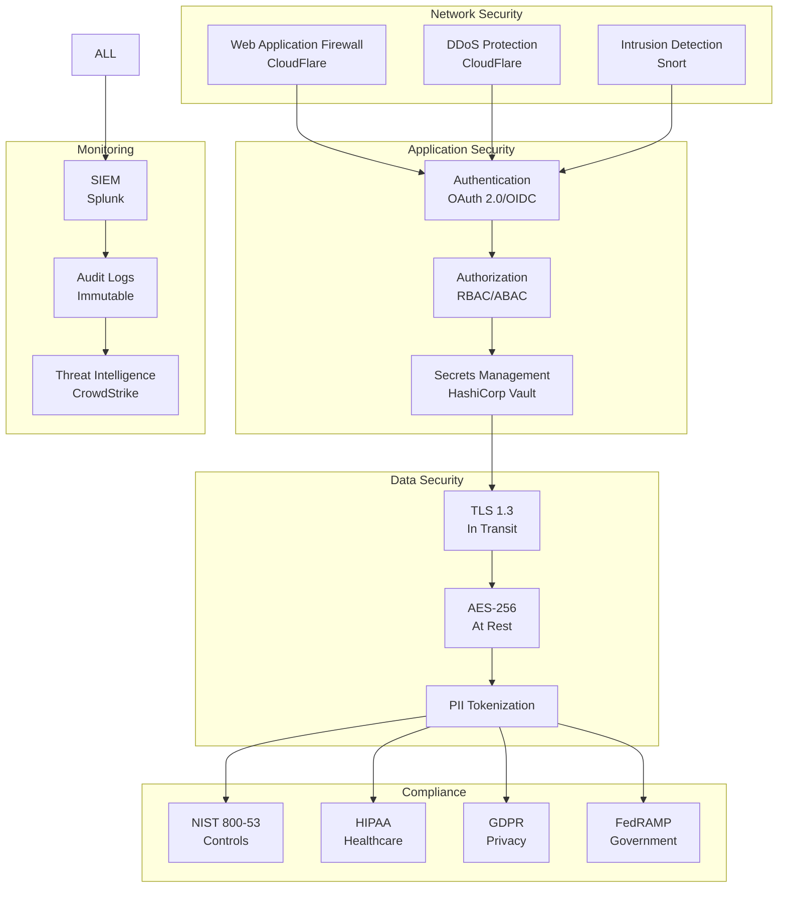
```mermaid
graph TB
    subgraph "Network Security"
        WAF[Web Application Firewall<br/>CloudFlare]
        DDOS[DDoS Protection<br/>CloudFlare]
        IDS[Intrusion Detection<br/>Snort]
    end

    subgraph "Application Security"
        AUTH_N[Authentication<br/>OAuth 2.0/OIDC]
        AUTH_Z[Authorization<br/>RBAC/ABAC]
        SECRETS[Secrets Management<br/>HashiCorp Vault]
    end

    subgraph "Data Security"
        ENCRYPT_TRANSIT[TLS 1.3<br/>In Transit]
        ENCRYPT_REST[AES-256<br/>At Rest]
        TOKENIZATION[PII Tokenization]
    end

    subgraph "Compliance"
        NIST[NIST 800-53<br/>Controls]
        HIPAA[HIPAA<br/>Healthcare]
        GDPR[GDPR<br/>Privacy]
        FEDRAMP[FedRAMP<br/>Government]
    end

    subgraph "Monitoring"
        SIEM[SIEM<br/>Splunk]
        AUDIT[Audit Logs<br/>Immutable]
        THREAT[Threat Intelligence<br/>CrowdStrike]
    end

    WAF --> AUTH_N
    DDOS --> AUTH_N
    IDS --> AUTH_N

    AUTH_N --> AUTH_Z
    AUTH_Z --> SECRETS

    SECRETS --> ENCRYPT_TRANSIT
    ENCRYPT_TRANSIT --> ENCRYPT_REST
    ENCRYPT_REST --> TOKENIZATION

    TOKENIZATION --> NIST
    TOKENIZATION --> HIPAA
    TOKENIZATION --> GDPR
    TOKENIZATION --> FEDRAMP

    ALL --> SIEM
    SIEM --> AUDIT
    AUDIT --> THREAT
```

### Zero Trust Architecture

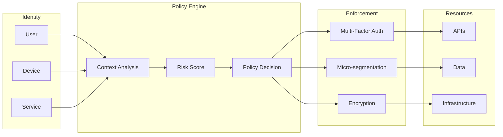
```mermaid
graph LR
    subgraph "Identity"
        USER[User]
        DEVICE[Device]
        SERVICE[Service]
    end

    subgraph "Policy Engine"
        CONTEXT[Context Analysis]
        RISK[Risk Score]
        POLICY[Policy Decision]
    end

    subgraph "Enforcement"
        MFA[Multi-Factor Auth]
        MICRO[Micro-segmentation]
        ENCRYPT[Encryption]
    end

    subgraph "Resources"
        API_RES[APIs]
        DATA_RES[Data]
        INFRA[Infrastructure]
    end

    USER --> CONTEXT
    DEVICE --> CONTEXT
    SERVICE --> CONTEXT

    CONTEXT --> RISK
    RISK --> POLICY

    POLICY --> MFA
    POLICY --> MICRO
    POLICY --> ENCRYPT

    MFA --> API_RES
    MICRO --> DATA_RES
    ENCRYPT --> INFRA
```

### Compliance Requirements Matrix

| Regulation | Requirement | Implementation |
|------------|------------|----------------|
| **NIST 800-53** | Access Control | RBAC with MFA |
| **HIPAA** | PHI Protection | Encryption + Audit |
| **GDPR** | Right to Delete | Data retention policies |
| **FedRAMP** | Continuous Monitoring | SIEM + Automated scanning |
| **SOC 2** | Availability | 99.99% SLA |
| **ISO 27001** | Risk Management | Annual assessment |
| **CJIS** | Criminal Justice Data | Background checks |

## Integration Architecture

### External System Integrations


```mermaid
graph TB
    subgraph "Aegis Platform"
        CORE[Core Platform]
        ADAPTER[Integration Adapters]
        TRANSFORM[Data Transformers]
    end

    subgraph "Government Systems"
        FEMA[FEMA IPAWS]
        NOAA[NOAA Weather]
        USGS[USGS Earthquakes]
        CDC[CDC Health Alerts]
    end

    subgraph "Infrastructure"
        SCADA[SCADA Systems]
        TRAFFIC[Traffic Management]
        UTILITY[Utility Networks]
        TELECOM[Telecom Networks]
    end

    subgraph "Commercial APIs"
        GOOGLE[Google Maps]
        TWITTER[Twitter API]
        WEATHER_COM[Weather.com]
        SATELLITE_IMG[Planet Labs]
    end

    subgraph "Emergency Services"
        CAD[CAD Systems]
        RMS[Records Management]
        MDT[Mobile Data Terms]
        RADIO[Radio Systems]
    end

    CORE --> ADAPTER
    ADAPTER --> TRANSFORM

    TRANSFORM <--> FEMA
    TRANSFORM <--> NOAA
    TRANSFORM <--> USGS
    TRANSFORM <--> CDC

    TRANSFORM <--> SCADA
    TRANSFORM <--> TRAFFIC
    TRANSFORM <--> UTILITY
    TRANSFORM <--> TELECOM

    TRANSFORM <--> GOOGLE
    TRANSFORM <--> TWITTER
    TRANSFORM <--> WEATHER_COM
    TRANSFORM <--> SATELLITE_IMG

    TRANSFORM <--> CAD
    TRANSFORM <--> RMS
    TRANSFORM <--> MDT
    TRANSFORM <--> RADIO
```

### API Standards and Protocols

| Integration Type | Protocol | Format | Authentication |
|-----------------|----------|---------|----------------|
| **Government** | SOAP/REST | XML/JSON | OAuth 2.0 |
| **IoT Devices** | MQTT/CoAP | Binary/JSON | TLS + API Key |
| **Emergency Systems** | CAP/EDXL | XML | SAML 2.0 |
| **Social Media** | REST | JSON | OAuth 2.0 |
| **Satellite** | REST/FTP | GeoTIFF/HDF | API Key |
| **Weather** | REST/WebSocket | JSON/GRIB | API Key |
| **Infrastructure** | OPC-UA/Modbus | Binary | Certificate |

## Mobile-First Design Architecture

### Responsive Design Strategy

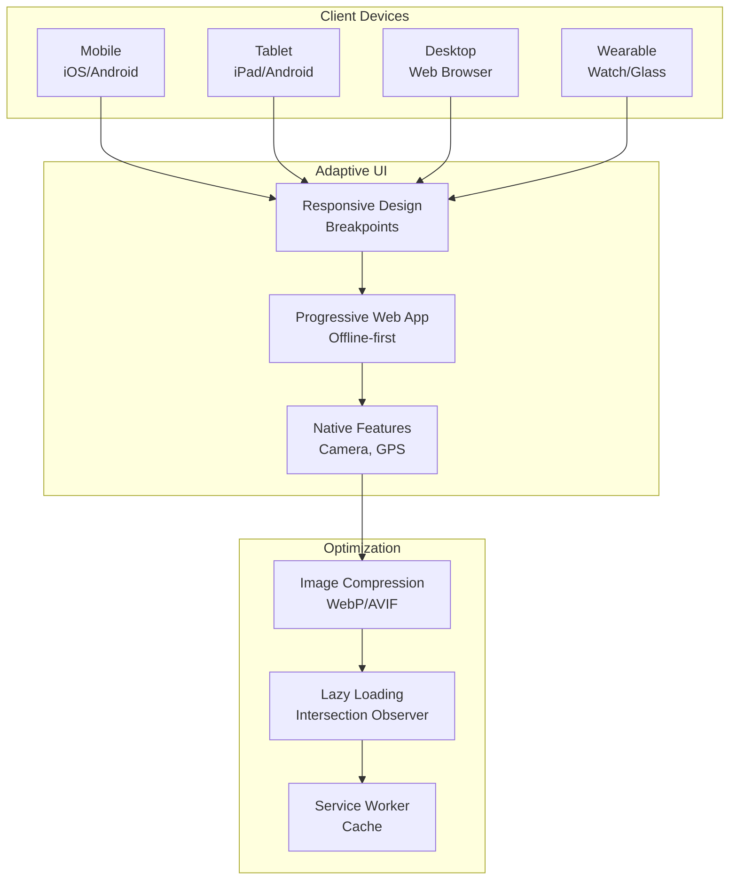
```mermaid
graph TB
    subgraph "Client Devices"
        MOBILE[Mobile<br/>iOS/Android]
        TABLET[Tablet<br/>iPad/Android]
        DESKTOP[Desktop<br/>Web Browser]
        WEARABLE[Wearable<br/>Watch/Glass]
    end

    subgraph "Adaptive UI"
        RESPONSIVE[Responsive Design<br/>Breakpoints]
        PWA[Progressive Web App<br/>Offline-first]
        NATIVE[Native Features<br/>Camera, GPS]
    end

    subgraph "Optimization"
        COMPRESS[Image Compression<br/>WebP/AVIF]
        LAZY[Lazy Loading<br/>Intersection Observer]
        CACHE_UI[Service Worker<br/>Cache]
    end

    MOBILE --> RESPONSIVE
    TABLET --> RESPONSIVE
    DESKTOP --> RESPONSIVE
    WEARABLE --> RESPONSIVE

    RESPONSIVE --> PWA
    PWA --> NATIVE

    NATIVE --> COMPRESS
    COMPRESS --> LAZY
    LAZY --> CACHE_UI
```

### Offline Capabilities

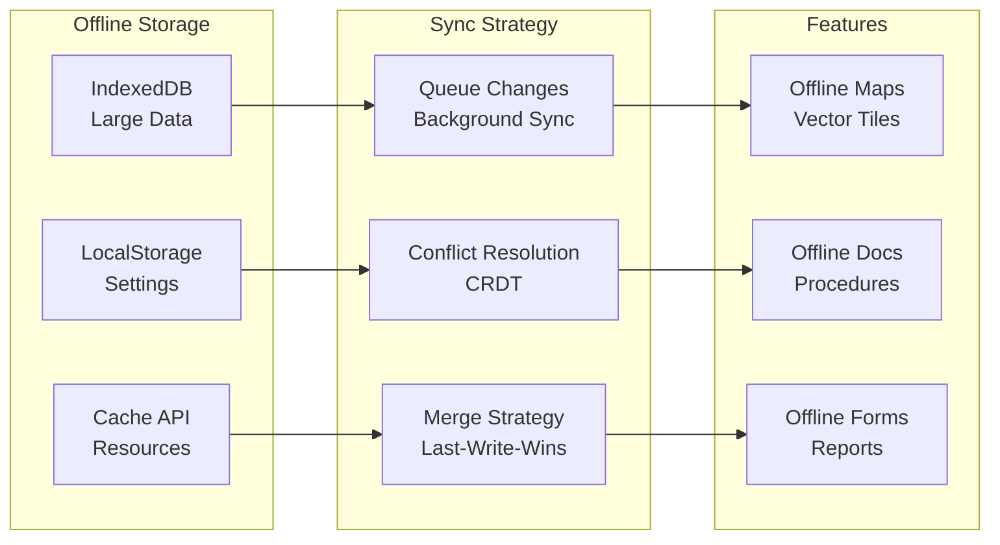
```mermaid
graph LR
    subgraph "Offline Storage"
        INDEXED[IndexedDB<br/>Large Data]
        LOCAL[LocalStorage<br/>Settings]
        CACHE_STOR[Cache API<br/>Resources]
    end

    subgraph "Sync Strategy"
        QUEUE_SYNC[Queue Changes<br/>Background Sync]
        CONFLICT[Conflict Resolution<br/>CRDT]
        MERGE[Merge Strategy<br/>Last-Write-Wins]
    end

    subgraph "Features"
        MAPS_OFF[Offline Maps<br/>Vector Tiles]
        DOCS_OFF[Offline Docs<br/>Procedures]
        FORMS_OFF[Offline Forms<br/>Reports]
    end

    INDEXED --> QUEUE_SYNC
    LOCAL --> CONFLICT
    CACHE_STOR --> MERGE

    QUEUE_SYNC --> MAPS_OFF
    CONFLICT --> DOCS_OFF
    MERGE --> FORMS_OFF
```

## Accessibility and Internationalization

### Accessibility Features (WCAG 2.1 AAA)

| Feature | Implementation | Compliance |
|---------|---------------|------------|
| **Screen Readers** | ARIA labels, semantic HTML | NVDA, JAWS |
| **Keyboard Navigation** | Tab order, shortcuts | Full keyboard |
| **Color Contrast** | 7:1 ratio minimum | AAA standard |
| **Text Scaling** | Responsive units (rem) | 200% zoom |
| **Audio Descriptions** | Video transcripts | Closed captions |
| **Cognitive** | Simple language, help text | Plain English |
| **Motor** | Large touch targets | 44x44px minimum |

### Internationalization Architecture

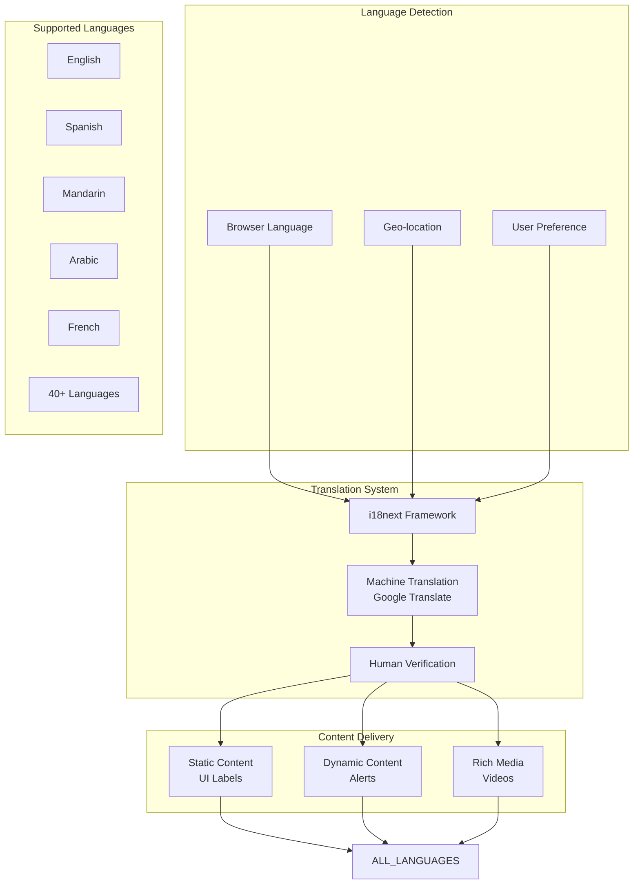
```mermaid
graph TB
    subgraph "Language Detection"
        BROWSER[Browser Language]
        GEO[Geo-location]
        USER_PREF[User Preference]
    end

    subgraph "Translation System"
        I18N[i18next Framework]
        MACHINE[Machine Translation<br/>Google Translate]
        HUMAN[Human Verification]
    end

    subgraph "Content Delivery"
        STATIC[Static Content<br/>UI Labels]
        DYNAMIC[Dynamic Content<br/>Alerts]
        RICH[Rich Media<br/>Videos]
    end

    subgraph "Supported Languages"
        EN[English]
        ES[Spanish]
        ZH[Mandarin]
        AR[Arabic]
        FR[French]
        MORE[40+ Languages]
    end

    BROWSER --> I18N
    GEO --> I18N
    USER_PREF --> I18N

    I18N --> MACHINE
    MACHINE --> HUMAN

    HUMAN --> STATIC
    HUMAN --> DYNAMIC
    HUMAN --> RICH

    STATIC --> ALL_LANGUAGES
    DYNAMIC --> ALL_LANGUAGES
    RICH --> ALL_LANGUAGES
```

## Future-Proofing Considerations

### Quantum-Ready Architecture

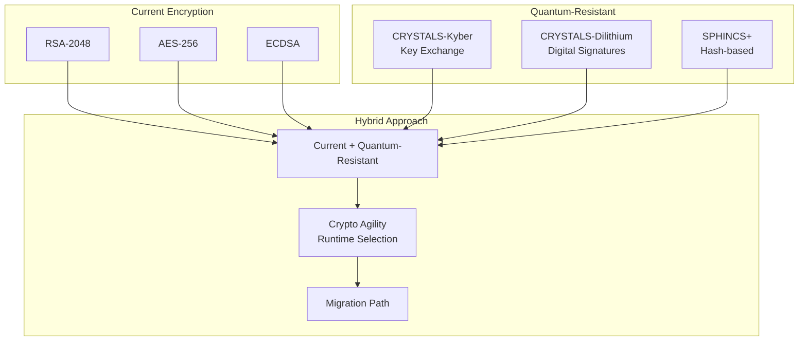
```mermaid
graph TB
    subgraph "Current Encryption"
        RSA[RSA-2048]
        AES[AES-256]
        ECDSA[ECDSA]
    end

    subgraph "Quantum-Resistant"
        CRYSTALS[CRYSTALS-Kyber<br/>Key Exchange]
        DILITHIUM[CRYSTALS-Dilithium<br/>Digital Signatures]
        SPHINCS[SPHINCS+<br/>Hash-based]
    end

    subgraph "Hybrid Approach"
        CURRENT_QR[Current + Quantum-Resistant]
        AGILE[Crypto Agility<br/>Runtime Selection]
        MIGRATION[Migration Path]
    end

    RSA --> CURRENT_QR
    AES --> CURRENT_QR
    ECDSA --> CURRENT_QR

    CRYSTALS --> CURRENT_QR
    DILITHIUM --> CURRENT_QR
    SPHINCS --> CURRENT_QR

    CURRENT_QR --> AGILE
    AGILE --> MIGRATION
```

### Edge Computing Architecture

```mermaid
graph TB
    subgraph "Edge Nodes"
        EDGE1[Edge Server 1<br/>5G Tower]
        EDGE2[Edge Server 2<br/>Emergency Center]
        EDGE3[Edge Server 3<br/>Hospital]
    end

    subgraph "Edge Services"
        INFERENCE[AI Inference<br/>Real-time]
        CACHE_EDGE[Content Cache]
        PROCESS[Stream Processing]
    end

    subgraph "Orchestration"
        K3S[K3s Lightweight<br/>Kubernetes]
        SYNC[State Sync<br/>Eventually Consistent]
        FAILOVER[Auto Failover]
    end

    subgraph "Central Cloud"
        TRAINING[Model Training]
        ANALYTICS_CLOUD[Analytics]
        STORAGE_CLOUD[Long-term Storage]
    end

    EDGE1 --> INFERENCE
    EDGE2 --> CACHE_EDGE
    EDGE3 --> PROCESS

    INFERENCE --> K3S
    CACHE_EDGE --> K3S
    PROCESS --> K3S

    K3S --> SYNC
    SYNC --> FAILOVER

    FAILOVER <--> TRAINING
    FAILOVER <--> ANALYTICS_CLOUD
    FAILOVER <--> STORAGE_CLOUD
```

## Conclusion

The Aegis Phase 2 design represents a quantum leap in emergency management technology, incorporating cutting-edge AI, autonomous systems, and predictive analytics. The architecture is designed for extreme scalability, real-time performance, and resilience under the most challenging conditions. By adopting a hybrid microservices approach with strong emphasis on AI/ML capabilities, multi-modal data processing, and edge computing, Aegis Phase 2 will set the global standard for intelligent emergency management systems.