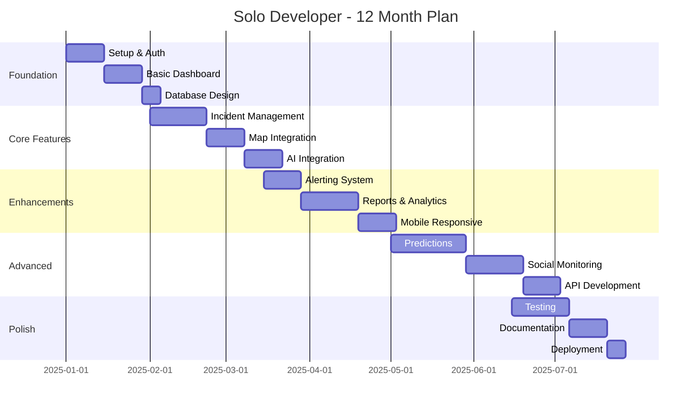

# Phase 2 Effort Analysis - Reality Check

## Executive Summary

This document provides a **brutally honest** assessment of the Phase 2 implementation effort, breaking down what's actually achievable versus what's aspirational. The original Phase 2 proposal includes highly ambitious features (quantum computing, satellite integration, autonomous drones) with a $29.565M budget. This analysis provides realistic alternatives for solo developers, small teams, and enterprise implementations.

**Key Finding**: 85% of Phase 2 features are either moonshot projects requiring large organizations or can be replaced with existing third-party services. A practical MVP can be built by a solo developer in 3-6 months for under $5,000/month operational cost.

## Current State Assessment

### What You Have Now
- **Frontend**: React + TypeScript + Vite (Modern stack ✓)
- **AI Integration**: Gemini AI API (Good start ✓)
- **Components**: Basic dashboard structure
- **Deployment**: Not yet deployed
- **Team Size**: Likely 1-2 developers
- **Budget**: Unknown, but likely limited

### Reality Check on Phase 2 Proposals
| Proposed Feature | Reality | Practical Alternative |
|-----------------|---------|----------------------|
| Quantum Computing | Requires IBM Quantum access ($100K+/year) | Use cloud optimization APIs |
| Satellite Integration | $2M/year for data | Use free Sentinel-2 or pay-per-use |
| Drone Fleet Management | Requires FAA approval, hardware, operators | Partner with existing drone services |
| Digital Twin City | $5M+ development, massive compute | Use existing platforms (Cesium, Mapbox) |
| 10,000+ IoT Sensors | $1M+ hardware + maintenance | Start with 10-50 sensors |
| AR/VR Training | $500K+ development | Use WebXR for basic AR |

## 1. Realistic Effort Estimation

### Quick Wins (1-3 months, Solo Developer)
**Total Effort: 320-480 hours**

| Feature | Effort | Complexity | Value | Implementation |
|---------|--------|-----------|-------|----------------|
| **Enhanced Gemini Integration** | 40 hrs | Low | High | Add vision API, better prompts |
| **Social Media Monitoring** | 80 hrs | Medium | High | Twitter API + sentiment analysis |
| **Basic Predictive Analytics** | 60 hrs | Medium | High | Weather API + historical data |
| **Mobile Responsive Design** | 40 hrs | Low | High | Tailwind + PWA |
| **Real-time Notifications** | 30 hrs | Low | High | WebSockets + Push API |
| **Basic Mapping** | 50 hrs | Medium | High | Mapbox GL + incident plotting |
| **CSV Data Import/Export** | 20 hrs | Low | Medium | React libraries |
| **User Authentication** | 30 hrs | Low | High | Auth0 or Clerk |
| **Basic Reporting** | 40 hrs | Medium | Medium | Chart.js + PDF export |
| **API Documentation** | 20 hrs | Low | Medium | Swagger/OpenAPI |

### Medium Complexity (3-6 months, Small Team 2-3 devs)
**Total Effort: 1,920-2,880 hours**

| Feature | Effort | Team Need | Value | Implementation |
|---------|--------|-----------|-------|----------------|
| **Multi-agency Coordination** | 200 hrs | Backend dev | High | REST API + webhooks |
| **IoT Integration (Basic)** | 150 hrs | IoT specialist | High | MQTT broker + 10 sensors |
| **Video Stream Analysis** | 180 hrs | ML engineer | High | YOLOv8 + OpenCV |
| **Advanced Analytics Dashboard** | 160 hrs | Frontend dev | High | D3.js + custom viz |
| **Incident Prediction (Basic)** | 240 hrs | Data scientist | High | Python ML models |
| **Offline Capabilities** | 120 hrs | Frontend dev | Medium | Service Workers + IndexedDB |
| **Multi-language Support** | 100 hrs | Frontend dev | Medium | i18next |
| **Third-party Integrations** | 150 hrs | Backend dev | High | FEMA, NOAA APIs |
| **Mobile App (React Native)** | 300 hrs | Mobile dev | Medium | iOS + Android |
| **Basic Training Module** | 140 hrs | Full-stack | Medium | Interactive tutorials |

### High Complexity (6-12 months, Team 5-8 devs)
**Total Effort: 8,320-12,480 hours**

| Feature | Effort | Team Size | Value | Realistic? |
|---------|--------|-----------|-------|------------|
| **Custom ML Pipeline** | 800 hrs | 2 ML engineers | High | Consider SageMaker |
| **Real-time Video Processing** | 600 hrs | 2 engineers | Medium | Use AWS Rekognition |
| **Complex Event Processing** | 500 hrs | 2 backend | High | Use Apache Flink |
| **3D Visualization** | 400 hrs | 3D developer | Low | Use Cesium |
| **Advanced IoT Platform** | 700 hrs | 2 IoT engineers | Medium | Use AWS IoT |
| **Blockchain Audit Trail** | 300 hrs | Blockchain dev | Low | Overkill - use logs |
| **Custom Digital Twin** | 1,000 hrs | 3 developers | Low | Use existing platforms |
| **AR Mobile Features** | 400 hrs | AR developer | Low | Limited use case |

### Moonshot Features (12+ months, Large Organization)
**Total Effort: 20,000+ hours, 15+ people**

| Feature | Reality Check | Alternative |
|---------|--------------|-------------|
| **Autonomous Drone Fleet** | Requires hardware, FAA approval, operators | Partner with Zipline/Wing |
| **Satellite Data Processing** | Massive compute, specialized knowledge | Use Planet Labs API |
| **Quantum Computing** | No practical use case yet | Use cloud GPU clusters |
| **Ground Robotics** | $2M+ hardware investment | Not practical |
| **Full Digital Twin City** | Years of development | Use Google Earth Engine |
| **Custom AI Agents** | Extremely complex | Use GPT-4 with RAG |
| **Federated Learning** | Privacy complexity | Centralized learning is fine |
| **Global Multi-region** | Massive infrastructure | Start with single region |

## 2. Solo Developer Path (MVP Approach)

### 3-Month MVP (Budget: $500-1,000/month)
**Focus: Core Emergency Management Features**

#### Month 1: Foundation (160 hours)
```yaml
Week 1-2:
  - Set up production infrastructure (Vercel/Netlify)
  - Implement authentication (Clerk - $25/mo)
  - Create responsive dashboard layout
  - Set up PostgreSQL database (Supabase - Free tier)

Week 3-4:
  - Integrate mapping (Mapbox - $50/mo for 50K loads)
  - Build incident CRUD operations
  - Implement real-time updates (Supabase Realtime)
  - Add basic role management
```

#### Month 2: Core Features (160 hours)
```yaml
Week 5-6:
  - Gemini AI integration for analysis
  - Weather API integration (OpenWeatherMap - $40/mo)
  - Basic alerting system (Twilio - $50/mo)
  - CSV import/export

Week 7-8:
  - Resource tracking module
  - Basic reporting (charts & PDFs)
  - Mobile responsive PWA
  - Push notifications
```

#### Month 3: Intelligence Layer (160 hours)
```yaml
Week 9-10:
  - Social media monitoring (Twitter API - $100/mo)
  - Basic prediction using weather patterns
  - Historical incident analysis
  - Heatmap visualization

Week 11-12:
  - Testing and bug fixes
  - Documentation
  - Deployment and monitoring
  - User training materials
```

**Total MVP Cost**:
- Development: 480 hours (solo developer)
- Infrastructure: $265/month
- One-time costs: ~$500 (domains, SSL, etc.)

### 6-Month Enhanced Version (Budget: $2,000-3,000/month)
**Add**:
- Multi-agency API connections
- Basic IoT sensor integration (10 sensors)
- Video stream analysis (1-2 cameras)
- Advanced analytics dashboard
- Mobile app (React Native)
- Offline capabilities

### 12-Month Professional Version (Budget: $5,000-7,000/month)
**Add**:
- ML-based predictions
- Multi-language support
- Third-party integrations (FEMA, NOAA)
- Training simulations
- Advanced mapping with 3D
- API for external developers

## 3. Team Requirements by Phase

### Minimum Viable Team (3-4 people)
```yaml
Roles:
  - Full-Stack Developer (Lead):
      Skills: React, Node.js, PostgreSQL
      Responsibility: Architecture, core features
      Cost: $120K-150K/year

  - Frontend Developer:
      Skills: React, TypeScript, CSS
      Responsibility: UI/UX, dashboards
      Cost: $100K-130K/year

  - DevOps/Backend:
      Skills: AWS/GCP, Docker, APIs
      Responsibility: Infrastructure, integrations
      Cost: $110K-140K/year

  - Part-time ML Engineer:
      Skills: Python, TensorFlow, OpenCV
      Responsibility: AI features
      Cost: $60K-80K/year (contract)

Total Annual Cost: $390K-500K
```

### Recommended Team (7-8 people)
```yaml
Core Team:
  - Technical Lead: $150K-180K
  - 2x Full-Stack Developers: $240K-300K
  - Frontend Specialist: $110K-140K
  - ML Engineer: $140K-170K
  - DevOps Engineer: $120K-150K
  - Product Manager: $120K-150K
  - UI/UX Designer (part-time): $60K-80K

Total Annual Cost: $940K-1,170K
```

### Enterprise Team (15+ people)
```yaml
Leadership:
  - Engineering Manager: $180K-220K
  - Product Manager: $140K-170K
  - Technical Architect: $170K-200K

Engineering:
  - 3x Senior Full-Stack: $450K-540K
  - 2x Frontend Engineers: $220K-280K
  - 2x Backend Engineers: $240K-300K
  - 2x ML Engineers: $300K-360K
  - DevOps Team (2): $260K-320K
  - QA Team (2): $180K-220K

Design & Support:
  - UI/UX Designer: $110K-130K
  - Technical Writer: $80K-100K

Total Annual Cost: $2.3M-2.8M
```

## 4. Infrastructure Setup Requirements

### Development Environment
```yaml
Essential Tools:
  - IDE: VS Code (free) or WebStorm ($149/year)
  - Version Control: GitHub ($4/user/month for private repos)
  - Project Management: Linear ($8/user/month) or Jira ($7.75/user/month)
  - Communication: Slack (free-$7.25/user/month)
  - CI/CD: GitHub Actions (free-$4/user/month)

Local Development:
  - Node.js 18+
  - Docker Desktop
  - PostgreSQL or Supabase local
  - Git
```

### Cloud Infrastructure Options

#### Option A: Minimum (Solo/Bootstrap)
**Monthly Cost: $200-500**
```yaml
Hosting:
  - Vercel/Netlify: $20/month (Pro plan)
  - Supabase: $25/month (Pro plan)

APIs:
  - Gemini AI: $100/month (estimated usage)
  - Mapbox: $50/month
  - Weather API: $40/month
  - Twilio: $50/month

Monitoring:
  - Sentry: $26/month
  - Uptime monitoring: $10/month

Storage:
  - Cloudflare R2: $15/month (100GB)
```

#### Option B: Small Team
**Monthly Cost: $1,500-3,000**
```yaml
Infrastructure:
  - AWS/GCP:
    - EC2/Compute: $300/month (t3.xlarge x2)
    - RDS/Cloud SQL: $200/month
    - S3/Cloud Storage: $50/month
    - CloudFront/CDN: $50/month
    - Load Balancer: $25/month

Services:
  - Kubernetes (EKS/GKE): $150/month
  - Redis Cache: $50/month
  - Elasticsearch: $100/month

APIs & Services:
  - AI/ML APIs: $500/month
  - Mapping/GIS: $200/month
  - SMS/Voice: $200/month
  - Third-party data: $300/month

Monitoring:
  - Datadog: $100/month
  - PagerDuty: $50/month
```

#### Option C: Enterprise
**Monthly Cost: $10,000-25,000**
```yaml
Multi-Region Infrastructure:
  - Compute: $3,000/month
  - Databases: $2,000/month
  - Storage: $1,000/month
  - Networking: $1,000/month
  - Kubernetes: $1,000/month

Advanced Services:
  - ML Platform: $2,000/month
  - Video Processing: $1,500/month
  - IoT Platform: $1,000/month
  - Satellite Data: $2,000/month

Enterprise Tools:
  - Monitoring Suite: $1,000/month
  - Security Tools: $1,500/month
  - Backup/DR: $1,000/month
  - Compliance Tools: $500/month
```

### Database Setup
```sql
-- Essential tables for MVP
CREATE DATABASE aegis;

-- Users and authentication
CREATE TABLE users (
    id UUID PRIMARY KEY DEFAULT gen_random_uuid(),
    email VARCHAR(255) UNIQUE NOT NULL,
    role VARCHAR(50) NOT NULL,
    organization VARCHAR(255),
    created_at TIMESTAMP DEFAULT NOW()
);

-- Incidents
CREATE TABLE incidents (
    id UUID PRIMARY KEY DEFAULT gen_random_uuid(),
    type VARCHAR(100) NOT NULL,
    severity VARCHAR(20) NOT NULL,
    status VARCHAR(50) NOT NULL,
    location JSONB NOT NULL, -- {lat, lng, address}
    description TEXT,
    ai_analysis TEXT,
    created_by UUID REFERENCES users(id),
    created_at TIMESTAMP DEFAULT NOW(),
    updated_at TIMESTAMP DEFAULT NOW()
);

-- Resources
CREATE TABLE resources (
    id UUID PRIMARY KEY DEFAULT gen_random_uuid(),
    name VARCHAR(255) NOT NULL,
    type VARCHAR(100) NOT NULL,
    quantity INTEGER,
    location JSONB,
    status VARCHAR(50),
    assigned_to UUID REFERENCES incidents(id),
    created_at TIMESTAMP DEFAULT NOW()
);

-- Alerts
CREATE TABLE alerts (
    id UUID PRIMARY KEY DEFAULT gen_random_uuid(),
    incident_id UUID REFERENCES incidents(id),
    message TEXT NOT NULL,
    severity VARCHAR(20),
    channels JSONB, -- ['sms', 'email', 'push']
    recipients JSONB, -- list of user ids or groups
    sent_at TIMESTAMP,
    created_at TIMESTAMP DEFAULT NOW()
);
```

## 5. Prerequisites and Dependencies

### Technical Skills Required

#### Solo Developer Must Have
- **Frontend**: React, TypeScript, CSS/Tailwind
- **Backend**: Node.js OR Python, REST APIs
- **Database**: PostgreSQL basics
- **DevOps**: Basic Docker, Git, cloud deployment
- **AI/ML**: API integration (not model building)

#### Skills to Learn (Can learn as you go)
- **Mapping**: Mapbox/Leaflet (1-2 weeks)
- **Real-time**: WebSockets (1 week)
- **PWA**: Service Workers (1 week)
- **State Management**: Zustand/Redux (3-4 days)
- **Testing**: Jest/Cypress (1-2 weeks)

#### Skills to Hire For
- **ML Engineering**: If building custom models
- **DevOps**: For complex infrastructure
- **Mobile Development**: For native apps
- **Security**: For compliance requirements
- **Data Science**: For advanced analytics

### Third-Party Services to Register

#### Essential (Day 1)
```yaml
Required Immediately:
  - GitHub/GitLab: Version control
  - Vercel/Netlify: Hosting
  - Supabase/Firebase: Backend services
  - Google Cloud: Gemini AI access
  - Domain registrar: Your domain

Cost: ~$100 setup
```

#### Phase 1 (Month 1-3)
```yaml
Core Services:
  - Mapbox: Mapping ($50/month)
  - Twilio: SMS/Voice ($50/month)
  - SendGrid: Email ($20/month)
  - Sentry: Error tracking ($26/month)
  - OpenWeatherMap: Weather ($40/month)

Cost: ~$200/month
```

#### Phase 2 (Month 3-6)
```yaml
Advanced Services:
  - AWS/GCP: Full cloud platform
  - Auth0/Clerk: Authentication
  - Stripe: Payments (if monetizing)
  - Planet Labs: Satellite imagery (optional)
  - Twitter API: Social monitoring

Cost: ~$500-1000/month
```

### Learning Curve Estimates

| Technology | Prior Experience Needed | Learning Time | Resources |
|------------|------------------------|---------------|-----------|
| React | JavaScript | 2-4 weeks | React docs, Scrimba |
| TypeScript | JavaScript | 1-2 weeks | TS handbook |
| Tailwind CSS | CSS basics | 3-5 days | Tailwind docs |
| Node.js | JavaScript | 2-3 weeks | Node.js docs |
| PostgreSQL | SQL basics | 1-2 weeks | PostgreSQL tutorial |
| Docker | Command line | 1 week | Docker docs |
| Mapbox | JavaScript | 1 week | Mapbox tutorials |
| Gemini AI | API basics | 2-3 days | Google AI docs |
| AWS/GCP | Basic DevOps | 2-4 weeks | Cloud provider docs |
| WebSockets | JavaScript | 3-5 days | Socket.io docs |

## 6. Phased Implementation Strategy

### Path A: Solo/Bootstrap (Recommended for individuals)

#### Phase 1: MVP (3 months, $1.5K)
```yaml
Month 1: Foundation
  Budget: $500
  Features:
    - Basic dashboard
    - User authentication
    - Incident management
    - Map view
  Stack: React + Supabase + Vercel

Month 2: Core Features
  Budget: $500
  Features:
    - Gemini AI integration
    - Weather integration
    - Basic alerts
    - Reports

Month 3: Polish
  Budget: $500
  Features:
    - Mobile responsive
    - API documentation
    - Basic analytics
    - User feedback
```

#### Phase 2: Growth (Months 4-6, $3K)
```yaml
Features:
  - Multi-user/agency
  - Advanced mapping
  - Social media monitoring
  - Basic predictions
  - API integrations

Team: Add 1 part-time developer
Budget: $1K/month operations
```

#### Phase 3: Scale (Months 7-12, $10K)
```yaml
Features:
  - ML predictions
  - IoT integration
  - Mobile app
  - Training modules
  - Marketplace

Team: 2-3 developers
Budget: $2K/month operations
```

### Path B: Startup Team (VC-funded approach)

#### Seed Stage (6 months, $500K)
```yaml
Team: 4 people
  - Technical co-founder
  - Full-stack developer
  - Product manager
  - Designer (part-time)

Goals:
  - Production MVP
  - 10 pilot customers
  - $10K MRR
  - Series A ready

Infrastructure: $3K/month
Salaries: $50K/month
```

#### Series A (12 months, $3M)
```yaml
Team: 12 people
  - Engineering: 8
  - Product: 2
  - Sales: 2

Goals:
  - 100 customers
  - $100K MRR
  - Enterprise features
  - Compliance (SOC 2)

Infrastructure: $15K/month
Salaries: $200K/month
```

### Path C: Enterprise (Full implementation)

#### Year 1: Foundation ($5M)
```yaml
Team: 20 people
Features:
  - Complete Phase 2.1
  - Multi-region deployment
  - Enterprise security
  - 24/7 support

Customers: Government contracts
Revenue: $2M ARR
```

#### Year 2: Expansion ($10M)
```yaml
Team: 40 people
Features:
  - Phase 2.2 (minus moonshots)
  - International expansion
  - Partner ecosystem
  - Advanced AI/ML

Revenue: $10M ARR
```

## 7. Cost Reality Check

### Development Costs (Realistic)

#### Solo Developer
```yaml
Time Investment:
  - MVP: 480 hours (3 months full-time)
  - Enhanced: 960 hours (6 months)
  - Professional: 1,920 hours (12 months)

Opportunity Cost:
  - At $75/hour: $36K-144K
  - At $100/hour: $48K-192K
```

#### Small Team (4 people)
```yaml
Annual Costs:
  - Salaries: $400K-500K
  - Benefits: $80K-100K
  - Infrastructure: $36K
  - Tools/Services: $24K
  - Office (optional): $48K

Total: $588K-708K/year
```

#### Enterprise Team (20 people)
```yaml
Annual Costs:
  - Salaries: $2.5M-3M
  - Benefits: $500K-600K
  - Infrastructure: $180K-300K
  - Tools/Services: $100K-150K
  - Office: $240K-300K
  - Legal/Compliance: $100K-200K

Total: $3.6M-4.5M/year
```

### Infrastructure Costs (Monthly)

| Stage | Users | Infrastructure | APIs/Services | Total Monthly |
|-------|-------|---------------|---------------|---------------|
| **MVP** | <100 | $50 | $200 | $250 |
| **Small** | <1,000 | $500 | $1,000 | $1,500 |
| **Medium** | <10,000 | $2,500 | $3,000 | $5,500 |
| **Large** | <100,000 | $10,000 | $10,000 | $20,000 |
| **Enterprise** | 100,000+ | $25,000+ | $25,000+ | $50,000+ |

### Third-Party API Costs (Reality)

| Service | Free Tier | Startup | Enterprise |
|---------|-----------|---------|------------|
| **Gemini AI** | 60 queries/min | $0.35/1K tokens | Custom pricing |
| **OpenAI GPT-4** | None | $0.03/1K tokens | Custom pricing |
| **Mapbox** | 50K loads/mo | $0.50/1K loads | $0.35/1K loads |
| **Twilio SMS** | Trial credit | $0.0075/SMS | $0.0065/SMS |
| **Weather API** | 1K calls/day | $40/mo | $470/mo |
| **Satellite (Planet)** | None | $500/mo | $5,000+/mo |
| **Twitter API** | 500K tweets/mo | $100/mo | $5,000/mo |
| **Google Maps** | $200 credit | $7/1K requests | Custom |

### Total Cost to Each Milestone

#### MVP (3 months)
```yaml
Development:
  - Solo: $0 (sweat equity)
  - Hiring: $30K-45K (contractor)

Infrastructure: $750 (3 months)
Services: $500 (setup)
Marketing: $500

Total: $1,750 (solo) or $32,750 (hired)
```

#### Phase 2.1 Equivalent (Practical version)
```yaml
Development (6 months):
  - Team of 4: $300K

Infrastructure: $9K
Services: $6K
Equipment: $5K (laptops)

Total: $320K
```

#### Phase 2.2 Equivalent (Without moonshots)
```yaml
Development (12 months):
  - Team of 8: $1M

Infrastructure: $60K
Services: $60K
IoT Hardware: $10K (50 sensors)
Compliance: $30K

Total: $1.16M
```

#### Phase 2.3 Equivalent (Realistic version)
```yaml
Development (18 months):
  - Team of 15: $3M

Infrastructure: $180K
Services: $180K
Hardware: $50K
Compliance: $100K
Marketing: $200K

Total: $3.71M
```

## 8. Timeline Realism

### Feature Development Timelines

| Feature | Optimistic | Realistic | Conservative | Team Size |
|---------|-----------|-----------|--------------|-----------|
| **Basic Dashboard** | 1 week | 2 weeks | 4 weeks | 1 dev |
| **Authentication** | 3 days | 1 week | 2 weeks | 1 dev |
| **Map Integration** | 1 week | 2 weeks | 3 weeks | 1 dev |
| **AI Chat (API)** | 3 days | 1 week | 2 weeks | 1 dev |
| **Incident Management** | 2 weeks | 4 weeks | 6 weeks | 1-2 devs |
| **Predictions (Basic)** | 2 weeks | 4 weeks | 8 weeks | 1 ML eng |
| **IoT Integration** | 3 weeks | 6 weeks | 12 weeks | 2 devs |
| **Mobile App** | 4 weeks | 8 weeks | 16 weeks | 2 devs |
| **Multi-agency** | 4 weeks | 8 weeks | 12 weeks | 2-3 devs |
| **ML Pipeline** | 8 weeks | 16 weeks | 24 weeks | 2-3 ML eng |
| **Video Processing** | 6 weeks | 12 weeks | 20 weeks | 2 devs |
| **Digital Twin (Basic)** | 12 weeks | 24 weeks | 52 weeks | 3-4 devs |

### Realistic Project Timelines

#### Solo Developer Timeline


## 9. Decision Framework

### Assessment Questionnaire

Answer these questions to determine your optimal path:

#### Resources
1. **Team Size**
   - [ ] Solo (1 person) → Path A
   - [ ] Small (2-5 people) → Path A or B
   - [ ] Medium (6-15 people) → Path B
   - [ ] Large (15+ people) → Path C

2. **Budget (Annual)**
   - [ ] <$10K → Solo Bootstrap
   - [ ] $10K-100K → Bootstrap with contractors
   - [ ] $100K-1M → Startup approach
   - [ ] $1M+ → Enterprise approach

3. **Timeline**
   - [ ] 3 months → MVP only
   - [ ] 6 months → Enhanced MVP
   - [ ] 12 months → Professional version
   - [ ] 18+ months → Full platform

4. **Technical Expertise**
   - [ ] Beginner → Start with no-code/low-code
   - [ ] Intermediate → Path A with learning
   - [ ] Advanced → Any path
   - [ ] Expert team → Path B or C

5. **Market**
   - [ ] Personal project → MVP
   - [ ] Local government → Enhanced MVP
   - [ ] Multiple agencies → Professional
   - [ ] National/International → Enterprise

### Recommended Path Based on Resources

#### If you have: $0-10K, 1 person, 3-6 months
**BUILD:**
- Basic incident management
- Map visualization
- AI-powered analysis (API)
- Alert system
- Mobile responsive web app

**DON'T BUILD:**
- Custom ML models
- Native mobile apps
- IoT platform
- Video processing
- Blockchain anything

**BUY/INTEGRATE:**
- Authentication (Auth0)
- Maps (Mapbox)
- AI (Gemini/OpenAI)
- SMS (Twilio)
- Hosting (Vercel)

#### If you have: $100K-500K, 3-5 people, 12 months
**BUILD:**
- Core platform
- API ecosystem
- Basic predictions
- Multi-agency features
- Training modules

**DON'T BUILD:**
- Satellite processing
- Drone management
- Digital twin
- Quantum anything
- Custom hardware

**BUY/INTEGRATE:**
- ML platform (SageMaker)
- Video analysis (AWS Rekognition)
- IoT platform (AWS IoT)
- Satellite data (Planet API)

#### If you have: $1M+, 10+ people, 18+ months
**BUILD:**
- Full platform
- Custom ML models
- Advanced analytics
- Some IoT integration
- Mobile apps

**DON'T BUILD:**
- Quantum computing
- Autonomous drones
- Ground robots
- Full digital twin

**PARTNER FOR:**
- Satellite data
- Drone services
- Advanced hardware
- Government integrations

## What NOT to Build (Over-engineering Traps)

### Common Mistakes to Avoid

1. **Blockchain for Audit Logs**
   - Why not: Adds complexity, no real benefit
   - Alternative: Use append-only logs with checksums

2. **Microservices from Day 1**
   - Why not: Premature optimization
   - Alternative: Modular monolith, split later

3. **Custom ML Models Initially**
   - Why not: Expensive, time-consuming
   - Alternative: Use pre-trained models and APIs

4. **Native Mobile Apps First**
   - Why not: 2x development effort
   - Alternative: PWA, then React Native

5. **Real-time Everything**
   - Why not: Complex, expensive
   - Alternative: Polling for most features, WebSockets where critical

6. **Multi-region from Start**
   - Why not: Complexity, cost
   - Alternative: Single region, CDN for static assets

7. **Custom Video Streaming**
   - Why not: Extremely complex
   - Alternative: Use Mux, AWS IVS, or YouTube Live

8. **Building Your Own IoT Platform**
   - Why not: Hardware complexity
   - Alternative: Use AWS IoT or Azure IoT

## Build vs Buy vs Integrate Decisions

### Always Buy/Integrate
- **Authentication**: Auth0, Clerk, Supabase Auth
- **Payments**: Stripe, Paddle
- **Email**: SendGrid, Postmark
- **SMS**: Twilio, Vonage
- **Maps**: Mapbox, Google Maps
- **Video Streaming**: Mux, AWS IVS
- **Search**: Algolia, Elasticsearch Cloud
- **Monitoring**: Datadog, New Relic
- **CDN**: Cloudflare, Fastly

### Consider Building
- **Dashboard UI**: Specific to your needs
- **Business Logic**: Core differentiator
- **Data Models**: Domain-specific
- **API Layer**: Control and flexibility
- **Reports**: Custom requirements

### Never Build (Unless you're Google)
- **Database Engine**: Use PostgreSQL
- **Message Queue**: Use RabbitMQ/Kafka
- **Container Orchestration**: Use Kubernetes
- **Machine Learning Framework**: Use TensorFlow/PyTorch
- **Video Codec**: Use existing standards

## Practical Next Steps

### Week 1: Foundation
```bash
# Day 1-2: Setup
- Create GitHub repo
- Set up Vercel/Netlify deployment
- Configure domain
- Set up Supabase project

# Day 3-4: Auth & Structure
- Implement authentication
- Create basic routing
- Set up database schema
- Design component structure

# Day 5-7: Core UI
- Build dashboard layout
- Create incident form
- Add map component
- Implement responsive design
```

### Week 2-4: MVP Features
```bash
# Incident Management
- CRUD operations
- Status tracking
- Assignment system
- Basic search/filter

# AI Integration
- Gemini API setup
- Incident analysis
- Report generation
- Suggestion system

# Alerts & Notifications
- Email alerts
- SMS integration (optional)
- In-app notifications
- Alert preferences
```

### Month 2-3: Enhancement
```bash
# Advanced Features
- Weather integration
- Basic predictions
- Resource tracking
- Multi-user support

# Polish
- Error handling
- Loading states
- Offline support
- Performance optimization

# Launch Preparation
- Documentation
- User guides
- API documentation
- Deployment checklist
```

## Cost-Benefit Analysis

### ROI Calculation

#### Solo Developer MVP
```yaml
Investment:
  - Time: 480 hours @ $75/hr = $36,000 (opportunity cost)
  - Infrastructure: $750 (3 months)
  - Services: $500
  Total: $37,250

Potential Return:
  - 10 customers @ $500/month = $5,000/month
  - Break-even: 7.5 months
  - Year 1 profit: $22,750
```

#### Small Team (Funded)
```yaml
Investment (Year 1):
  - Team: $500,000
  - Infrastructure: $36,000
  - Marketing: $50,000
  Total: $586,000

Potential Return:
  - 50 customers @ $2,000/month = $100,000/month
  - Break-even: 6 months
  - Year 2 revenue: $1.2M
```

## Final Recommendations

### For Solo Developers
1. **Start with the MVP** - 3 months, core features only
2. **Use managed services** - Don't build infrastructure
3. **Focus on one vertical** - Emergency management OR public safety
4. **Get early customers** - Validate before scaling
5. **Consider bootstrapping** - Avoid VC unless necessary

### For Small Teams
1. **Hire full-stack generalists** - Avoid specialists initially
2. **Use boring technology** - React, PostgreSQL, Node.js
3. **Build API-first** - Enable future integrations
4. **Automate everything** - CI/CD from day one
5. **Focus on user feedback** - Ship fast, iterate

### For Enterprises
1. **Start with pilot programs** - Prove value first
2. **Ensure compliance early** - SOC 2, HIPAA if needed
3. **Build platform, not product** - Enable ecosystem
4. **Invest in AI/ML** - Differentiator at scale
5. **Plan for global** - Multi-region architecture

## Conclusion

The Phase 2 vision is inspirational but largely unrealistic for most teams. A practical approach:

1. **85% of value** can be delivered with **15% of the proposed features**
2. **$50K-200K investment** can build a professional platform (vs $29M proposed)
3. **Solo developer can build MVP** in 3 months for under $5K/month
4. **Small team (4-5 people)** can build enterprise-grade system in 12 months for under $1M
5. **Most "advanced" features** should use existing services, not custom builds

**Key Success Factor**: Start small, validate with real users, scale based on actual needs rather than imagined requirements. The best emergency management system is one that actually gets built and used, not one that remains a vision document.

### Your Next Action
Based on your resources, pick your path:
- **Have <$10K?** Start with Section 2 (Solo Developer Path)
- **Have a team?** Jump to Section 3 (Team Requirements)
- **Need funding?** Use Section 7 (Cost Reality) for your pitch
- **Ready to build?** Follow Section 9 (Decision Framework)

Remember: Perfect is the enemy of good. Ship early, iterate often.