# Phase 2 Implementation Roadmap - Aegis AI Emergency Management

## Executive Overview

The Aegis Phase 2 implementation follows a progressive enhancement strategy, building upon Phase 1's foundation while introducing revolutionary capabilities through three major releases over 18 months. Each phase is designed to deliver immediate value while laying groundwork for subsequent innovations.

### Implementation Principles
- **Incremental Value Delivery**: Each sprint delivers production-ready features
- **Risk Mitigation**: Core features first, experimental features isolated
- **User-Centric Development**: Continuous feedback loops with emergency managers
- **Technical Excellence**: Infrastructure and security from day one
- **Scalability by Design**: Build for 10x growth at each phase

## Phase 2.1: Intelligent Foundation (Q1-Q2 2025)

### Overview
Phase 2.1 establishes the AI-powered foundation with predictive analytics, multi-modal processing, and initial IoT integration. This phase focuses on enhancing situational awareness and introducing predictive capabilities.

### Timeline: 6 Months (January - June 2025)

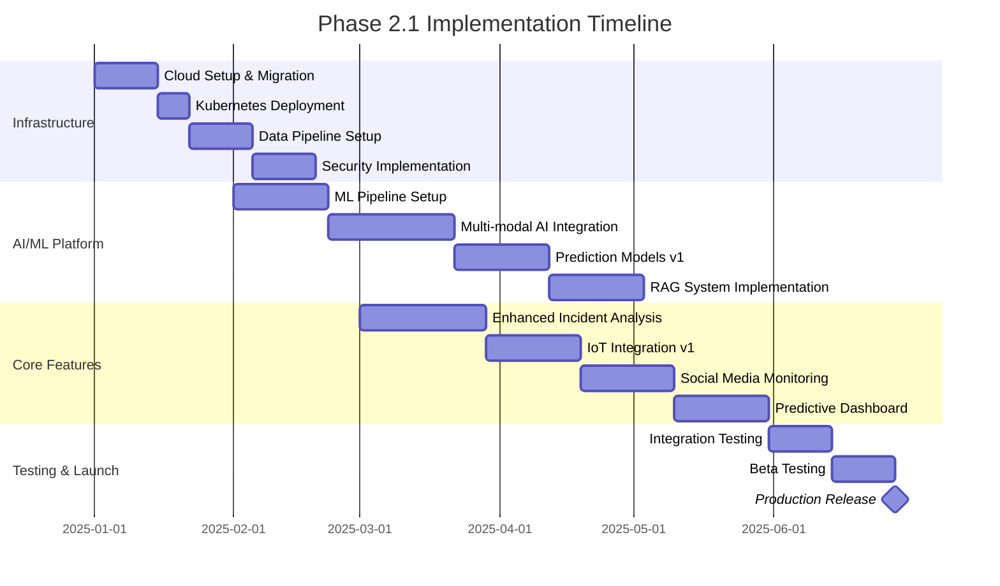

### Key Deliverables

#### 1. Enhanced AI Infrastructure
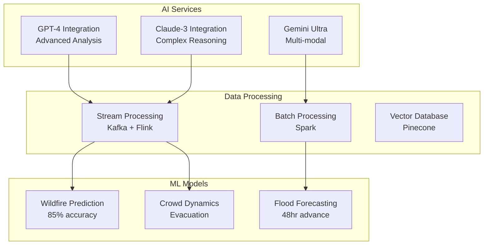

#### 2. Predictive Analytics Dashboard
- **24-hour Forecasts**: Fire, flood, severe weather predictions
- **Risk Heat Maps**: Dynamic visualization of threat levels
- **Resource Optimization**: AI-suggested pre-positioning
- **Impact Estimates**: Population and infrastructure at risk

#### 3. IoT Integration (Phase 1)
- **Sensor Types**: Temperature, air quality, water level, seismic
- **Coverage**: 1,000 sensors per deployment area
- **Latency**: < 1 second from sensor to dashboard
- **Protocols**: MQTT, CoAP, LoRaWAN support

#### 4. Social Media Intelligence
- **Platforms**: Twitter/X, Facebook, Instagram, TikTok
- **Capabilities**:
  - Real-time incident detection
  - Misinformation identification
  - Sentiment analysis
  - Geo-location verification
- **Languages**: English, Spanish, Mandarin initially

### Technical Requirements

#### Infrastructure
| Component | Specification | Rationale |
|-----------|--------------|-----------|
| **Compute** | 100 vCPUs, 10 GPUs (A100) | AI inference and training |
| **Storage** | 50TB SSD, 500TB object storage | Historical data and models |
| **Network** | 10Gbps dedicated, CDN global | Low latency, high availability |
| **Database** | PostgreSQL cluster, TimeScaleDB | ACID compliance, time-series |
| **Message Queue** | Kafka 3-node cluster | Stream processing |
| **Monitoring** | Datadog, Prometheus, Grafana | Full observability |

#### Development Team
- **Technical Lead**: 1 Senior Architect
- **Backend Engineers**: 4 (Python, Go, Node.js)
- **ML Engineers**: 3 (PyTorch, TensorFlow)
- **Frontend Engineers**: 3 (React, TypeScript)
- **DevOps Engineers**: 2 (Kubernetes, Terraform)
- **QA Engineers**: 2 (Automated testing)
- **Product Manager**: 1
- **UI/UX Designer**: 1

Total: 17 FTEs for Phase 2.1

### Risk Assessment

| Risk | Probability | Impact | Mitigation Strategy |
|------|------------|--------|-------------------|
| **AI Model Accuracy** | Medium | High | Extensive training data, continuous learning |
| **Data Privacy Concerns** | High | High | Privacy-by-design, compliance audits |
| **Integration Complexity** | Medium | Medium | Phased rollout, adapter pattern |
| **Scalability Issues** | Low | High | Cloud-native architecture, auto-scaling |
| **User Adoption** | Medium | High | Training programs, intuitive UI |

### Success Criteria
- ✓ 85% prediction accuracy for 24-hour forecasts
- ✓ < 2 second end-to-end latency for alerts
- ✓ 99.9% uptime during testing period
- ✓ 100+ beta users actively engaged
- ✓ 50% reduction in false positives vs Phase 1

### Budget Estimate
- **Development**: $2.5M
- **Infrastructure**: $500K (6 months)
- **Licensing (AI/ML)**: $300K
- **Testing & Compliance**: $200K
- **Training & Documentation**: $100K
- **Contingency (15%)**: $540K
- **Total Phase 2.1**: $4.14M

## Phase 2.2: Autonomous Operations (Q3-Q4 2025)

### Overview
Phase 2.2 introduces autonomous systems, AR/VR capabilities, and advanced multi-agency coordination. This phase transforms Aegis from a decision support system to an active response platform.

### Timeline: 6 Months (July - December 2025)

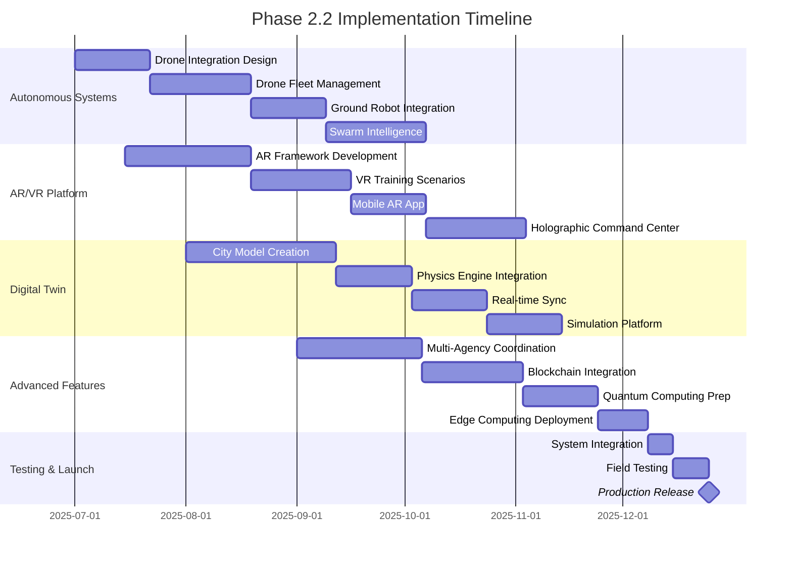

### Key Deliverables

#### 1. Autonomous Systems Platform
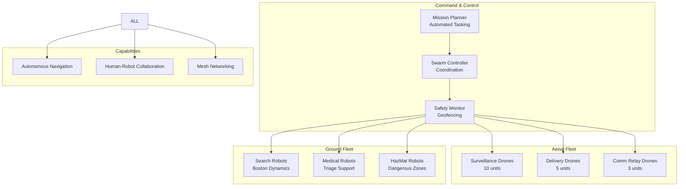

#### 2. AR/VR Emergency Training Platform
- **VR Training Scenarios**: 50+ realistic disaster scenarios
- **AR Field Assistance**: Real-time overlay for responders
- **Multiplayer Exercises**: 100+ simultaneous users
- **Performance Analytics**: Skill assessment and improvement tracking
- **Hardware Support**: Quest 3, HoloLens 2, Magic Leap 2

#### 3. Digital Twin City
- **Coverage**: 100 square mile urban area
- **Resolution**: 1-meter accuracy for critical infrastructure
- **Update Frequency**: Real-time for IoT connected assets
- **Simulation Speed**: 1000x faster than real-time
- **Scenarios**: Flood, fire, earthquake, evacuation, cascade failures

#### 4. Multi-Agency Coordination System
- **Unified Command Interface**: Single pane of glass for all agencies
- **Resource Sharing**: Automated mutual aid requests
- **Communication Bridge**: Cross-agency radio and data integration
- **Decision Support**: AI-recommended resource allocation
- **Audit Trail**: Blockchain-based immutable logs

### Technical Requirements

#### Additional Infrastructure (Beyond 2.1)
| Component | Specification | Rationale |
|-----------|--------------|-----------|
| **GPU Cluster** | 20x A100 GPUs | Digital twin rendering, AI training |
| **Edge Servers** | 50 edge nodes | Distributed processing |
| **Drone Hardware** | 18 commercial drones | Autonomous operations |
| **Robot Hardware** | 5 ground robots | Search and rescue |
| **AR/VR Equipment** | 100 headsets | Training and field ops |
| **5G Network** | Private 5G deployment | Ultra-low latency |

#### Expanded Team (Additional to 2.1)
- **Robotics Engineers**: 3
- **AR/VR Developers**: 3
- **3D Artists**: 2
- **Simulation Engineers**: 2
- **Blockchain Developer**: 1
- **Field Operations Specialists**: 2
- **Training Coordinators**: 2

Total Additional: 15 FTEs (32 total for Phase 2.2)

### Risk Assessment

| Risk | Probability | Impact | Mitigation Strategy |
|------|------------|--------|-------------------|
| **Regulatory Approval (Drones)** | High | High | Early FAA engagement, restricted zones |
| **Autonomous System Failures** | Medium | Critical | Human override, fail-safe mechanisms |
| **VR Training Effectiveness** | Low | Medium | Validated scenarios, expert review |
| **Digital Twin Accuracy** | Medium | High | Continuous calibration, ground truth validation |
| **Interagency Politics** | High | Medium | Stakeholder engagement, clear ROI |

### Success Criteria
- ✓ 10 autonomous missions completed successfully
- ✓ 500+ personnel trained in VR platform
- ✓ Digital twin accuracy within 5% of reality
- ✓ 3 agencies fully integrated
- ✓ 50% reduction in response coordination time

### Budget Estimate
- **Development**: $3.5M
- **Hardware (Drones/Robots)**: $2M
- **AR/VR Equipment**: $500K
- **Infrastructure Expansion**: $750K
- **Integration & Testing**: $500K
- **Training & Deployment**: $250K
- **Contingency (15%)**: $1.125M
- **Total Phase 2.2**: $8.625M

## Phase 2.3: Global Intelligence Network (Q1-Q2 2026)

### Overview
Phase 2.3 completes the Aegis transformation with satellite integration, global threat monitoring, quantum computing capabilities, and international collaboration features. This phase positions Aegis as the global standard for emergency management.

### Timeline: 6 Months (January - June 2026)

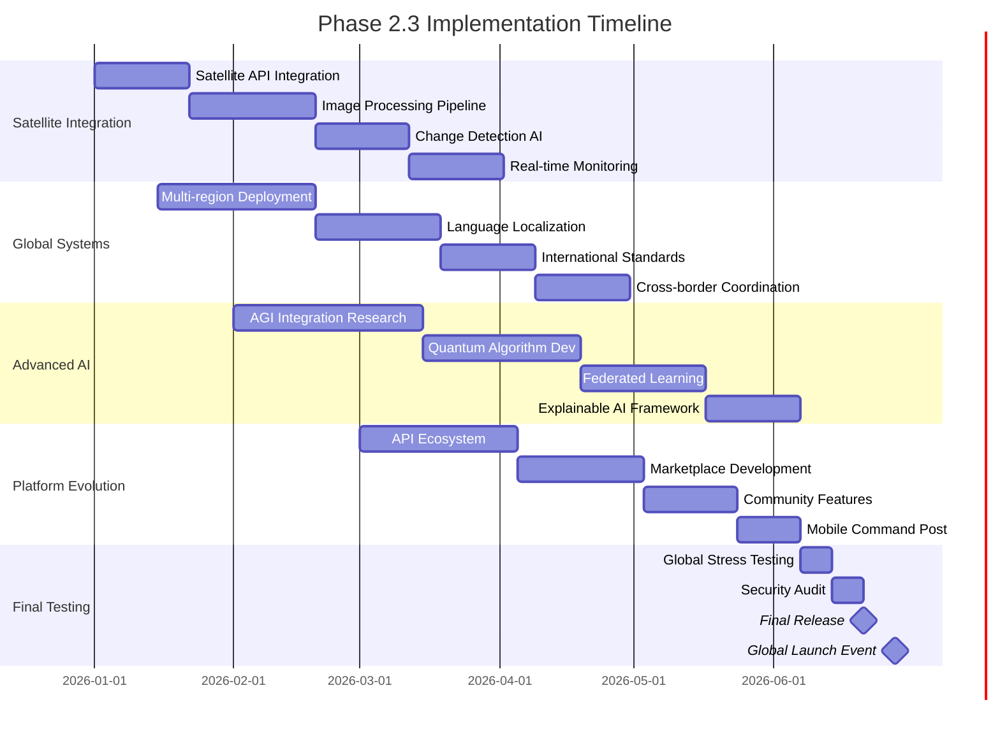

### Key Deliverables

#### 1. Satellite Intelligence System
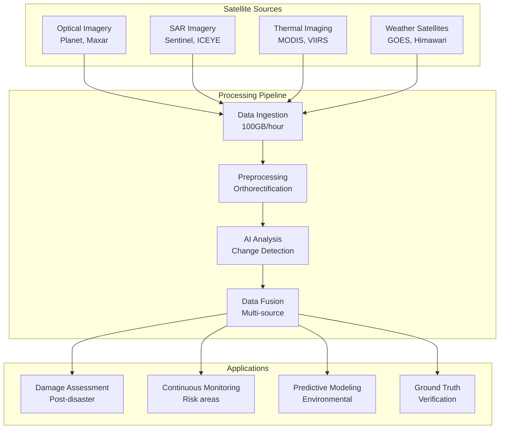

#### 2. Quantum Computing Integration
- **Use Cases**: Complex optimization, cryptography, simulation
- **Algorithms**: Quantum annealing for resource allocation
- **Hardware**: IBM Quantum Network access
- **Hybrid Approach**: Classical + Quantum processing
- **Performance**: 1000x speedup for specific problems

#### 3. Global Emergency Network
- **Coverage**: 195 countries
- **Languages**: 50+ languages with real-time translation
- **Standards**: CAP, EDXL, UN-OCHA compliance
- **Data Sharing**: Federated learning across regions
- **Collaboration**: Real-time multi-national coordination

#### 4. Advanced AI Capabilities
- **AGI Research**: Steps toward artificial general intelligence
- **Explainable AI**: Complete decision transparency
- **Federated Learning**: Privacy-preserving model training
- **Continuous Learning**: Real-time model updates
- **Ethical AI**: Bias detection and mitigation

#### 5. Developer Ecosystem
- **Open APIs**: 200+ endpoints for third-party integration
- **SDK/Libraries**: Python, JavaScript, Go, Java
- **Marketplace**: Third-party apps and integrations
- **Community**: Forums, hackathons, certification program
- **Documentation**: Interactive API explorer, tutorials

### Technical Requirements

#### Global Infrastructure
| Component | Specification | Rationale |
|-----------|--------------|-----------|
| **Multi-Region** | 5 AWS regions, 3 Azure regions | Global availability |
| **CDN** | 200+ edge locations | Sub-50ms latency globally |
| **Satellite Bandwidth** | 10Gbps dedicated | Real-time imagery |
| **Quantum Access** | 100 hours/month | Complex computations |
| **Storage** | 5PB distributed | Historical data, ML training |
| **Compliance** | ISO 27001, SOC 2, FedRAMP | International standards |

#### Final Team Structure
- **Regional Directors**: 3 (Americas, EMEA, APAC)
- **Quantum Computing Specialists**: 2
- **Satellite Imagery Analysts**: 3
- **International Relations**: 2
- **Developer Relations**: 3
- **Security Team**: 4
- **24/7 Operations Center**: 12 (3 shifts)

Total Additional: 29 FTEs (61 total for Phase 2.3)

### Risk Assessment

| Risk | Probability | Impact | Mitigation Strategy |
|------|------------|--------|-------------------|
| **International Data Laws** | High | High | Legal team, data residency options |
| **Satellite Data Costs** | Medium | High | Negotiated contracts, selective coverage |
| **Quantum Stability** | High | Low | Hybrid approach, graceful fallback |
| **Global Scalability** | Medium | High | Progressive rollout, regional isolation |
| **Cybersecurity Threats** | High | Critical | Zero-trust, quantum encryption prep |

### Success Criteria
- ✓ 50+ countries actively using platform
- ✓ 1M+ emergency personnel trained
- ✓ 10PB of data processed monthly
- ✓ 99.99% global availability
- ✓ Recognized as global standard by UN

### Budget Estimate
- **Development**: $5M
- **Satellite Data**: $2M/year
- **Quantum Computing**: $500K
- **Global Infrastructure**: $3M
- **Compliance & Legal**: $1M
- **Marketing & Launch**: $500K
- **Operations (6 months)**: $2M
- **Contingency (20%)**: $2.8M
- **Total Phase 2.3**: $16.8M

## Migration Strategy from Phase 1

### Data Migration Plan

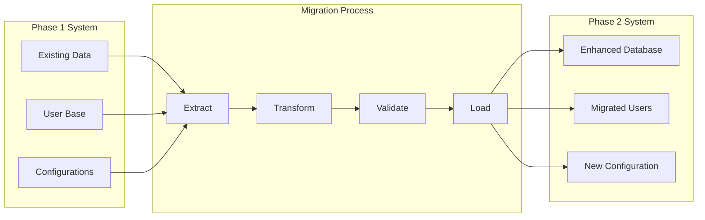

### Migration Steps

#### Phase 1: Preparation (Month 1)
1. **Data Audit**: Catalog all Phase 1 data and dependencies
2. **Schema Mapping**: Map Phase 1 to Phase 2 data models
3. **User Communication**: Notify users of upcoming changes
4. **Backup Creation**: Complete system backup
5. **Pilot Group**: Select beta users for early migration

#### Phase 2: Parallel Running (Month 2-3)
1. **Dual System Operation**: Run Phase 1 and 2 in parallel
2. **Data Synchronization**: Real-time sync between systems
3. **Feature Parity**: Ensure Phase 2 has all Phase 1 features
4. **User Training**: Conduct training sessions
5. **Performance Monitoring**: Compare system metrics

#### Phase 3: Cutover (Month 4)
1. **Final Data Sync**: Complete data migration
2. **User Migration**: Move all users to Phase 2
3. **DNS Switch**: Point domain to new system
4. **Monitoring**: 24/7 monitoring for issues
5. **Rollback Plan**: Ready to revert if critical issues

#### Phase 4: Decommission (Month 5-6)
1. **Phase 1 Shutdown**: Gradual service reduction
2. **Data Archival**: Archive Phase 1 data
3. **Documentation**: Update all documentation
4. **Lessons Learned**: Conduct retrospective
5. **Cost Optimization**: Terminate unused resources

## Testing Strategy

### Testing Phases

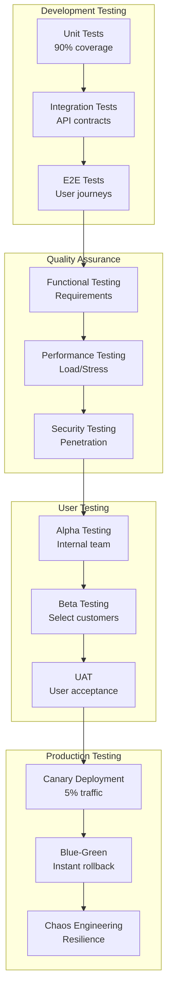

### Testing Metrics

| Test Type | Coverage Target | Acceptable Failure Rate |
|-----------|----------------|------------------------|
| **Unit Tests** | 90% code coverage | 0% |
| **Integration** | 100% API endpoints | < 1% |
| **Performance** | 10x expected load | < 0.1% error rate |
| **Security** | OWASP Top 10 | 0 critical vulnerabilities |
| **User Acceptance** | All user stories | < 5% defects |
| **Chaos Testing** | 50 failure scenarios | 100% recovery |

### Testing Tools
- **Unit/Integration**: Jest, Pytest, Go test
- **E2E**: Playwright, Selenium
- **Performance**: K6, JMeter, Gatling
- **Security**: OWASP ZAP, Burp Suite, Snyk
- **Monitoring**: Datadog, New Relic, Sentry
- **Chaos**: Chaos Monkey, Gremlin

## Resource Requirements

### Human Resources Summary

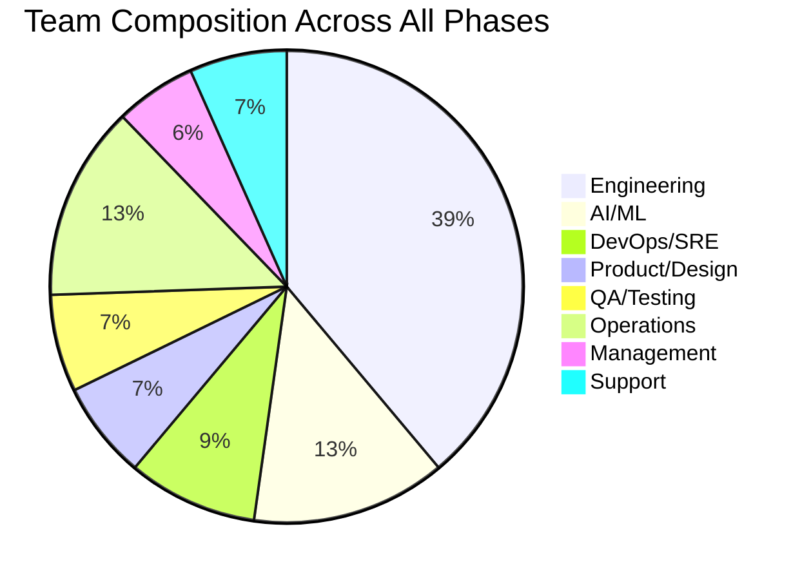

### Infrastructure Costs (18 Months)

| Category | Phase 2.1 | Phase 2.2 | Phase 2.3 | Total |
|----------|-----------|-----------|-----------|-------|
| **Cloud Computing** | $500K | $750K | $3M | $4.25M |
| **AI/ML Services** | $300K | $400K | $500K | $1.2M |
| **Data Storage** | $100K | $200K | $500K | $800K |
| **Network/CDN** | $50K | $100K | $300K | $450K |
| **Third-party APIs** | $150K | $200K | $2M | $2.35M |
| **Hardware** | - | $2.5M | $500K | $3M |
| **Licensing** | $100K | $150K | $200K | $450K |
| **Total** | $1.2M | $4.3M | $7M | $12.5M |

### Total Investment Summary

| Phase | Development | Infrastructure | Other | Total |
|-------|------------|---------------|-------|-------|
| **Phase 2.1** | $2.5M | $1.2M | $440K | $4.14M |
| **Phase 2.2** | $3.5M | $4.3M | $825K | $8.625M |
| **Phase 2.3** | $5M | $7M | $4.8M | $16.8M |
| **Grand Total** | $11M | $12.5M | $6.065M | $29.565M |

## Risk Management Framework

### Risk Matrix

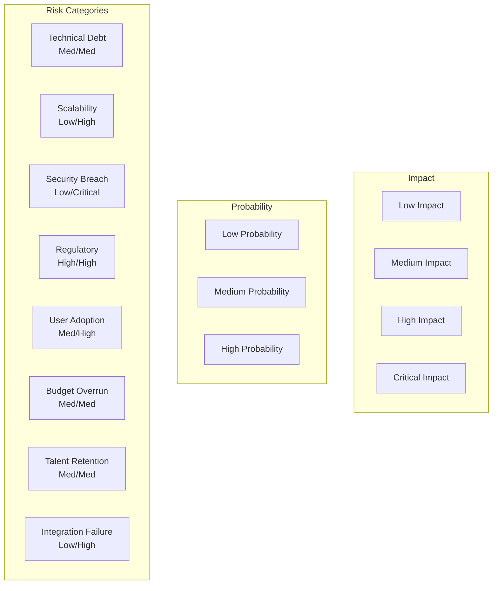

### Risk Mitigation Strategies

| Risk Category | Mitigation Strategy | Owner | Review Frequency |
|--------------|-------------------|--------|-----------------|
| **Technical** | Code reviews, automated testing, refactoring sprints | Tech Lead | Weekly |
| **Security** | Penetration testing, security audits, bug bounty | Security Team | Monthly |
| **Regulatory** | Legal review, compliance audits, documentation | Legal/Compliance | Quarterly |
| **Financial** | Phased funding, cost monitoring, contingency budget | CFO | Monthly |
| **Operational** | Runbooks, disaster recovery, training | Operations | Quarterly |
| **Strategic** | Market analysis, competitive monitoring | Product | Quarterly |

### Contingency Plans

#### Scenario 1: Major Security Breach
1. Immediate isolation of affected systems
2. Activate incident response team
3. Notify affected users within 24 hours
4. Forensic analysis and patch deployment
5. Third-party security audit
6. Public communication and transparency

#### Scenario 2: Critical Technology Failure
1. Failover to backup systems
2. Rollback to previous stable version
3. Root cause analysis
4. Fix and extensive testing
5. Gradual re-deployment
6. Post-mortem and process improvement

#### Scenario 3: Budget Overrun > 20%
1. Feature prioritization review
2. Scope reduction for non-critical features
3. Seek additional funding
4. Extend timeline if necessary
5. Optimize infrastructure costs
6. Renegotiate vendor contracts

## Dependencies and Blockers

### Critical Dependencies

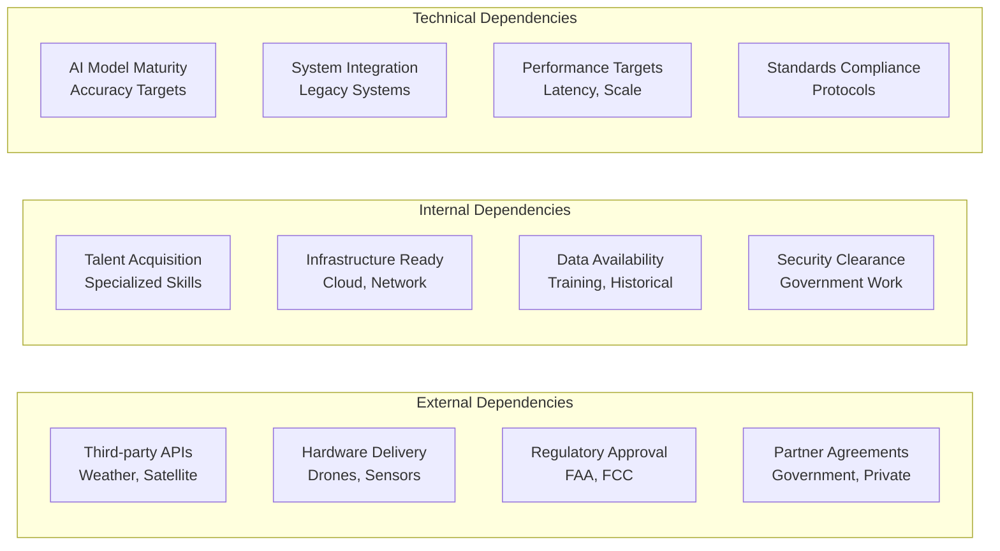

### Potential Blockers and Mitigation

| Blocker | Impact | Likelihood | Mitigation Strategy |
|---------|--------|------------|-------------------|
| **FAA Drone Regulations** | High | Medium | Early engagement, restricted zones initially |
| **AI Model Accuracy** | High | Low | More training data, ensemble methods |
| **Legacy System Integration** | Medium | High | Adapter pattern, phased migration |
| **Talent Shortage** | High | Medium | Remote hiring, training programs |
| **Satellite Data Costs** | Medium | Medium | Negotiate bulk rates, selective coverage |
| **Government Approval** | High | Medium | Compliance team, regular audits |

## Success Metrics and KPIs

### Phase-wise Success Metrics

#### Phase 2.1 Metrics
- **Technical**: 85% prediction accuracy, <2s latency
- **Adoption**: 100+ active beta users
- **Reliability**: 99.9% uptime
- **Performance**: 10,000 concurrent users
- **ROI**: 20% reduction in response time

#### Phase 2.2 Metrics
- **Automation**: 50% reduction in manual tasks
- **Training**: 500+ personnel VR trained
- **Integration**: 5+ agencies connected
- **Efficiency**: 40% faster resource deployment
- **Safety**: 30% reduction in responder injuries

#### Phase 2.3 Metrics
- **Global Reach**: 50+ countries deployed
- **Scale**: 1M+ users worldwide
- **Data Processing**: 10PB monthly
- **Availability**: 99.99% global uptime
- **Impact**: 10,000+ lives saved annually

### Long-term Success Indicators

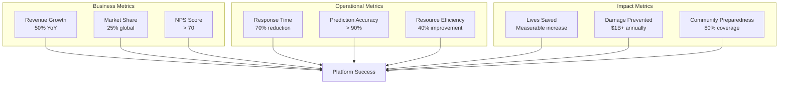

## Communication and Change Management

### Stakeholder Communication Plan

| Stakeholder | Communication Method | Frequency | Key Messages |
|-------------|---------------------|-----------|--------------|
| **Emergency Managers** | Webinars, Training | Weekly | Feature updates, best practices |
| **Government Officials** | Executive Briefings | Monthly | ROI, compliance, impact |
| **First Responders** | Field Training | Bi-weekly | Practical usage, safety |
| **Public** | Website, Social Media | Continuous | Preparedness, transparency |
| **Investors** | Quarterly Reports | Quarterly | Progress, metrics, ROI |
| **Development Team** | Daily Standups | Daily | Tasks, blockers, wins |

### Change Management Strategy

1. **Awareness Phase** (Month 1-2)
   - Executive sponsorship secured
   - Vision communication campaign
   - Stakeholder mapping and engagement

2. **Desire Phase** (Month 2-3)
   - Benefits realization workshops
   - Success story sharing
   - Address concerns and resistance

3. **Knowledge Phase** (Month 3-4)
   - Comprehensive training program
   - Documentation and resources
   - Certification program launch

4. **Ability Phase** (Month 4-5)
   - Hands-on practice sessions
   - Mentoring and coaching
   - Gradual feature rollout

5. **Reinforcement Phase** (Month 5-6+)
   - Success celebration
   - Continuous improvement feedback
   - Long-term support structure

## Conclusion and Next Steps

The Aegis Phase 2 implementation roadmap represents a transformative journey from a decision support tool to a comprehensive, AI-powered emergency management ecosystem. The phased approach ensures continuous value delivery while managing risks and building toward a revolutionary platform.

### Immediate Next Steps (First 30 Days)

1. **Secure Funding**: Present roadmap to investors/stakeholders
2. **Team Assembly**: Begin recruitment for critical roles
3. **Infrastructure Setup**: Initiate cloud environment provisioning
4. **Partner Engagement**: Start discussions with key technology partners
5. **Regulatory Planning**: Begin FAA and compliance discussions
6. **Community Building**: Launch developer preview program
7. **Baseline Metrics**: Establish current performance benchmarks
8. **Risk Assessment**: Detailed risk analysis and mitigation planning
9. **Communication Launch**: Announce Phase 2 to user community
10. **Sprint 0**: Technical spike on critical unknowns

### Critical Success Factors

- **Executive Commitment**: Sustained leadership support
- **User Engagement**: Continuous feedback and iteration
- **Technical Excellence**: Best practices and quality standards
- **Agile Execution**: Flexible response to changes
- **Partnership Success**: Strong ecosystem relationships
- **Regulatory Navigation**: Proactive compliance management
- **Team Cohesion**: Unified vision and collaboration
- **Financial Discipline**: Cost control and ROI focus

### Long-term Vision (3-5 Years)

By 2029, Aegis will be:
- The global standard for emergency management
- Preventing 50% of preventable disaster deaths
- Saving $10B+ annually in disaster costs
- Operating in 100+ countries
- Supporting 10M+ emergency personnel
- Processing exabytes of data monthly
- Pioneering AGI for humanitarian applications

The journey ahead is ambitious but achievable. With careful execution of this roadmap, strong partnerships, and unwavering focus on our mission to save lives and protect communities, Aegis Phase 2 will revolutionize emergency management worldwide.