# User Flows Documentation - Aegis AI Emergency Management

## Overview

This document provides detailed user journey diagrams and interaction flows for all features within the Aegis system, illustrating how users navigate and interact with the application.

## Primary User Flow - Complete Incident Response

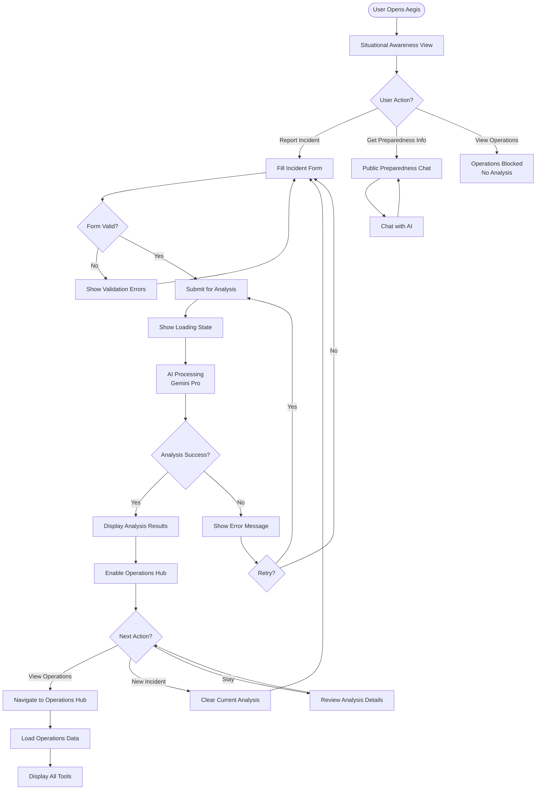

## Feature 1: Situational Awareness User Flow

### Detailed Incident Reporting Flow

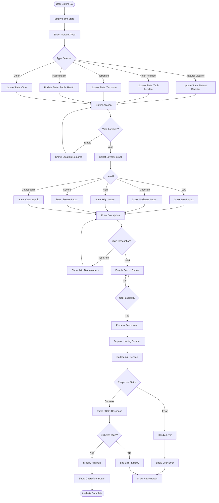

### Analysis Display Flow

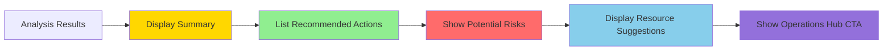

## Feature 2: Public Preparedness User Flow

### Chat Interaction Flow

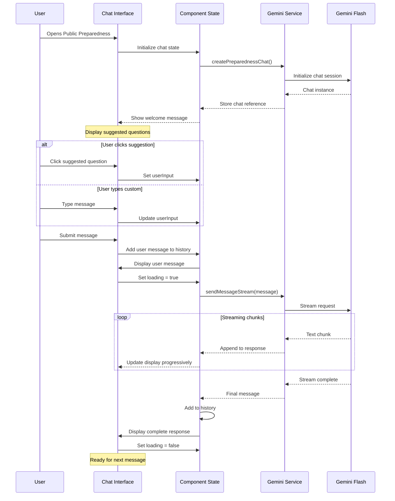

### Chat State Management Flow

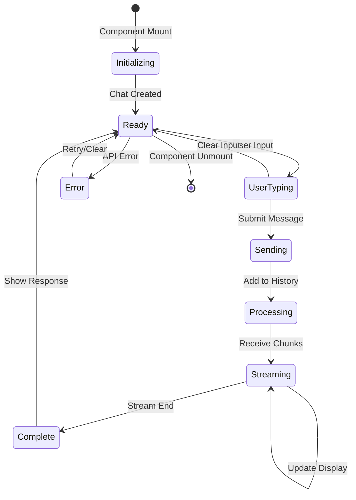

## Feature 3: Operations Hub User Flow

### Operations Hub Loading Flow

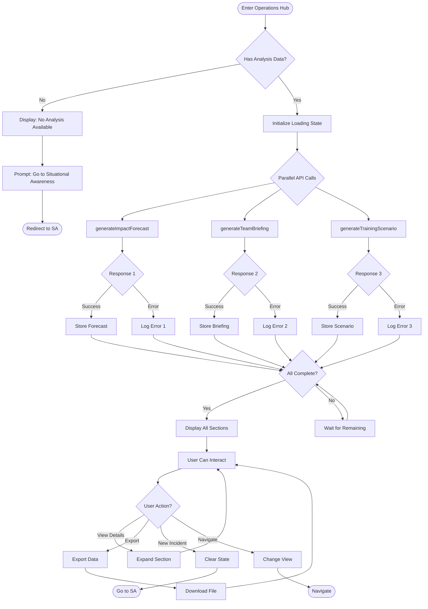

### Operations Data Display Flow

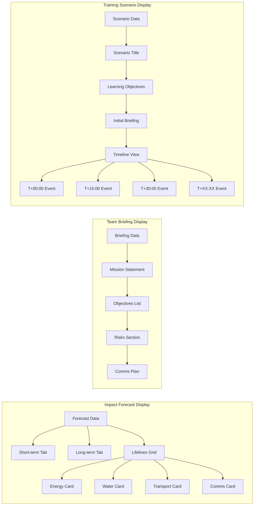

## Cross-Feature Navigation Flows

### Navigation State Machine

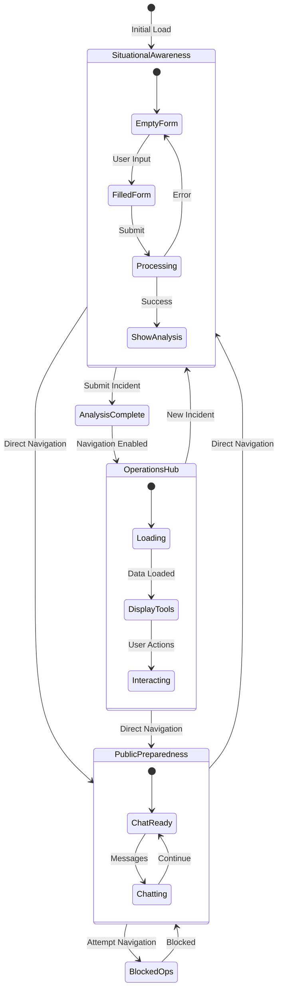

## Error Handling Flows

### Comprehensive Error Flow

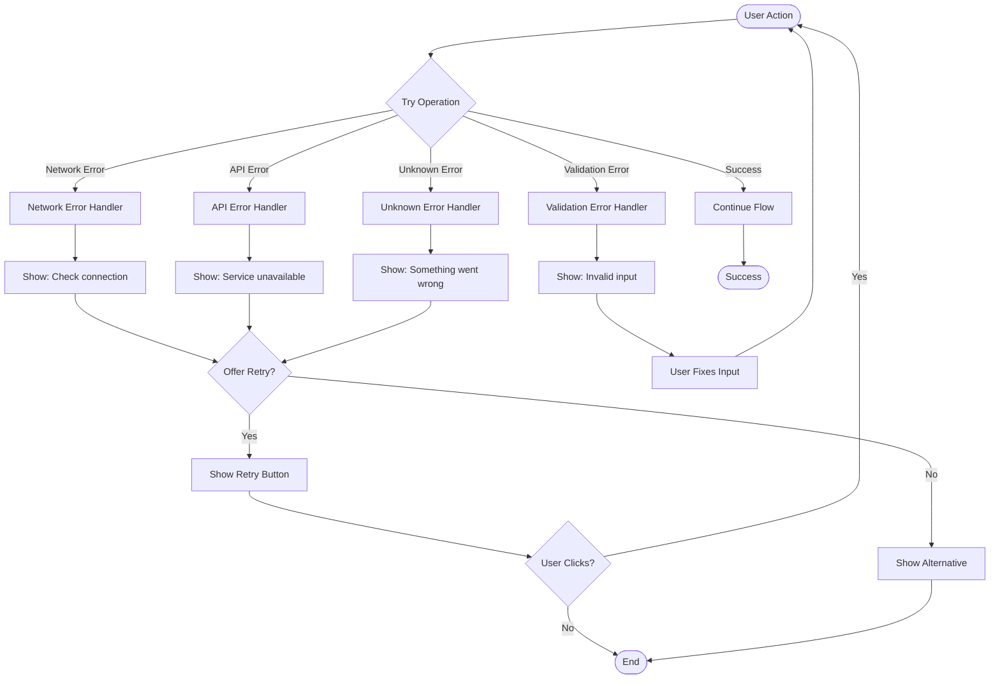

## Mobile Responsive Flow

### Adaptive UI Flow

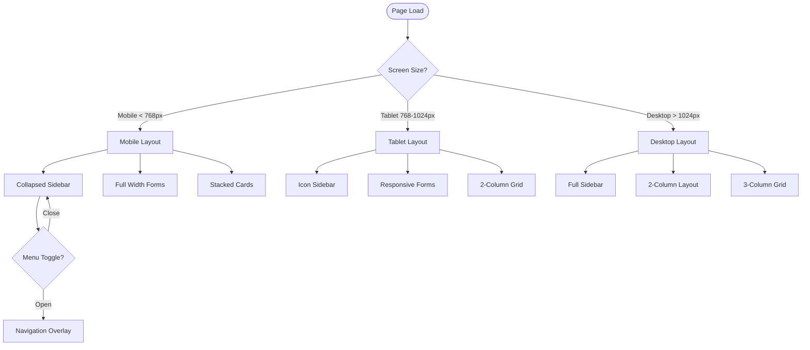

## Performance Optimization Flows

### Lazy Loading Flow

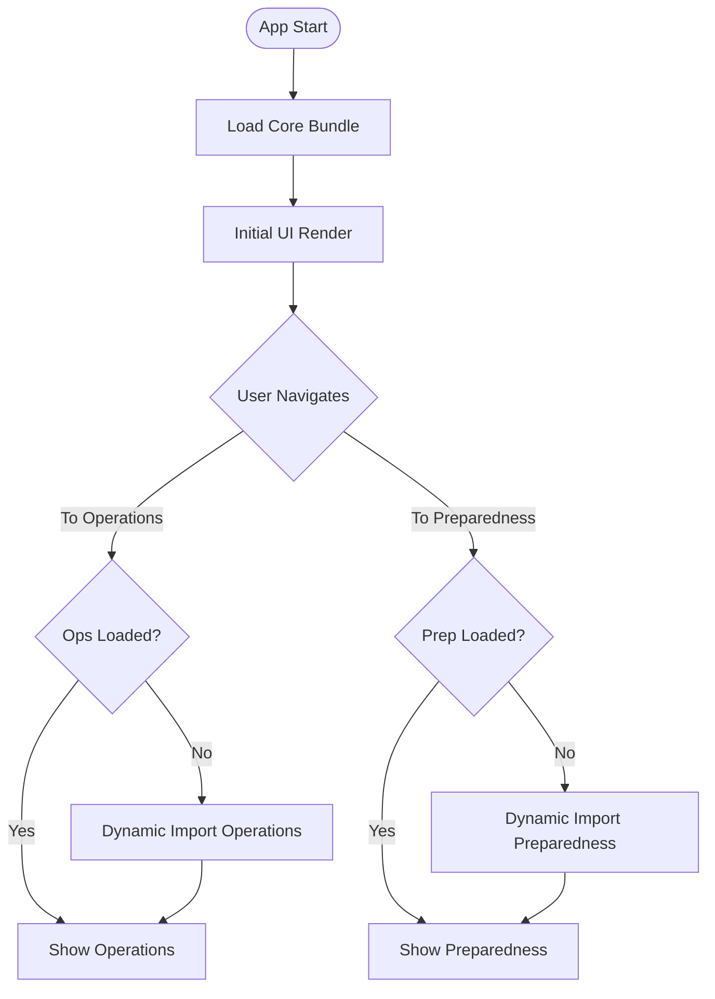

### Data Caching Flow

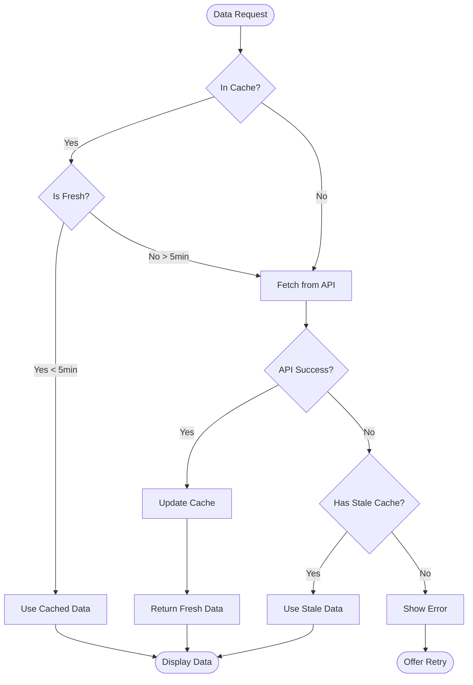

## Accessibility Flows

### Keyboard Navigation Flow

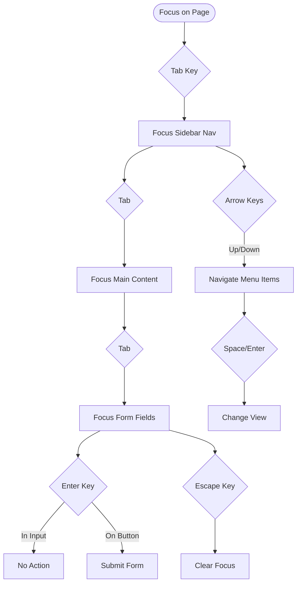

## Best Practices for User Flow Design

### Flow Design Principles

1. **Progressive Disclosure**: Show only necessary information at each step
2. **Clear Feedback**: Every action has visible response
3. **Error Prevention**: Validate before errors occur
4. **Recovery Options**: Always provide way to recover from errors
5. **Consistent Patterns**: Similar actions have similar flows

### User Flow Metrics

| Metric | Target | Measurement |
|--------|--------|-------------|
| Task Completion Rate | > 90% | Successful analysis creation |
| Error Recovery Rate | > 80% | Users who retry after error |
| Time to Analysis | < 2 min | Form start to results |
| Navigation Success | > 95% | Reach intended destination |
| Chat Satisfaction | > 85% | Helpful response rate |

---

These comprehensive user flows ensure intuitive navigation and interaction patterns throughout the Aegis system, supporting both emergency professionals and public users effectively.